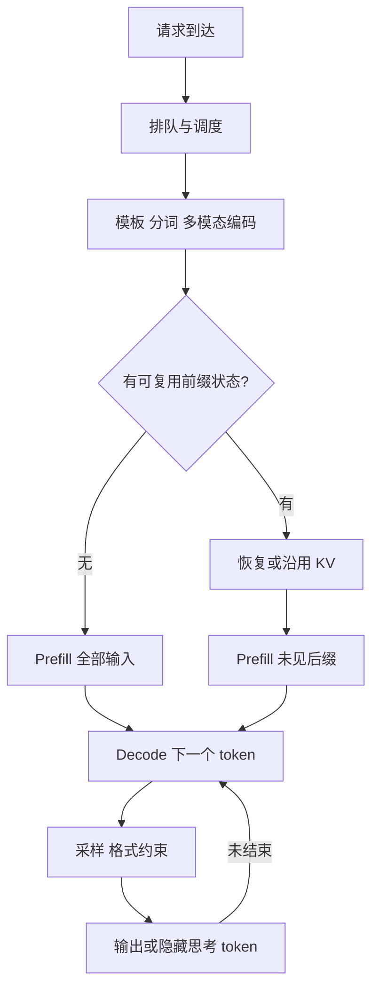
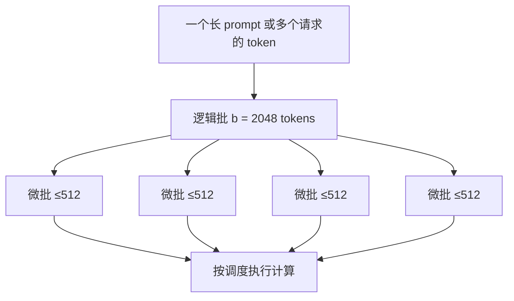
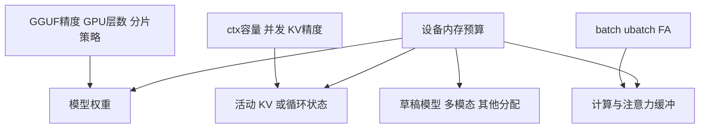
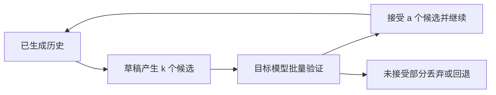

<a id="guide"></a>

# llama.cpp 参数说明与性能图解

编写日期：2026-09-22～23。核对基线：本工作区 `llama.cpp` 的 **`f5e85d43a048f3d5adefb4c5e29867d8077fba62`**，提交日期 2026-08-28，`b10669-4-gf5e85d43a`。这是固定版本说明，**不宣称涵盖 9 月 22 日上游新增选项**。源码树没有未提交修改；本次没有编译模型、启动推理服务或产生新跑分。

阅读顺序：先读本文建立性能模型，再查[公共与各子程序完整参数表](llamacpp-all-parameters-catalog.md)、[独立工具参数表](llamacpp-tool-parameters.md)、[请求参数完整表](llamacpp-request-parameters.md)和[源码证据笔记](llamacpp-parameter-performance-evidence.md)。另提供合并后的完整手册；附录覆盖范围以各自的可核对清单为准。

“所有参数”在此具体指：该提交 `common/arg.cpp` 的全部参数注册项（含别名、工具独有、弃用和已移除项），再补上不走这套解析器的主要运行工具。C/C++ API 结构体字段、全部后端环境变量、CMake 选项以及模型转换/开发脚本是另外的配置接口；本文列重要入口，不把它们冒充命令行参数。HTTP 请求参数也另列，不能机械地把 `--` 改成下划线。

## 1. 先分清楚你要优化什么

| 指标 | 含义 | 常见影响项 |
|---|---|---|
| 冷启动耗时 | 从启动程序到模型可用 | 模型大小、磁盘、下载、`--load-mode`、warmup |
| 首 token 延迟 TTFT | 从提交请求到收到第一个输出 token | 排队、模板与分词、图像编码、前缀复用、prefill、首轮采样、网络 |
| 首个可见答案延迟 | 从请求到用户看到正文 | TTFT 加上可能隐藏的思考过程；思考 token 仍要计算 |
| PP tok/s | prompt processing / prefill，读取输入的速度 | `-b`、`-ub`、GPU offload、Flash Attention、输入长度 |
| TG tok/s | token generation / decode，逐 token 生成速度 | 权重带宽、模型量化、GPU/CPU 分配、KV 读写、已有上下文、投机解码 |
| TPOT / ITL | 每个输出 token 耗时 / 相邻流式输出间隔 | decode、调度、网络缓冲；二者在真实流式服务中不完全相等 |
| 总吞吐 | 所有并发请求每秒合计产出多少 token | `-np`、continuous batching、容量、批处理效率 |
| 尾延迟 P95/P99 | 最慢一部分请求的等待与完成时间 | 长 prompt 抢占计算、队列、缓存未命中、过高并发 |
| 容量与质量 | 能放下多少上下文、回答是否正确 | 模型与 KV 精度、上下文上限、截断、RoPE、采样、思考预算 |

**每秒生成更快、第一句话更早出现、能同时服务更多人，是三个不同目标。** 例如缩短输出通常减少完成时间，但不证明 TG tok/s 变高；缓存命中减少要读的 token，也不证明 GPU 的 PP 算力变强。



近似分解（用于理解，非基准模型）：

`TTFT ≈ 排队 + 输入处理 + 缓存恢复 + 未命中输入的 prefill + 首轮输出开销`

`总完成时间 ≈ TTFT + 后续生成 token 数 × 平均 TPOT`

实际阶段可能重叠；投机解码会一次提交多个 token。只拿服务端 `predicted_per_second` 不能代表客户端端到端速度。依据：[server 请求、响应和 timings 定义][server]、[bench 的 PP/TG/PG 说明][bench]。

## 2. 哪些参数值得先动

下面的方向是机制推断，不是保证的加速比例。所有“更快”都需要相同模型、工作负载和设备上的 A/B 验证。

| 参数/操作 | 首字与 prefill | decode | 内存/显存 | 质量或其他代价 |
|---|---|---|---|---|
| 换更小/低比特 GGUF，`-m` | 通常减少计算与搬运 | 带宽受限时常有收益 | 权重占用减少 | 可能降低质量；不同量化内核性能不单调 |
| 增加 `-ngl`，直到足够 GPU 驻留 | 通常改善 | 通常改善 | 显存增加、主存承担减少 | 放不下会失败/触发调整；CPU 与 GPU 性能决定收益 |
| 增大 `-ub`，配合足够 `-b` | GPU 利用不足时常改善 PP | 单路短步 decode 常不明显 | 计算缓冲通常增加 | 太大可能挤出权重、OOM或恶化调度延迟 |
| `-fa on` | 长上下文常有收益 | 依后端、模型、长度而定 | 注意力中间缓冲可能显著减少 | 要有支持的算子、形状与数据类型 |
| `-ctk/-ctv q8_0` 或更低比特 | 可能减少 KV 带宽 | 长上下文可能受益，也可能被解量化开销抵消 | KV 变小 | 长程记忆/精确检索质量需实测 |
| 降低 `-c` | 主要减少容量，不代表短输入必然更快 | 已使用长度不变时未必改善 | KV 预留通常减少 | 容纳的输入与输出变少 |
| 增大 `-np`、保留 `-cb` | 排队/首字可能变差 | 总 TG 可增加；单用户 TG可能下降 | 每路状态与容量需求增加 | 吞吐与延迟权衡 |
| 命中 `cache_prompt` / RAM 状态缓存 | 可以显著减少重复 prefill | 不会消除后续 attention 对历史的读取 | 需要保存状态 | 相同语义不足以命中，通常依赖相同 token 前缀 |
| 调 `-t/-tb` | CPU 执行时重要 | 线程过多可更慢 | 通常不是主要显存因素 | 受核心类型、NUMA、带宽影响 |
| 开投机解码 `--spec-type` | 不解决普通长 prompt 的 prefill | 高接受率且草稿便宜时加速 | 草稿权重、KV、验证缓冲增加 | 接受率低/设备竞争时更慢 |
| 限制 `-n`、`--reasoning-budget` | 后者可缩短正文出现前等待 | 减少总生成工作，未必提高每秒速度 | 缓解长期占用 | 回答可能不完整、推理能力受损 |
| `--temp`、`--top-p` 等 | 通常不是 PP 调优手段 | 主要改变采样；极端场景采样会成瓶颈 | 通常影响较小 | 直接改变回答分布，不能为跑分随意变动 |

参数语法与行为依据：[公共解析器][arg]、[默认结构体][common]；进一步证据见[机制核对笔记](llamacpp-parameter-performance-evidence.md)。

## 3. `-b`、`-ub`、`-np`：三个不同的“批”

`--batch-size / -b` 是送入处理过程的**逻辑 token 批大小上限**；`--ubatch-size / -ub` 是实际计算拆分的**物理微批上限**；`--parallel / -np` 是 server 的**请求 slot 数**。`-b 2048` 不等于 2048 个用户，`-ub 512` 也不等于每个用户生成 512 个 token。



这是上限示意，不承诺每次恰好四块；序列布局、后端和模型会影响实际拆分。单用户普通 decode 每步只有一个新 token，把 `-b` 从 2048 改成 8192 不会自动产生更多可并行的 token。多用户 decode 则可以把不同用户的新 token 拼进同批，提高权重读取的利用率。

建议先固定 `-b 2048` 扫描 `-ub 128/256/512/1024`，测 PP、显存峰值与混合负载 P95 TTFT；再测试 `-b 512/1024/2048/4096`。如果增加 `-ub` 后必须减少 GPU 层数，它可能让 PP 小幅改善却使 TG 大幅下降。依据：[参数定义][arg]、[批处理与计时实现][context]。

## 4. 上下文、并发与 KV：容量如何计算

`-c` 是运行上下文容量配置，实际生效值会受模型、对齐、自动 fit 和服务器 slot 规则影响。容量中要为模板、系统提示、历史、图片/音频 token、当前输入以及生成预留空间。token 不等于中文字数。

对普通 Transformer attention，KV 体积的近似式是：

`KV bytes ≈ token 槽位总数 × Σ各注意力层( K维数 × K每元素字节 + V维数 × V每元素字节 )`

同构 GQA 模型可写成 `C × L × Hkv × (Dk × Bk + Dv × Bv)`。这里用的是 **KV heads**，不是 query heads；不要把 GQA 按完整 query heads 计算。量化块还含 scale 等元数据，不能一律按 4bit=0.5 字节做精确预算。

**算例，非硬件跑分：** 32 层、8 个 KV heads、K/V head dimension 均为 128、普通 full attention：F16 K+V 每 token 为 128 KiB，8192 token 约 1 GiB，32768 token 约 4 GiB。Q8_0 块为 32 个值加 2 字节 scale，约为 F16 的 53.125%；Q4_0 为 16 字节数据加 2 字节 scale，约为 F16 的 28.125%。因此 32768 token 的同形 KV 粗估分别为 4 / 2.125 / 1.125 GiB。

这些数字**不含权重、计算缓冲、分配对齐、量化布局额外空间、多模态编码器、草稿模型、RAM 状态副本**。SWA、MLA、循环状态、混合 attention/SSM 架构不能直接套这个公式。依据：[KV 实现][kv]、[量化块结构][quants]。



### 4.1 明确分池与统一池

本版本 `-np` 在 server 默认自动设置；`--kv-unified` 的默认行为与 slot 是否自动有关。为可重复实验应显式指定。

| 配置意图 | 示例 | 含义 |
|---|---|---|
| 四路各约 8K，分池 | `-c 32768 -np 4 --no-kv-unified` | 常规分池中每路约为总上下文/路数，仍受对齐和模型上限约束 |
| 四路共享约 32K 活动池 | `-c 32768 -np 4 --kv-unified` | 空闲容量可以在序列间调剂；不表示四路都能同时占满32K |
| 统一池并限制每路 | `-c 32768 -np 4 --kv-unified --kv-unified-per-slot 8192` | 同时约束共享池和单路上限 |

当指定 `--kv-unified-per-slot N` 且**未显式设置 `-c`**时，代码可按 `n_parallel × N` 调整共享池。该版本 server 还会限制 slot 不超过模型报告的训练上下文；应读取启动日志的 `n_ctx`、`n_ctx_seq`、`n_ctx_slot` 和 `/props` 确认。它是这个提交的具体行为，不能泛化成所有版本都固定 `c/np`，也不能泛化成统一 KV 能无限借用显存。依据：[server context][srvctx]、[公共初始化][init]。

### 4.2 配置长度与实际长度

只把 `-c` 从 8K 提高到 128K，而测试 prompt 仍是 100 token，测到的是“大容量配置下的短输入”，不是“128K 已占用上下文的 decode”。普通 full attention 在历史增长后需要读更多 KV；长上下文 TG 可能下降。Flash Attention 优化访存与中间结果，并未使 full attention 的工作量与上下文无关。

`--context-shift` 可以在窗口满时移动/丢弃部分历史，`--keep` 指定保留开头的数量；它不会让模型真正记住被丢弃的全文。`--rope-scaling`、`--rope-scale`、`--rope-freq-*`、`--yarn-*` 影响位置编码与外推，不能凭扩大 `-c` 保证长文准确率。SWA 模型的 `--swa-full` 还涉及完整缓存与内存取舍，应按对应架构核对。[参数定义][arg]、[KV 实现][kv]

## 5. 模型放在哪儿：GPU、CPU 与多 GPU

### 5.1 单 GPU

`-ngl / --gpu-layers / --n-gpu-layers` 在本版本支持数值、`auto`、`all`。**99 是一个层数，不是“全部”的特殊关键字**；模型足够深时 99 并不覆盖所有层。想表达全部就使用本版本支持的 `-ngl all`，并看启动日志确认实际 offload。

`--fit on` 根据设备余量适配未显式指定的参数；`--fit-target` 是每设备要保留的余量，单位 MiB，默认 1024，**不是模型最多允许用的显存**。`--fit-ctx` 是允许 fit 调到的最小上下文。为了公平跑分，先用自动 fit 找可行配置，再固定关键值；否则更大微批触发更少 GPU 层数，会把两个变量混在一起。

`--device` 选择设备；`--list-devices` 查看当前二进制发现的后端。设置 GPU 层数不会给一个 CPU-only 构建凭空添加 GPU 支持。`--no-kv-offload` 把 KV offload 关掉可能省设备内存，但常增加 CPU 工作或传输；`--op-offload` 控制另一类运算 offload，和权重 offload 不是同一个开关。`--override-tensor` 是按 tensor 名称模式指定存储位置的高级工具，规则写得能加载不代表性能合理。[arg][arg]、[init][init]

### 5.2 多 GPU

| 参数 | 作用 | 性能判断 |
|---|---|---|
| `-sm none` | 单 GPU | 模型能放下时是很好的对照组 |
| `-sm layer` | 按层和 KV 分布到多 GPU，支持流水方式 | 主要扩容；多卡不意味着单请求翻倍，层间仍有依赖 |
| `-sm row` | 权重按行拆分 | 可并行，但跨卡传输与同步可能抵消收益 |
| `-sm tensor` | 权重与 KV 的张量并行，本版本实验项 | 强依赖支持程度、GPU互联和模型结构 |
| `-ts 3,1` | 分配比例，非 GiB 数字 | 用于异构显存；比例还会受不可分割的tensor/层等约束 |
| `-mg 0` | none 模式主卡；row 模式还涉及中间结果/KV | 不同 split mode 含义不同，不能当成通用调度权重 |

不要把“总显存够”当成“每卡都够”，主卡中间缓冲也会占空间。本版 `tensor` 模式要求 FA，backend sampling 会回退 CPU；`layer` 的自动流水也有完整 GPU offload、KV offload、无 tensor override、设备支持 async/events 等条件。CPU MoE 的 override 可能使流水不启用。跨机器 RPC 扩容还叠加网络代价，应单独测试。依据：[分片参数][arg]、[模型加载实现][model]、[context 初始化][context]。

### 5.3 MoE、dense FFN 与 CPU

`--cpu-moe` 把所有专家权重放 CPU；`--n-cpu-moe N` 只涉及前 N 层的专家；`--n-cpu-ffn N` 是 dense FFN 对应策略。它们让注意力等部分仍可驻 GPU，适用于显存紧张时的选择性分配。MoE 每 token 只激活部分专家，但**模型需要存储的专家权重总量并不会等于激活量**。

CPU 承担更多层/专家时，内存带宽、线程和跨设备传输变得重要。它常用于“能运行”的容量折中，是否优于整层 offload 需要比较具体模型。把 CPU 搬运误认为免费，是常见错误。[模型 tensor 放置定义][arg]

## 6. CPU 参数如何影响推理

`-t / --threads` 控制生成用线程；`-tb / --threads-batch` 控制批处理/prompt 阶段，未设置通常继承前者。decode 小批经常受内存带宽限制，prefill 则更容易利用矩阵运算并行，所以两者最优线程数不必相同。

| 参数族 | 含义与影响 |
|---|---|
| `--cpu-mask`、`--cpu-range`、`--cpu-strict` | 控制线程能去哪些逻辑 CPU；可减少跨 NUMA 访问、大小核迁移，也可能选错核心变慢 |
| 对应 `*-batch` 参数 | 给 PP 单独的亲和性、优先级和轮询设置 |
| `--prio` | 调度优先级；不会提升硬件带宽，过高会影响同机其他任务 |
| `--poll` | 更积极等待新工作可减少唤醒延迟，但增加空转 CPU 和功耗 |
| `--numa distribute/isolate/numactl` | NUMA 分配与亲和策略；平台相关，不能作为通用 Windows 调优开关 |
| `--spec-draft-*` CPU 参数 | 给草稿模型另配线程，避免目标与草稿抢满相同 CPU 资源 |

可先试线程数 `1,2,4,8` 到物理核心数，分别记录 PP/TG。超线程数或操作系统报告的逻辑核心数不自动等于最佳线程数。官方历史示例也展示了加线程并非一直更快；其机器和模型很旧，不宜复制其中 tok/s 当现代机器预期。[官方性能排查][tips]

## 7. Flash Attention 与 KV 精度

`--flash-attn on/off/auto` 调整 attention 的实现选择。FA 使用融合/分块方式减少中间张量写回和读写成本，尤其值得在长上下文下测试。`auto` 不是保证所有层实际都启用；必须检查实际后端和日志。

`--cache-type-k`、`--cache-type-v` 选择 KV 类型，**不修改 GGUF 权重精度**。本版本注册类型包括 `f32/f16/bf16/q8_0/q4_0/q4_1/iq4_nl/q5_0/q5_1`，但“解析器接受名字”不等于“每个模型与后端的所有 K/V 组合都有内核”。本版量化 V 要求 FA：`auto` 会启用，`off` 会报错；MLA / DeepSeek4 的 K/V 类型还必须一致。失败时应核对日志和该模型支持情况。

实用顺序：F16 建立质量基准 → Q8_0 看显存收益 → 必要时试更低比特 → 同时测长文检索、结构化输出、实际业务任务和长上下文 decode。不要因为短 prompt 测试没变化就认定长上下文量化也无损；也不要因为内存少一半就预计速度一定翻倍。[缓存类型参数][arg]、[context 验证][context]、[KV 实现][kv]

## 8. 三种“缓存”别混用

| 层次 | 相关参数/字段 | 保存什么 | 主要收益与代价 |
|---|---|---|---|
| 模型文件缓存/映射 | `--cache-list`、模型下载、`--load-mode` | 权重文件与操作系统页缓存 | 下载/加载快；不是对话 prefill 缓存 |
| 活动前缀复用 | 请求 `cache_prompt`、slot、`--slot-prompt-similarity` | 正在模型上下文里的序列状态 | 相同 token 前缀可不重算；占用活动容量 |
| 可恢复状态 | `--cache-ram`、`--cache-idle-slots`、checkpoints、slot save/restore | 可恢复的 prompt/序列状态副本 | 会话切换后省重算；消耗 RAM、复制和恢复时间 |

`--cache-ram` 单位 **MiB**，此基线默认 8192，0 禁用，-1 不限；它不是直接增大 GPU 活动 KV，更不是自动接入外部 Redis 或 LMCache。`--ctx-checkpoints`、`--checkpoint-min-step` 决定检查点数与间距，对不能任意裁剪状态的架构和回退恢复尤其相关。间隔太密可能多占 RAM、增加状态复制；太疏则要重算更长后缀。

`--cache-reuse` / 请求 `n_cache_reuse` 尝试通过 KV shift 复用片段，依赖模型与缓存实现；它不是对任意历史文本的语义检索。固定系统提示与知识前缀，把每轮变化内容放后面，通常更有利于前缀复用。

**算例：** 8192-token prompt 中有 7680 token 可直接复用，余下 512 token 新增；若假设 PP=2000 tok/s、恢复成本忽略，则重算约 4.096 秒变成约 0.256 秒。这是条件算例，实际还含恢复、排队与预填充长度效应，不能宣传成 16 倍整请求加速。继续生成仍要关注已有上下文，缓存不会让历史 KV 消失。[server 缓存说明][server]、[server context][srvctx]

## 9. 投机解码：为什么有时更快，有时反而慢

普通自回归每次由大模型走一步；投机解码先用便宜的草稿模型或 n-gram 方法提出多个候选，再由目标模型批量验证，接受可用前缀后继续。



关键参数：`--spec-type` 选择策略；`--spec-draft-model` 指定草稿模型；`--spec-draft-n-max/n-min/p-min` 控制候选长度与阈值；`--spec-draft-ngl`、设备、线程、缓存类型分配草稿资源；`--spec-ngram-*` 调整 n-gram 匹配与候选。完整合法类型和所有别名见参数表，旧 `--draft-*` 不应直接照搬。

粗略判断：`每个最终 token 的时间 ≈ (草稿耗时 + 目标验证耗时 + 回退/调度成本) / 本轮最终提交 token 数`。接受率高仍不够，草稿必须便宜；草稿抢占显存导致目标层回 CPU，或多用户已经充分利用 GPU 时，反而可能更慢。

兼容的 tokenizer、词表、特定架构与验证逻辑都是前提。MTP/EAGLE 等草稿不是任意小模型都能替代；不能笼统声称所有策略、所有采样组合都逐 token 与普通解码相同。用真实 prompt 测接受率、最终 TG 和质量，不能只比较草稿自身速度。[投机实现][spec]、[采样验证][sampling]

## 10. 采样、思考与格式：主要影响输出，也会影响成本

| 参数族 | 怎样影响输出 | 性能含义 |
|---|---|---|
| `--temp` | 调整分布尖锐程度；零温偏向贪心 | 通常不是模型主计算加速开关 |
| `--top-k/top-p/min-p/typical/top-n-sigma` | 筛选候选集 | 排序、概率处理有开销，但大模型一般由网络前向主导 |
| `--repeat-* / presence / frequency` | 历史重复惩罚 | 扫描窗口和数据结构有开销；过度惩罚可损害代码/JSON |
| `--dry-*` | 惩罚重复片段 | 历史窗口大时 CPU 采样开销可能明显 |
| `--mirostat-* / adaptive-* / dynatemp-* / xtc-*` | 不同分布控制策略 | 交互与执行链不同，不能假设可全部无冲突叠加 |
| `--samplers / --sampler-seq` | 采样器及顺序 | 相同各项数值但顺序不同，输出分布可能不同 |
| `--grammar / --json-schema*` | 限制合法 token 路径 | 复杂语法可能增加逐 token CPU 开销；格式正确不等于内容正确 |
| `--backend-sampling` | 实验性地让后端采样 | 可能减少主机同步/数据搬运；支持组合受限制 |
| `--seed` | 随机种子 | 有助实验可重复，但后端、batch、缓存变化仍可能导致差异 |
| `--ignore-eos`、停止词、`-n` | 决定何时停止 | 直接影响总计算量与完成时间 |
| `--reasoning-budget` | 限制受支持的思考 token 预算 | 能缩短隐式思考等待，但可能影响复杂题正确率 |
| `--reasoning-format` | 如何组织/分离思考文本 | 改输出呈现并不等于停止模型思考 |
| `--chat-template* / --jinja` | 控制角色、工具与思考格式 | 模板错误可能严重损害模型行为；模板长度也影响 prefill |

不要把“把 thinking 字段隐藏”当成取消计算，也不要把相同 seed 当跨设备位级一致性保证。该源码里 README 的手写 HTTP 默认值有滞后迹象，例如 `repeat_penalty` 与自动生成 CLI 表不同；实际默认应核对启动配置、`/props` 和当前请求解析实现。[采样实现][sampling]、[server 工具与请求解析][srvutils]

## 11. 其余参数怎么归类

完整列表在附录，下面提供定位方式。

| 家族 | 主要用途 | 对性能的关系 |
|---|---|---|
| `-m/-hf/-hff/-mu` 等来源 | 选择文件、下载源、认证 | 选择的模型决定性能；来源本身主要影响下载/加载 |
| `--load-mode` 与旧 mmap/mlock/direct-io | 文件映射、预装入、锁页等 | 主要影响加载、缺页、CPU驻留；已全驻留 GPU 的稳态 TG 不一定变化 |
| `--warmup` | 启动时提前做空跑 | 提前支付初始化成本；关闭可能启动快、首请求慢 |
| `--lora* / --control-vector*` | 适配器与行为方向 | 增加计算/权重；不同 LoRA 请求不能简单同批，影响吞吐 |
| `--mmproj* / --image-*-tokens / --mtmd-batch-max-tokens` | 多模态编码器、图片token预算 | 图片token更多，视觉细节可能更好，同时编码/PP/KV压力上升 |
| `--video-fps / --video-timestamp-interval` | 视频抽帧与时间戳 | fps 越高通常输入工作越多；不是提高文本解码速度 |
| embeddings / pooling / normalize / rerank | 向量、归一化与排序任务 | 任务改变，应测样本/秒和PP，不用聊天TG评判 |
| host / port / TLS / CORS / API key | 网络与访问配置 | 通常不改变模型计算；HTTP、TLS、传输仍影响端到端耗时 |
| `--threads-http` | HTTP 请求工作线程 | 不等于模型线程数，也不等于推理slot数 |
| models-dir / models-preset / models-max / sleep | 多模型路由、加载、休眠 | 冷启动、常驻内存与切换延迟权衡 |
| log / verbosity / metrics / slots / perf | 可观察性 | 详细日志、逐token信息可能扰动高吞吐或小模型测量 |
| tools / MCP / agent | 执行外部工具与工作流 | 外部工具时间可远大于推理；不属于纯模型tok/s |
| CLI 输入、显示、颜色、交互 | 使用体验 | 主要是I/O；慢终端输出会污染端到端时间 |
| perplexity / imatrix / retrieval / TTS / diffusion等 | 独立任务流程 | 指标与部分参数语义不同，查工具标签后使用 |

完整注册表同时区分**可用选项、兼容别名、弃用项、只用于明确报错的已移除项**。环境变量只在 `.set_env(...)` 有对应映射时成立，不应为任意旗标自行拼 `LLAMA_ARG_*`。对于公共配置，命令行优先于环境变量；server router/preset 另有自己的合并规则。[arg][arg]、[server presets][server]

## 12. 可复制的调参案例

以下是 **PowerShell 单行命令**，假设可执行文件在当前目录、模型路径已换成实际文件；属于实验起点，不是已测最优值。不要把 server 的参数格式直接复制给独立 `llama-bench`。

### A. 单人对话，优先低延迟

```powershell
.\llama-server.exe -m "D:\models\model.gguf" -ngl all -c 8192 -np 1 -b 2048 -ub 512 -fa on -ctk f16 -ctv f16 --cache-ram 0 --host 127.0.0.1 --port 8080
```

先确认显存足够、FA支持、实际全 offload。F16用于基准；放不下时依次考虑降低不需要的上下文、缩小微批、KV Q8、合适的权重量化/模型大小，最后再比较部分CPU offload。这里将RAM状态缓存关闭便于隔离测量，活动slot仍可能按请求复用前缀；要测冷prefill还必须设置请求 `cache_prompt:false`。日常多轮可再比较RAM缓存收益。

### B. 四个并发用户，明确每人8K容量

```powershell
.\llama-server.exe -m "D:\models\model.gguf" -ngl all -c 32768 -np 4 --no-kv-unified -cb -b 2048 -ub 512 -fa on -ctk q8_0 -ctv q8_0 --cache-ram 0
```

和 `-np 1/2/4` 比较总输出吞吐、每用户TPOT与P95 TTFT。为保证每人8K，分池对照时 `-c` 应随路数调整；为比较固定显存预算则固定 `-c`，明确每路可用容量因此变化。这是两种不同实验，不能混在同一张“并发加速表”。

### C. 长文分析与多轮复用

```powershell
.\llama-server.exe -m "D:\models\long-context.gguf" -ngl all -c 32768 -np 1 -fa on -ctk q8_0 -ctv q8_0 -b 2048 -ub 512 --cache-ram 4096
```

模型必须支持目标上下文，质量也要检验。先发送长文+问题A，再保持相同token前缀提问B，比较 `cache_prompt:true/false` 的真实TTFT、处理token数、缓存token数。不同聊天历史结构可能改变前缀，不能只看文本内容“差不多”。对会话轮换测试，再加入其它会话制造slot/缓存压力。

### D. CPU-only，分别找PP与TG的最佳线程

```powershell
.\llama-server.exe -m "D:\models\model.gguf" --device none -ngl 0 --no-kv-offload --no-op-offload -c 4096 -np 1 -t 4 -tb 8 -b 512 -ub 128
```

4和8是扫描起点。记录核心结构、内存通道、实际驻留和是否发生交换；逐一改变 `-t` 与 `-tb`。如果模型靠频繁换页运行，应先解决容量问题，再谈线程调优。

### E. 用官方bench拆开测PP与TG

```powershell
.\llama-bench.exe -m "D:\models\model.gguf" -ngl 999 -p 512,2048 -n 128 -b 2048 -ub 128,256,512 -fa on -ctk f16 -ctv f16 -r 5 -o json
```

bench 有独立解析器，示例用数值 `999`（仍是层数上限）避免将server的字符串 `all` 当成通用语法；确认日志实际全offload。此命令是参数笛卡尔组合扫描，不是同时跑很多模型。一般保留预热；分别报告首次启动和稳态。测**已有长历史**下的生成另用该工具 `-d / --n-depth` 或 `-pg` 的具体语义，并在报告中写清填充深度与本次测量长度，不能仅增加server `-c`。[bench源码][benchsrc]

### F. 测请求缓存与生成长度

```powershell
$body = @{ prompt = '请用三点介绍向量数据库。'; n_predict = 256; temperature = 0; cache_prompt = $false; stream = $false } | ConvertTo-Json
Invoke-RestMethod -Method Post -Uri 'http://127.0.0.1:8080/completion' -ContentType 'application/json; charset=utf-8' -Body ([Text.Encoding]::UTF8.GetBytes($body))
```

这是原生 `/completion` 测试，聊天业务应使用正确聊天模板或 `/v1/chat/completions`。`stream:false` 方便读取完整计时对象，却不能直接测客户端首token到达；测TTFT须使用流式客户端时间戳。对比缓存时保持输入、采样、输出上限等一致，并区分第一次填充与后续命中。

## 13. 请求参数与启动参数的区别

启动时确定设备、模型、KV 类型、context容量；请求级可选采样、生成长度、输出格式与缓存行为。不能在请求JSON里用 `n_gpu_layers` 给已经加载的模型随意改GPU分配。

| 原生 `/completion` 字段 | 说明 | 性能关注 |
|---|---|---|
| `prompt`、`n_cmpl` | 输入与每prompt生成份数 | 输入规模、请求工作倍数 |
| `n_predict`、`stop`、`ignore_eos` | 输出上限与停止条件 | 总生成工作；0可仅评估prompt |
| `n_keep`、`n_cache_reuse` | 超窗保留与KV片段复用 | 历史完整性、复用成本 |
| `cache_prompt`、`id_slot` | 前缀缓存、slot选择 | 命中率、slot竞争；固定slot不一定提高吞吐 |
| `temperature`、`top_k/top_p/min_p/typical_p` | 基础采样 | 分布与采样开销 |
| `dynatemp_range/exponent`、`mirostat/tau/eta` | 动态温度与Mirostat | 输出风格、熵与执行链 |
| `repeat_penalty/last_n`、`presence_penalty/frequency_penalty` | 重复控制 | 扫描与质量 |
| `dry_multiplier/base/allowed_length/penalty_last_n/sequence_breakers` | 重复片段控制 | 长窗口采样成本 |
| `xtc_probability/threshold`、`seed`、`samplers`、`min_keep`、`logit_bias` | 其他采样选项 | 候选集合与可重复性 |
| `grammar`、`json_schema`、`n_indent` | 结构与缩进 | 约束解码成本 |
| `n_probs`、`post_sampling_probs` | 返回候选概率 | 额外概率计算/拷贝/响应量 |
| `stream`、`sse_ping_interval` | 流式输出与连接保活 | 体验和网络行为；流式不等于模型算得更快 |
| `timings_per_token`、`return_progress`、`return_tokens`、`response_fields` | 诊断与返回内容 | 观测开销、传输体积 |
| `t_max_predict_ms` | 生成阶段软时间限制 | 有特定触发条件，不是整请求硬超时 |
| `lora` | 每请求适配器列表 | 不同LoRA配置会限制合批 |

这是该版本 README 原生completion文档字段的分组索引；实现中有效注册的 66 个顶层字段、1 个嵌套字段和6个别名另见[请求参数完整表](llamacpp-request-parameters.md)。本节**不是所有端点JSON schema的穷举**；实现还可能接受扩展项。`/v1/chat/completions` 的 `messages/tools/tool_choice/response_format/max_tokens` 等需按该端点兼容层核对。embedding、rerank、slot save/restore、models 管理等端点各有自己的输入。不要把返回的 `timings`、`tokens_cached` 当作启动旗标。依据：[server API][server]、[请求解析实现][srvutils]。

## 14. 跑分要能解释，才有调参价值

1. 固定模型文件与哈希、GGUF量化、llama.cpp build/commit、后端、驱动、设备、电源策略。
2. 固定实际输入token长度、已占用历史长度、输出长度、采样、思考预算与并发分布。
3. 分别测冷启动、冷prefill、缓存命中、短上下文TG、长上下文TG和并发负载。
4. 一次只改一个主变量；当容量约束迫使联动更改时，把联动项写进记录。
5. 预热后至少重复数次，报告中位数与波动；服务压测另报告吞吐、P95/P99和失败率。
6. 记录实际offload层数、KV大小、主存与显存峰值、缓存命中token、投机接受率。CPU与GPU利用率只作辅助证据。
7. 改量化、长上下文、RoPE、思考预算、采样、模板时同步做质量评估，别只看速度。

| 症状 | 先检查 |
|---|---|
| 启动即OOM | 权重+KV+计算缓冲总预算；各GPU分别是否超限；fit实际改了什么 |
| 长输入迟迟不出首字 | 是否重复prefill、PP速度、排队、多模态编码、微批 |
| 首字快但后续很慢 | 实际上下文长度、GPU offload、权重/KV带宽、线程过量、草稿成本 |
| 单人快多人慢 | 总吞吐与单人延迟是否混淆、slot容量、队列、prefill与decode竞争 |
| 修改参数后跑分突然很好 | 是否输出更短、缓存恰好命中、用了不同模型/设备、fit改变容量 |
| 显存还有空余却慢 | 未必容量瓶颈；可能是带宽、互联、CPU、采样或调度 |

## 15. 资料入口与版本维护

这里的机制以固定版本一手源码为主。网络检索已核对官方工具文档与性能排查页；没有将论坛上不同模型或分支的跑分拼成普遍结论。工作区既有的历史跑分使用了其它二进制版本，因此本文不将其当本提交验证结果。

| 一手资料 | 用途 |
|---|---|
| [公共参数解析器][arg] | 选项名、别名、环境变量、适用工具、删除/弃用判断 |
| [公共参数结构体][common] | 初始默认值；还需看每工具和运行时覆盖 |
| [Server完整说明][server] | 启动参数、接口、缓存、并发、模型路由 |
| [CLI说明][cli] | 交互程序参数与行为 |
| [官方bench说明][bench]与[实现][benchsrc] | 参数扫描、PP/TG/PG与实际解析语法 |
| [GPU/线程性能排查][tips] | 确认offload、避免CPU线程过量；历史数值非现代基准 |
| [构建说明][build] | 后端构建条件，运行旗标无法代替编译支持 |
| [FlashAttention论文](https://arxiv.org/abs/2205.14135) | attention的I/O优化思路；不代表llama.cpp所有内核都是相同实现 |

升级后先运行对应程序 `--version` 和 `--help`，对比参数表及实际启动日志。尤其重新核对 `--load-mode`、`--fit`、KV统一池、slot容量、投机类型、实验性后端、默认采样链。源代码里的注册项最多只能证明该工具能解析它；硬件与模型是否真正支持仍需运行确认。

[arg]: https://github.com/ggml-org/llama.cpp/blob/f5e85d43a048f3d5adefb4c5e29867d8077fba62/common/arg.cpp
[common]: https://github.com/ggml-org/llama.cpp/blob/f5e85d43a048f3d5adefb4c5e29867d8077fba62/common/common.h
[server]: https://github.com/ggml-org/llama.cpp/blob/f5e85d43a048f3d5adefb4c5e29867d8077fba62/tools/server/README.md
[cli]: https://github.com/ggml-org/llama.cpp/blob/f5e85d43a048f3d5adefb4c5e29867d8077fba62/tools/cli/README.md
[bench]: https://github.com/ggml-org/llama.cpp/blob/f5e85d43a048f3d5adefb4c5e29867d8077fba62/tools/llama-bench/README.md
[benchsrc]: https://github.com/ggml-org/llama.cpp/blob/f5e85d43a048f3d5adefb4c5e29867d8077fba62/tools/llama-bench/llama-bench.cpp
[context]: https://github.com/ggml-org/llama.cpp/blob/f5e85d43a048f3d5adefb4c5e29867d8077fba62/src/llama-context.cpp
[kv]: https://github.com/ggml-org/llama.cpp/blob/f5e85d43a048f3d5adefb4c5e29867d8077fba62/src/llama-kv-cache.cpp
[quants]: https://github.com/ggml-org/llama.cpp/blob/f5e85d43a048f3d5adefb4c5e29867d8077fba62/ggml/src/ggml-common.h
[srvctx]: https://github.com/ggml-org/llama.cpp/blob/f5e85d43a048f3d5adefb4c5e29867d8077fba62/tools/server/server-context.cpp
[srvutils]: https://github.com/ggml-org/llama.cpp/blob/f5e85d43a048f3d5adefb4c5e29867d8077fba62/tools/server/server-schema.cpp
[init]: https://github.com/ggml-org/llama.cpp/blob/f5e85d43a048f3d5adefb4c5e29867d8077fba62/common/common.cpp
[model]: https://github.com/ggml-org/llama.cpp/blob/f5e85d43a048f3d5adefb4c5e29867d8077fba62/src/llama-model.cpp
[sampling]: https://github.com/ggml-org/llama.cpp/blob/f5e85d43a048f3d5adefb4c5e29867d8077fba62/common/sampling.cpp
[spec]: https://github.com/ggml-org/llama.cpp/blob/f5e85d43a048f3d5adefb4c5e29867d8077fba62/common/speculative.cpp
[tips]: https://github.com/ggml-org/llama.cpp/blob/f5e85d43a048f3d5adefb4c5e29867d8077fba62/docs/development/token_generation_performance_tips.md
[build]: https://github.com/ggml-org/llama.cpp/blob/f5e85d43a048f3d5adefb4c5e29867d8077fba62/docs/build.md


---

<a id="catalog"></a>

# llama.cpp 完整公共参数注册表

版本：`f5e85d43a048f3d5adefb4c5e29867d8077fba62`。本表逐项覆盖 `common/arg.cpp` 的 **357 个注册定义**，共 **551 个不重复命令行拼写**。同名但按工具分别注册的参数保留两行；同一注册项的所有正向、反向及短别名放在同一行。各行编号是本表审计编号，不是 CLI 参数。

本表覆盖公共解析器以及在其中注册的工具专属选项；`llama-bench`、`llama-quantize` 等使用独立解析器的参数不在这 357 项里，需结合主指南的独立工具附录。编译时未构建某个工具或后端时，相关参数不能凭空提供该功能。

**适用工具读法：** `COMMON` 指继承公共参数的工具集合，并不保证每个工具实际使用每个字段；`DOWNLOAD` 不继承 COMMON。`CLI` 为 llama-cli，`COMPLETION` 为 llama-completion，`SERVER` 为 llama-server，`BENCH` 在此表指使用公共解析器的 llama-batched-bench，不能当成 llama-bench 的参数清单。其余大写标签保留源码枚举名称，通常对应同名工具；`MTMD` 为多模态 CLI。标记“排除”表示该工具不接受该项。过滤规则见[固定版本源码](https://github.com/ggml-org/llama.cpp/blob/f5e85d43a048f3d5adefb4c5e29867d8077fba62/common/arg.cpp#L1425)。

**默认值与值格式：** 表中仅在明确处写默认值；其余默认由工具初始化、模型元数据、构建与自动适配共同决定，按“自动/该运行时帮助”为准，不能把某台机器的数字当全局默认。`N/F/P` 等为源码值占位符；“无值开关”不再跟 true/false，成对的正反向拼写用来开启或关闭。`--flag value` 与 `--flag=value` 是否等价以工具解析器为准。JSON 附件保存完整帮助表达式、环境变量与源码供核对。

**性能列读法：** 作用与适用范围直接来自每行链接的注册定义；性能列为结合计算与存储机制的定性分析，不是此硬件上的实测承诺。优化要区分加载、预填充 PP、逐 token 解码 TG、首 token 延迟 TTFT、总吞吐、峰值内存与质量。更多线程、更多 GPU、更多并发都不保证同时改善所有指标。

K/V 类型（第 113/114/292/293 行）：`f32, f16, bf16, q8_0, q4_0, q4_1, iq4_nl, q5_0, q5_1`，接受类型与当前后端实际可运行组合是两回事。见[类型枚举](https://github.com/ggml-org/llama.cpp/blob/f5e85d43a048f3d5adefb4c5e29867d8077fba62/common/arg.cpp#L304)。

推测类型（第 307 行）：`none, draft-simple, draft-eagle3, draft-mtp, draft-dflash, draft-dspark, ngram-simple, ngram-map-k, ngram-map-k4v, ngram-mod, ngram-cache`。见[算法名称注册](https://github.com/ggml-org/llama.cpp/blob/f5e85d43a048f3d5adefb4c5e29867d8077fba62/common/speculative.cpp#L33)。


## 帮助、终端与连接

| 编号/源码 | 全部拼写 | 值格式 | 适用工具 | 中文作用 | 性能影响 |
|---|---|---|---|---|---|
| [1](https://github.com/ggml-org/llama.cpp/blob/f5e85d43a048f3d5adefb4c5e29867d8077fba62/common/arg.cpp#L1440) | `-h`<br>`--help`<br>`--usage` | `无值开关` | COMMON, DOWNLOAD | 打印帮助后退出。 | 不直接改变模型计算；影响输入输出、管理或使用方式。 |
| [2](https://github.com/ggml-org/llama.cpp/blob/f5e85d43a048f3d5adefb4c5e29867d8077fba62/common/arg.cpp#L1447) | `--version` | `无值开关` | COMMON | 显示版本和构建信息。 | 不直接改变模型计算；影响输入输出、管理或使用方式。 |
| [3](https://github.com/ggml-org/llama.cpp/blob/f5e85d43a048f3d5adefb4c5e29867d8077fba62/common/arg.cpp#L1455) | `-cl`<br>`--cache-list` | `无值开关` | COMMON | 列出本地下载缓存中的模型。 | 不直接改变模型计算；影响输入输出、管理或使用方式。 |
| [4](https://github.com/ggml-org/llama.cpp/blob/f5e85d43a048f3d5adefb4c5e29867d8077fba62/common/arg.cpp#L1467) | `--completion-bash` | `无值开关` | COMMON | 输出 Bash 自动补全脚本。 | 不直接改变模型计算；影响输入输出、管理或使用方式。 |
| [5](https://github.com/ggml-org/llama.cpp/blob/f5e85d43a048f3d5adefb4c5e29867d8077fba62/common/arg.cpp#L1474) | `--server-base` | `URL` | CLI | CLI 连接指定已有服务器。 | 不直接改变模型计算；影响输入输出、管理或使用方式。 |
| [6](https://github.com/ggml-org/llama.cpp/blob/f5e85d43a048f3d5adefb4c5e29867d8077fba62/common/arg.cpp#L1481) | `--verbose-prompt` | `无值开关` | COMPLETION, CLI, EMBEDDING, RETRIEVAL | 生成前打印详细提示词。 | 大量终端/磁盘输出可影响端到端时间；通常不改变模型算子。 |
| [7](https://github.com/ggml-org/llama.cpp/blob/f5e85d43a048f3d5adefb4c5e29867d8077fba62/common/arg.cpp#L1488) | `--display-prompt`<br>`--no-display-prompt` | `无值开关` | COMPLETION, CLI | 开关提示词显示。 | 大量终端/磁盘输出可影响端到端时间；通常不改变模型算子。 |
| [8](https://github.com/ggml-org/llama.cpp/blob/f5e85d43a048f3d5adefb4c5e29867d8077fba62/common/arg.cpp#L1496) | `-co`<br>`--color` | `[on\|off\|auto]` | COMPLETION, CLI, SPECULATIVE, LOOKUP | 终端输出着色；on/off/auto，默认 auto。 | 不直接改变模型计算；影响输入输出、管理或使用方式。 |

## CPU 线程与调度

| 编号/源码 | 全部拼写 | 值格式 | 适用工具 | 中文作用 | 性能影响 |
|---|---|---|---|---|---|
| [9](https://github.com/ggml-org/llama.cpp/blob/f5e85d43a048f3d5adefb4c5e29867d8077fba62/common/arg.cpp#L1513) | `-t`<br>`--threads` | `N` | COMMON | 生成阶段 CPU 线程数；非正数使用硬件并发数。 | 影响 CPU 算力利用率与同步成本；过多线程可能受内存带宽或调度开销限制而变慢。 |
| [10](https://github.com/ggml-org/llama.cpp/blob/f5e85d43a048f3d5adefb4c5e29867d8077fba62/common/arg.cpp#L1523) | `-tb`<br>`--threads-batch` | `N` | COMMON | 提示词与批处理 CPU 线程数；未指定时沿用生成线程数。 | 影响 CPU 算力利用率与同步成本；过多线程可能受内存带宽或调度开销限制而变慢。 |
| [11](https://github.com/ggml-org/llama.cpp/blob/f5e85d43a048f3d5adefb4c5e29867d8077fba62/common/arg.cpp#L1533) | `-C`<br>`--cpu-mask` | `M` | COMMON | 生成线程 CPU 亲和性十六进制掩码。 | 改变 CPU/NUMA 局部性与线程迁移；可减少跨节点访问，也可能限制可用算力。 |
| [12](https://github.com/ggml-org/llama.cpp/blob/f5e85d43a048f3d5adefb4c5e29867d8077fba62/common/arg.cpp#L1543) | `-Cr`<br>`--cpu-range` | `lo-hi` | COMMON | 生成线程 CPU 亲和性编号范围。 | 改变 CPU/NUMA 局部性与线程迁移；可减少跨节点访问，也可能限制可用算力。 |
| [13](https://github.com/ggml-org/llama.cpp/blob/f5e85d43a048f3d5adefb4c5e29867d8077fba62/common/arg.cpp#L1553) | `--cpu-strict` | `<0\|1>` | COMMON | 是否严格按指定 CPU 放置线程。 | 改变 CPU/NUMA 局部性与线程迁移；可减少跨节点访问，也可能限制可用算力。 |
| [14](https://github.com/ggml-org/llama.cpp/blob/f5e85d43a048f3d5adefb4c5e29867d8077fba62/common/arg.cpp#L1560) | `--prio` | `N` | COMMON | 生成线程/进程优先级：-1 低，0 普通，1 中，2 高，3 实时。 | 改变与其他进程竞争 CPU 时的调度延迟；不增加硬件算力。 |
| [15](https://github.com/ggml-org/llama.cpp/blob/f5e85d43a048f3d5adefb4c5e29867d8077fba62/common/arg.cpp#L1570) | `--poll` | `<0...100>` | COMMON | 生成线程等待工作时的忙轮询程度；0 禁用。 | 忙轮询可减少唤醒延迟，但增加 CPU 占用和功耗。 |
| [16](https://github.com/ggml-org/llama.cpp/blob/f5e85d43a048f3d5adefb4c5e29867d8077fba62/common/arg.cpp#L1577) | `-Cb`<br>`--cpu-mask-batch` | `M` | COMMON | 批处理线程 CPU 掩码；缺省继承生成设置。 | 改变 CPU/NUMA 局部性与线程迁移；可减少跨节点访问，也可能限制可用算力。 |
| [17](https://github.com/ggml-org/llama.cpp/blob/f5e85d43a048f3d5adefb4c5e29867d8077fba62/common/arg.cpp#L1587) | `-Crb`<br>`--cpu-range-batch` | `lo-hi` | COMMON | 批处理线程 CPU 编号范围。 | 改变 CPU/NUMA 局部性与线程迁移；可减少跨节点访问，也可能限制可用算力。 |
| [18](https://github.com/ggml-org/llama.cpp/blob/f5e85d43a048f3d5adefb4c5e29867d8077fba62/common/arg.cpp#L1597) | `--cpu-strict-batch` | `<0\|1>` | COMMON | 批处理线程严格放置开关。 | 改变 CPU/NUMA 局部性与线程迁移；可减少跨节点访问，也可能限制可用算力。 |
| [19](https://github.com/ggml-org/llama.cpp/blob/f5e85d43a048f3d5adefb4c5e29867d8077fba62/common/arg.cpp#L1604) | `--prio-batch` | `N` | COMMON | 批处理线程优先级：0 至 3。 | 改变与其他进程竞争 CPU 时的调度延迟；不增加硬件算力。 |
| [20](https://github.com/ggml-org/llama.cpp/blob/f5e85d43a048f3d5adefb4c5e29867d8077fba62/common/arg.cpp#L1614) | `--poll-batch` | `<0\|1>` | COMMON | 批处理线程轮询开关；缺省继承生成设置。 | 忙轮询可减少唤醒延迟，但增加 CPU 占用和功耗。 |

## 查询缓存、上下文与批处理

| 编号/源码 | 全部拼写 | 值格式 | 适用工具 | 中文作用 | 性能影响 |
|---|---|---|---|---|---|
| [21](https://github.com/ggml-org/llama.cpp/blob/f5e85d43a048f3d5adefb4c5e29867d8077fba62/common/arg.cpp#L1621) | `-lcs`<br>`--lookup-cache-static` | `FNAME` | LOOKUP, SERVER | 静态 n-gram 查询缓存文件；生成时不更新。 | 匹配重复片段可减少串行目标模型步骤；命中不足时查找和验证可能成为额外成本。 |
| [22](https://github.com/ggml-org/llama.cpp/blob/f5e85d43a048f3d5adefb4c5e29867d8077fba62/common/arg.cpp#L1628) | `-lcd`<br>`--lookup-cache-dynamic` | `FNAME` | LOOKUP, SERVER | 动态 n-gram 查询缓存文件；生成时更新。 | 匹配重复片段可减少串行目标模型步骤；命中不足时查找和验证可能成为额外成本。 |
| [23](https://github.com/ggml-org/llama.cpp/blob/f5e85d43a048f3d5adefb4c5e29867d8077fba62/common/arg.cpp#L1635) | `-c`<br>`--ctx-size` | `N` | COMMON | 上下文容量；0 从模型读取。 | 决定可用上下文与 KV 容量；容量增加通常增大内存，实际长历史增加注意力成本。 |
| [24](https://github.com/ggml-org/llama.cpp/blob/f5e85d43a048f3d5adefb4c5e29867d8077fba62/common/arg.cpp#L1646) | `--kv-unified-per-slot` | `N` | SERVER | 每个并行槽位的上下文上限；未显式设置 -c 时共享 KV 池按 槽位数×此值 配置。 | 决定可用上下文与 KV 容量；容量增加通常增大内存，实际长历史增加注意力成本。 |
| [25](https://github.com/ggml-org/llama.cpp/blob/f5e85d43a048f3d5adefb4c5e29867d8077fba62/common/arg.cpp#L1654) | `-n`<br>`--predict`<br>`--n-predict` | `N` | COMMON | 最大生成 token 数；-1 不限；部分工具支持 -2 生成至上下文满。 | 直接改变生成 token 总量及总等待时间；不能据此判断每 token 速度。 |
| [26](https://github.com/ggml-org/llama.cpp/blob/f5e85d43a048f3d5adefb4c5e29867d8077fba62/common/arg.cpp#L1665) | `-b`<br>`--batch-size` | `N` | COMMON | 逻辑批大小上限；决定一次向解码器提交多少 token。 | 较大逻辑批允许更多提示词/并发 token 一起处理；受微批、上下文与内存约束。 |
| [27](https://github.com/ggml-org/llama.cpp/blob/f5e85d43a048f3d5adefb4c5e29867d8077fba62/common/arg.cpp#L1672) | `-ub`<br>`--ubatch-size` | `N` | COMMON | 物理微批大小上限；决定实际计算分块。 | 较大微批常提高 GPU 利用率与预填充吞吐，但提高临时计算缓冲区峰值。 |
| [28](https://github.com/ggml-org/llama.cpp/blob/f5e85d43a048f3d5adefb4c5e29867d8077fba62/common/arg.cpp#L1679) | `--keep` | `N` | COMMON | 上下文移位时保留初始提示词的 token 数；-1 全保留。 | 影响上下文移位及重算成本、保留信息和长对话行为。 |
| [29](https://github.com/ggml-org/llama.cpp/blob/f5e85d43a048f3d5adefb4c5e29867d8077fba62/common/arg.cpp#L1686) | `--swa-full` | `无值开关` | COMMON | 为滑动窗口注意力分配完整大小 SWA 缓存。 | 完整 SWA 缓存消耗更多内存；缓存范围改变可复用历史能力。 |
| [30](https://github.com/ggml-org/llama.cpp/blob/f5e85d43a048f3d5adefb4c5e29867d8077fba62/common/arg.cpp#L1694) | `-ctxcp`<br>`--ctx-checkpoints`<br>`--swa-checkpoints` | `N` | SERVER, CLI | 每槽位最多保存的上下文检查点数。 | 更多检查点增加状态存储，可能减少回退后的重算。 |
| [31](https://github.com/ggml-org/llama.cpp/blob/f5e85d43a048f3d5adefb4c5e29867d8077fba62/common/arg.cpp#L1702) | `-cms`<br>`--checkpoint-min-step` | `N` | SERVER | 上下文检查点之间最小 token 间隔；0 无最小间隔。 | 间隔更小可更精细回退，但增加检查点维护与存储成本。 |
| [32](https://github.com/ggml-org/llama.cpp/blob/f5e85d43a048f3d5adefb4c5e29867d8077fba62/common/arg.cpp#L1712) | `-cram`<br>`--cache-ram` | `N` | SERVER, CLI | RAM 中提示词缓存大小上限，单位 MiB；-1 不限，0 禁用。 | 使用更多 RAM 保存状态可减少重复预填充；受命中率与状态复制开销影响。 |
| [33](https://github.com/ggml-org/llama.cpp/blob/f5e85d43a048f3d5adefb4c5e29867d8077fba62/common/arg.cpp#L1720) | `-kvu`<br>`--kv-unified`<br>`-no-kvu`<br>`--no-kv-unified` | `无值开关` | SERVER, PERPLEXITY, BATCHED, BENCH, PARALLEL | 开关所有序列共用的统一 KV 缓冲区；槽位数自动时默认启用。 | 改变多序列 KV 容量共享和分配，影响并发容量与显存利用率。 |
| [34](https://github.com/ggml-org/llama.cpp/blob/f5e85d43a048f3d5adefb4c5e29867d8077fba62/common/arg.cpp#L1728) | `--cache-idle-slots`<br>`--no-cache-idle-slots` | `无值开关` | SERVER | 新任务到来时将空闲槽位存入提示词缓存，并在统一 KV 模式下清空；要求启用 cache-ram。 | 使用更多 RAM 保存状态可减少重复预填充；受命中率与状态复制开销影响。 |
| [35](https://github.com/ggml-org/llama.cpp/blob/f5e85d43a048f3d5adefb4c5e29867d8077fba62/common/arg.cpp#L1736) | `--context-shift`<br>`--no-context-shift` | `无值开关` | COMPLETION, CLI, SERVER, IMATRIX, PERPLEXITY | 开关长时间生成时的上下文移位。 | 影响上下文移位及重算成本、保留信息和长对话行为。 |
| [36](https://github.com/ggml-org/llama.cpp/blob/f5e85d43a048f3d5adefb4c5e29867d8077fba62/common/arg.cpp#L1744) | `--chunks` | `N` | IMATRIX, PERPLEXITY, RETRIEVAL | 最大处理文本块数；-1 全部。 | 改变评测工作量或输入布局，影响评测耗时及可比较性。 |
| [37](https://github.com/ggml-org/llama.cpp/blob/f5e85d43a048f3d5adefb4c5e29867d8077fba62/common/arg.cpp#L1751) | `-fa`<br>`--flash-attn` | `[on\|off\|auto]` | COMMON | Flash Attention 开关：on/off/auto。 | 融合/分块注意力常降低中间矩阵流量及内存，尤其长上下文；收益依赖后端和模型支持。 |

## 输入、计时与会话

| 编号/源码 | 全部拼写 | 值格式 | 适用工具 | 中文作用 | 性能影响 |
|---|---|---|---|---|---|
| [38](https://github.com/ggml-org/llama.cpp/blob/f5e85d43a048f3d5adefb4c5e29867d8077fba62/common/arg.cpp#L1766) | `-p`<br>`--prompt` | `PROMPT` | COMMON；排除 SERVER | 初始生成提示词。 | 通过实际输入 token、模板或媒体内容改变预填充工作量及剩余上下文。 |
| [39](https://github.com/ggml-org/llama.cpp/blob/f5e85d43a048f3d5adefb4c5e29867d8077fba62/common/arg.cpp#L1773) | `-sys`<br>`--system-prompt` | `PROMPT` | COMPLETION, CLI, DIFFUSION, MTMD | 系统提示词；是否生效取决于聊天模板。 | 通过实际输入 token、模板或媒体内容改变预填充工作量及剩余上下文。 |
| [40](https://github.com/ggml-org/llama.cpp/blob/f5e85d43a048f3d5adefb4c5e29867d8077fba62/common/arg.cpp#L1780) | `--perf`<br>`--no-perf` | `无值开关` | COMMON | 开关 libllama 内部性能计时。 | 改变计时采集或展示；主要用于测量，可能有少量观测开销。 |
| [41](https://github.com/ggml-org/llama.cpp/blob/f5e85d43a048f3d5adefb4c5e29867d8077fba62/common/arg.cpp#L1789) | `--show-timings`<br>`--no-show-timings` | `无值开关` | CLI | 开关每次回答后的计时信息显示。 | 改变计时采集或展示；主要用于测量，可能有少量观测开销。 |
| [42](https://github.com/ggml-org/llama.cpp/blob/f5e85d43a048f3d5adefb4c5e29867d8077fba62/common/arg.cpp#L1797) | `-f`<br>`--file` | `FNAME` | COMMON；排除 SERVER | 从文件读提示词。 | 通过实际输入 token、模板或媒体内容改变预填充工作量及剩余上下文。 |
| [43](https://github.com/ggml-org/llama.cpp/blob/f5e85d43a048f3d5adefb4c5e29867d8077fba62/common/arg.cpp#L1809) | `-sysf`<br>`--system-prompt-file` | `FNAME` | COMPLETION, CLI, DIFFUSION | 从文件读系统提示词。 | 通过实际输入 token、模板或媒体内容改变预填充工作量及剩余上下文。 |
| [44](https://github.com/ggml-org/llama.cpp/blob/f5e85d43a048f3d5adefb4c5e29867d8077fba62/common/arg.cpp#L1819) | `--in-file` | `FNAME` | IMATRIX | 输入文件列表，以逗号分隔。 | 通过实际输入 token、模板或媒体内容改变预填充工作量及剩余上下文。 |
| [45](https://github.com/ggml-org/llama.cpp/blob/f5e85d43a048f3d5adefb4c5e29867d8077fba62/common/arg.cpp#L1832) | `-bf`<br>`--binary-file` | `FNAME` | COMMON；排除 SERVER | 从二进制文件读提示词。 | 通过实际输入 token、模板或媒体内容改变预填充工作量及剩余上下文。 |
| [46](https://github.com/ggml-org/llama.cpp/blob/f5e85d43a048f3d5adefb4c5e29867d8077fba62/common/arg.cpp#L1848) | `-e`<br>`--escape`<br>`--no-escape` | `无值开关` | COMMON | 开关换行、制表等转义序列处理。 | 不直接改变模型计算；影响输入输出、管理或使用方式。 |
| [47](https://github.com/ggml-org/llama.cpp/blob/f5e85d43a048f3d5adefb4c5e29867d8077fba62/common/arg.cpp#L1856) | `-ptc`<br>`--print-token-count` | `N` | COMPLETION | 每 N 个 token 打印一次 token 计数。 | 大量终端/磁盘输出可影响端到端时间；通常不改变模型算子。 |
| [48](https://github.com/ggml-org/llama.cpp/blob/f5e85d43a048f3d5adefb4c5e29867d8077fba62/common/arg.cpp#L1863) | `--prompt-cache` | `FNAME` | COMPLETION | 提示词状态缓存文件，用于减少后续启动的重复预填充。 | 提示词/状态匹配命中可跳过重复预填充；读写、拷贝或不命中会增加成本。 |
| [49](https://github.com/ggml-org/llama.cpp/blob/f5e85d43a048f3d5adefb4c5e29867d8077fba62/common/arg.cpp#L1870) | `--prompt-cache-all` | `无值开关` | COMPLETION | 也将用户输入和生成结果保存到提示词状态缓存。 | 提示词/状态匹配命中可跳过重复预填充；读写、拷贝或不命中会增加成本。 |
| [50](https://github.com/ggml-org/llama.cpp/blob/f5e85d43a048f3d5adefb4c5e29867d8077fba62/common/arg.cpp#L1877) | `--prompt-cache-ro` | `无值开关` | COMPLETION | 只读取提示词状态缓存，不写回。 | 提示词/状态匹配命中可跳过重复预填充；读写、拷贝或不命中会增加成本。 |
| [51](https://github.com/ggml-org/llama.cpp/blob/f5e85d43a048f3d5adefb4c5e29867d8077fba62/common/arg.cpp#L1884) | `-r`<br>`--reverse-prompt` | `PROMPT` | COMPLETION, CLI, SERVER | 遇到指定反向提示词时停止生成并交还控制。 | 直接改变生成 token 总量及总等待时间；不能据此判断每 token 速度。 |
| [52](https://github.com/ggml-org/llama.cpp/blob/f5e85d43a048f3d5adefb4c5e29867d8077fba62/common/arg.cpp#L1891) | `-sp`<br>`--special` | `无值开关` | COMPLETION, CLI, SERVER | 允许输出特殊 token。 | 大量终端/磁盘输出可影响端到端时间；通常不改变模型算子。 |
| [53](https://github.com/ggml-org/llama.cpp/blob/f5e85d43a048f3d5adefb4c5e29867d8077fba62/common/arg.cpp#L1898) | `-cnv`<br>`--conversation`<br>`-no-cnv`<br>`--no-conversation` | `无值开关` | COMPLETION | 开关会话模式；有聊天模板时默认自动开启，启用交互且不显示特殊 token 及前后缀。 | 不直接改变模型计算；影响输入输出、管理或使用方式。 |
| [54](https://github.com/ggml-org/llama.cpp/blob/f5e85d43a048f3d5adefb4c5e29867d8077fba62/common/arg.cpp#L1909) | `-st`<br>`--single-turn` | `无值开关` | COMPLETION, CLI | 会话仅执行一轮后退出。 | 不直接改变模型计算；影响输入输出、管理或使用方式。 |
| [55](https://github.com/ggml-org/llama.cpp/blob/f5e85d43a048f3d5adefb4c5e29867d8077fba62/common/arg.cpp#L1918) | `-i`<br>`--interactive` | `无值开关` | COMPLETION | 开启交互模式。 | 不直接改变模型计算；影响输入输出、管理或使用方式。 |
| [56](https://github.com/ggml-org/llama.cpp/blob/f5e85d43a048f3d5adefb4c5e29867d8077fba62/common/arg.cpp#L1925) | `-if`<br>`--interactive-first` | `无值开关` | COMPLETION | 开启交互模式并先等待用户输入。 | 不直接改变模型计算；影响输入输出、管理或使用方式。 |
| [57](https://github.com/ggml-org/llama.cpp/blob/f5e85d43a048f3d5adefb4c5e29867d8077fba62/common/arg.cpp#L1932) | `-mli`<br>`--multiline-input` | `无值开关` | COMPLETION, CLI | 支持多行输入或粘贴。 | 不直接改变模型计算；影响输入输出、管理或使用方式。 |
| [58](https://github.com/ggml-org/llama.cpp/blob/f5e85d43a048f3d5adefb4c5e29867d8077fba62/common/arg.cpp#L1939) | `--in-prefix-bos` | `无值开关` | COMPLETION | 在用户输入前添加 BOS token，再添加输入前缀。 | 通过实际输入 token、模板或媒体内容改变预填充工作量及剩余上下文。 |
| [59](https://github.com/ggml-org/llama.cpp/blob/f5e85d43a048f3d5adefb4c5e29867d8077fba62/common/arg.cpp#L1947) | `--in-prefix` | `STRING` | COMPLETION | 用户输入前缀。 | 通过实际输入 token、模板或媒体内容改变预填充工作量及剩余上下文。 |
| [60](https://github.com/ggml-org/llama.cpp/blob/f5e85d43a048f3d5adefb4c5e29867d8077fba62/common/arg.cpp#L1955) | `--in-suffix` | `STRING` | COMPLETION | 用户输入后缀。 | 通过实际输入 token、模板或媒体内容改变预填充工作量及剩余上下文。 |
| [61](https://github.com/ggml-org/llama.cpp/blob/f5e85d43a048f3d5adefb4c5e29867d8077fba62/common/arg.cpp#L1963) | `--warmup`<br>`--no-warmup` | `无值开关` | COMPLETION, CLI, SERVER, MTMD, EMBEDDING, RETRIEVAL, PERPLEXITY, DEBUG | 开关正式运行前的空跑预热。 | 预热增加启动时间，但可将首次图构建/分配等成本移出首个请求。 |
| [62](https://github.com/ggml-org/llama.cpp/blob/f5e85d43a048f3d5adefb4c5e29867d8077fba62/common/arg.cpp#L1971) | `--spm-infill` | `无值开关` | SERVER | 使用 Suffix/Prefix/Middle 代码补全排列。 | 不直接改变模型计算；影响输入输出、管理或使用方式。 |

## 采样与结构化输出

| 编号/源码 | 全部拼写 | 值格式 | 适用工具 | 中文作用 | 性能影响 |
|---|---|---|---|---|---|
| [63](https://github.com/ggml-org/llama.cpp/blob/f5e85d43a048f3d5adefb4c5e29867d8077fba62/common/arg.cpp#L1981) | `--samplers` | `SAMPLERS` | COMMON | 按分号分隔指定完整采样器执行顺序。 | 主要影响输出分布、重复率与质量；采样/约束本身有 CPU 成本，并可间接改变输出长度。 |
| [64](https://github.com/ggml-org/llama.cpp/blob/f5e85d43a048f3d5adefb4c5e29867d8077fba62/common/arg.cpp#L1990) | `-s`<br>`--seed` | `SEED` | COMMON | 采样随机种子。 | 影响随机结果和复现实验；通常不直接提升吞吐。 |
| [65](https://github.com/ggml-org/llama.cpp/blob/f5e85d43a048f3d5adefb4c5e29867d8077fba62/common/arg.cpp#L1997) | `--sampler-seq`<br>`--sampling-seq` | `SEQUENCE` | COMMON | 使用简写指定采样器序列。 | 主要影响输出分布、重复率与质量；采样/约束本身有 CPU 成本，并可间接改变输出长度。 |
| [66](https://github.com/ggml-org/llama.cpp/blob/f5e85d43a048f3d5adefb4c5e29867d8077fba62/common/arg.cpp#L2004) | `--ignore-eos` | `无值开关` | COMMON | 忽略 EOS，允许继续生成。 | 忽略终止符可显著增加生成 token 总量与等待时间，需同时设置生成上限。 |
| [67](https://github.com/ggml-org/llama.cpp/blob/f5e85d43a048f3d5adefb4c5e29867d8077fba62/common/arg.cpp#L2011) | `--temp`<br>`--temperature` | `N` | COMMON | 采样温度。 | 主要影响输出分布、重复率与质量；采样/约束本身有 CPU 成本，并可间接改变输出长度。 |
| [68](https://github.com/ggml-org/llama.cpp/blob/f5e85d43a048f3d5adefb4c5e29867d8077fba62/common/arg.cpp#L2020) | `--top-k` | `N` | COMMON | 仅保留概率最高的 K 个候选；0 禁用。 | 主要影响输出分布、重复率与质量；采样/约束本身有 CPU 成本，并可间接改变输出长度。 |
| [69](https://github.com/ggml-org/llama.cpp/blob/f5e85d43a048f3d5adefb4c5e29867d8077fba62/common/arg.cpp#L2028) | `--top-p` | `N` | COMMON | nucleus/top-p 累积概率截断；1.0 禁用。 | 主要影响输出分布、重复率与质量；采样/约束本身有 CPU 成本，并可间接改变输出长度。 |
| [70](https://github.com/ggml-org/llama.cpp/blob/f5e85d43a048f3d5adefb4c5e29867d8077fba62/common/arg.cpp#L2036) | `--min-p` | `N` | COMMON | 以最高概率为基准的 min-p 相对阈值；0 禁用。 | 主要影响输出分布、重复率与质量；采样/约束本身有 CPU 成本，并可间接改变输出长度。 |
| [71](https://github.com/ggml-org/llama.cpp/blob/f5e85d43a048f3d5adefb4c5e29867d8077fba62/common/arg.cpp#L2044) | `--top-nsigma`<br>`--top-n-sigma` | `N` | COMMON | top-n-sigma 采样阈值；-1 禁用。 | 主要影响输出分布、重复率与质量；采样/约束本身有 CPU 成本，并可间接改变输出长度。 |
| [72](https://github.com/ggml-org/llama.cpp/blob/f5e85d43a048f3d5adefb4c5e29867d8077fba62/common/arg.cpp#L2051) | `--xtc-probability` | `N` | COMMON | XTC 采样触发概率；0 禁用。 | 主要影响输出分布、重复率与质量；采样/约束本身有 CPU 成本，并可间接改变输出长度。 |
| [73](https://github.com/ggml-org/llama.cpp/blob/f5e85d43a048f3d5adefb4c5e29867d8077fba62/common/arg.cpp#L2059) | `--xtc-threshold` | `N` | COMMON | XTC 候选概率阈值；1 禁用。 | 主要影响输出分布、重复率与质量；采样/约束本身有 CPU 成本，并可间接改变输出长度。 |
| [74](https://github.com/ggml-org/llama.cpp/blob/f5e85d43a048f3d5adefb4c5e29867d8077fba62/common/arg.cpp#L2067) | `--typical`<br>`--typical-p` | `N` | COMMON | 局部典型性采样概率 p；1 禁用。 | 主要影响输出分布、重复率与质量；采样/约束本身有 CPU 成本，并可间接改变输出长度。 |
| [75](https://github.com/ggml-org/llama.cpp/blob/f5e85d43a048f3d5adefb4c5e29867d8077fba62/common/arg.cpp#L2074) | `--repeat-last-n` | `N` | COMMON | 重复惩罚检查的最近 token 数；0 禁用。 | 改变重复检测和惩罚成本及输出质量；更长检查范围可能增加采样负担。 |
| [76](https://github.com/ggml-org/llama.cpp/blob/f5e85d43a048f3d5adefb4c5e29867d8077fba62/common/arg.cpp#L2086) | `--repeat-penalty` | `N` | COMMON | 重复 token 的乘性惩罚；1 不惩罚。 | 主要影响输出分布、重复率与质量；采样/约束本身有 CPU 成本，并可间接改变输出长度。 |
| [77](https://github.com/ggml-org/llama.cpp/blob/f5e85d43a048f3d5adefb4c5e29867d8077fba62/common/arg.cpp#L2100) | `--presence-penalty` | `N` | COMMON | token 出现即施加的 presence 惩罚；0 禁用。 | 主要影响输出分布、重复率与质量；采样/约束本身有 CPU 成本，并可间接改变输出长度。 |
| [78](https://github.com/ggml-org/llama.cpp/blob/f5e85d43a048f3d5adefb4c5e29867d8077fba62/common/arg.cpp#L2111) | `--frequency-penalty` | `N` | COMMON | 随 token 出现次数累加的 frequency 惩罚；0 禁用。 | 主要影响输出分布、重复率与质量；采样/约束本身有 CPU 成本，并可间接改变输出长度。 |
| [79](https://github.com/ggml-org/llama.cpp/blob/f5e85d43a048f3d5adefb4c5e29867d8077fba62/common/arg.cpp#L2122) | `--dry-multiplier` | `N` | COMMON | DRY 长序列重复惩罚乘数；0 禁用。 | 改变重复检测和惩罚成本及输出质量；更长检查范围可能增加采样负担。 |
| [80](https://github.com/ggml-org/llama.cpp/blob/f5e85d43a048f3d5adefb4c5e29867d8077fba62/common/arg.cpp#L2129) | `--dry-base` | `N` | COMMON | DRY 惩罚指数底数。 | 改变重复检测和惩罚成本及输出质量；更长检查范围可能增加采样负担。 |
| [81](https://github.com/ggml-org/llama.cpp/blob/f5e85d43a048f3d5adefb4c5e29867d8077fba62/common/arg.cpp#L2140) | `--dry-allowed-length` | `N` | COMMON | DRY 允许的无惩罚重复长度。 | 改变重复检测和惩罚成本及输出质量；更长检查范围可能增加采样负担。 |
| [82](https://github.com/ggml-org/llama.cpp/blob/f5e85d43a048f3d5adefb4c5e29867d8077fba62/common/arg.cpp#L2147) | `--dry-penalty-last-n` | `N` | COMMON | DRY 检查的最近 token 范围；0 禁用。 | 改变重复检测和惩罚成本及输出质量；更长检查范围可能增加采样负担。 |
| [83](https://github.com/ggml-org/llama.cpp/blob/f5e85d43a048f3d5adefb4c5e29867d8077fba62/common/arg.cpp#L2157) | `--dry-sequence-breaker` | `STRING` | COMMON | 添加 DRY 序列分隔符并清空默认集合；none 表示不使用分隔符。 | 改变重复检测和惩罚成本及输出质量；更长检查范围可能增加采样负担。 |
| [84](https://github.com/ggml-org/llama.cpp/blob/f5e85d43a048f3d5adefb4c5e29867d8077fba62/common/arg.cpp#L2183) | `--adaptive-target` | `N` | COMMON | adaptive-p 目标概率；负数禁用，启用时取 0 至 1。 | 主要影响输出分布、重复率与质量；采样/约束本身有 CPU 成本，并可间接改变输出长度。 |
| [85](https://github.com/ggml-org/llama.cpp/blob/f5e85d43a048f3d5adefb4c5e29867d8077fba62/common/arg.cpp#L2193) | `--adaptive-decay` | `N` | COMMON | adaptive-p 目标自适应衰减率，0 至 0.99；小值响应快，大值更稳定。 | 主要影响输出分布、重复率与质量；采样/约束本身有 CPU 成本，并可间接改变输出长度。 |
| [86](https://github.com/ggml-org/llama.cpp/blob/f5e85d43a048f3d5adefb4c5e29867d8077fba62/common/arg.cpp#L2203) | `--dynatemp-range` | `N` | COMMON | 动态温度变化范围；0 禁用。 | 主要影响输出分布、重复率与质量；采样/约束本身有 CPU 成本，并可间接改变输出长度。 |
| [87](https://github.com/ggml-org/llama.cpp/blob/f5e85d43a048f3d5adefb4c5e29867d8077fba62/common/arg.cpp#L2210) | `--dynatemp-exp` | `N` | COMMON | 动态温度指数。 | 主要影响输出分布、重复率与质量；采样/约束本身有 CPU 成本，并可间接改变输出长度。 |
| [88](https://github.com/ggml-org/llama.cpp/blob/f5e85d43a048f3d5adefb4c5e29867d8077fba62/common/arg.cpp#L2217) | `--mirostat` | `N` | COMMON | Mirostat：0 禁用、1 原版、2 第二版；启用时忽略 top-k、top-p 和 typical。 | 主要影响输出分布、重复率与质量；采样/约束本身有 CPU 成本，并可间接改变输出长度。 |
| [89](https://github.com/ggml-org/llama.cpp/blob/f5e85d43a048f3d5adefb4c5e29867d8077fba62/common/arg.cpp#L2226) | `--mirostat-lr` | `N` | COMMON | Mirostat 学习率 eta。 | 主要影响输出分布、重复率与质量；采样/约束本身有 CPU 成本，并可间接改变输出长度。 |
| [90](https://github.com/ggml-org/llama.cpp/blob/f5e85d43a048f3d5adefb4c5e29867d8077fba62/common/arg.cpp#L2234) | `--mirostat-ent` | `N` | COMMON | Mirostat 目标熵 tau。 | 主要影响输出分布、重复率与质量；采样/约束本身有 CPU 成本，并可间接改变输出长度。 |
| [91](https://github.com/ggml-org/llama.cpp/blob/f5e85d43a048f3d5adefb4c5e29867d8077fba62/common/arg.cpp#L2242) | `-l`<br>`--logit-bias` | `TOKEN_ID(+/-)BIAS` | COMMON | 按 token ID 增减 logit；格式如 15043+1 或 15043-1。 | 主要影响输出分布、重复率与质量；采样/约束本身有 CPU 成本，并可间接改变输出长度。 |
| [92](https://github.com/ggml-org/llama.cpp/blob/f5e85d43a048f3d5adefb4c5e29867d8077fba62/common/arg.cpp#L2264) | `--grammar` | `GRAMMAR` | COMMON | 用类似 BNF 的语法约束生成。 | 筛选合法 token 可保证格式，但复杂语法会增加逐 token 约束计算成本。 |
| [93](https://github.com/ggml-org/llama.cpp/blob/f5e85d43a048f3d5adefb4c5e29867d8077fba62/common/arg.cpp#L2271) | `--grammar-file` | `FNAME` | COMMON | 从文件加载生成语法。 | 筛选合法 token 可保证格式，但复杂语法会增加逐 token 约束计算成本。 |
| [94](https://github.com/ggml-org/llama.cpp/blob/f5e85d43a048f3d5adefb4c5e29867d8077fba62/common/arg.cpp#L2278) | `-j`<br>`--json-schema` | `SCHEMA` | COMMON | 用 JSON Schema 约束生成；外部引用需先转换为语法。 | 筛选合法 token 可保证格式，但复杂语法会增加逐 token 约束计算成本。 |
| [95](https://github.com/ggml-org/llama.cpp/blob/f5e85d43a048f3d5adefb4c5e29867d8077fba62/common/arg.cpp#L2285) | `-jf`<br>`--json-schema-file` | `FILE` | COMMON | 从文件加载 JSON Schema 约束。 | 筛选合法 token 可保证格式，但复杂语法会增加逐 token 约束计算成本。 |
| [96](https://github.com/ggml-org/llama.cpp/blob/f5e85d43a048f3d5adefb4c5e29867d8077fba62/common/arg.cpp#L2302) | `-bs`<br>`--backend-sampling` | `无值开关` | COMMON | 实验性后端采样，将采样计算放到后端执行。 | 可减少 logits 传回 CPU 的同步/传输；实验性，收益与支持依赖后端及采样配置。 |

## Embedding、位置编码与 KV

| 编号/源码 | 全部拼写 | 值格式 | 适用工具 | 中文作用 | 性能影响 |
|---|---|---|---|---|---|
| [97](https://github.com/ggml-org/llama.cpp/blob/f5e85d43a048f3d5adefb4c5e29867d8077fba62/common/arg.cpp#L2309) | `--pooling` | `{none,mean,cls,last,rank}` | EMBEDDING, RETRIEVAL, SERVER, DEBUG | embedding 池化方式：none/mean/cls/last/rank；缺省沿用模型。 | 改变 embedding 计算/聚合与语义；注意力类型也影响计算布局，不能仅按速度选择。 |
| [98](https://github.com/ggml-org/llama.cpp/blob/f5e85d43a048f3d5adefb4c5e29867d8077fba62/common/arg.cpp#L2321) | `--attention` | `{causal,non-causal}` | EMBEDDING | embedding 注意力类型：causal/non-causal；缺省沿用模型。 | 改变 embedding 计算/聚合与语义；注意力类型也影响计算布局，不能仅按速度选择。 |
| [99](https://github.com/ggml-org/llama.cpp/blob/f5e85d43a048f3d5adefb4c5e29867d8077fba62/common/arg.cpp#L2330) | `--rope-scaling` | `{none,linear,yarn}` | COMMON | RoPE 缩放方法：none/linear/yarn；优先遵循模型配置。 | 主要改变长上下文位置编码和质量；不是免费扩容，实际长上下文仍需 KV 与注意力计算。 |
| [100](https://github.com/ggml-org/llama.cpp/blob/f5e85d43a048f3d5adefb4c5e29867d8077fba62/common/arg.cpp#L2340) | `--rope-scale` | `N` | COMMON | 上下文 RoPE 扩展倍数 N。 | 主要改变长上下文位置编码和质量；不是免费扩容，实际长上下文仍需 KV 与注意力计算。 |
| [101](https://github.com/ggml-org/llama.cpp/blob/f5e85d43a048f3d5adefb4c5e29867d8077fba62/common/arg.cpp#L2347) | `--rope-freq-base` | `N` | COMMON | RoPE 基础频率；缺省从模型读取。 | 主要改变长上下文位置编码和质量；不是免费扩容，实际长上下文仍需 KV 与注意力计算。 |
| [102](https://github.com/ggml-org/llama.cpp/blob/f5e85d43a048f3d5adefb4c5e29867d8077fba62/common/arg.cpp#L2354) | `--rope-freq-scale` | `N` | COMMON | RoPE 频率缩放因子；上下文扩展倍数为 1/N。 | 主要改变长上下文位置编码和质量；不是免费扩容，实际长上下文仍需 KV 与注意力计算。 |
| [103](https://github.com/ggml-org/llama.cpp/blob/f5e85d43a048f3d5adefb4c5e29867d8077fba62/common/arg.cpp#L2361) | `--yarn-orig-ctx` | `N` | COMMON | YaRN 原始训练上下文长度。 | 主要改变长上下文位置编码和质量；不是免费扩容，实际长上下文仍需 KV 与注意力计算。 |
| [104](https://github.com/ggml-org/llama.cpp/blob/f5e85d43a048f3d5adefb4c5e29867d8077fba62/common/arg.cpp#L2368) | `--yarn-ext-factor` | `N` | COMMON | YaRN 外推混合因子；0 为完全插值。 | 主要改变长上下文位置编码和质量；不是免费扩容，实际长上下文仍需 KV 与注意力计算。 |
| [105](https://github.com/ggml-org/llama.cpp/blob/f5e85d43a048f3d5adefb4c5e29867d8077fba62/common/arg.cpp#L2375) | `--yarn-attn-factor` | `N` | COMMON | YaRN 注意力幅值缩放。 | 主要改变长上下文位置编码和质量；不是免费扩容，实际长上下文仍需 KV 与注意力计算。 |
| [106](https://github.com/ggml-org/llama.cpp/blob/f5e85d43a048f3d5adefb4c5e29867d8077fba62/common/arg.cpp#L2382) | `--yarn-beta-slow` | `N` | COMMON | YaRN 慢变化频率校正参数。 | 主要改变长上下文位置编码和质量；不是免费扩容，实际长上下文仍需 KV 与注意力计算。 |
| [107](https://github.com/ggml-org/llama.cpp/blob/f5e85d43a048f3d5adefb4c5e29867d8077fba62/common/arg.cpp#L2389) | `--yarn-beta-fast` | `N` | COMMON | YaRN 快变化频率校正参数。 | 主要改变长上下文位置编码和质量；不是免费扩容，实际长上下文仍需 KV 与注意力计算。 |
| [108](https://github.com/ggml-org/llama.cpp/blob/f5e85d43a048f3d5adefb4c5e29867d8077fba62/common/arg.cpp#L2396) | `-gan`<br>`--grp-attn-n` | `N` | COMPLETION, PASSKEY | 分组注意力的组因子。 | 改变长上下文分组注意力行为；影响上下文表达与相关计算。 |
| [109](https://github.com/ggml-org/llama.cpp/blob/f5e85d43a048f3d5adefb4c5e29867d8077fba62/common/arg.cpp#L2403) | `-gaw`<br>`--grp-attn-w` | `N` | COMPLETION | 分组注意力窗口宽度。 | 改变长上下文分组注意力行为；影响上下文表达与相关计算。 |
| [110](https://github.com/ggml-org/llama.cpp/blob/f5e85d43a048f3d5adefb4c5e29867d8077fba62/common/arg.cpp#L2410) | `-kvo`<br>`--kv-offload`<br>`-nkvo`<br>`--no-kv-offload` | `无值开关` | COMMON | 开关 KV 缓存卸载到设备。 | KV 放设备可减少 CPU 路径，消耗设备内存；禁用可能减显存但增加传输/主机工作。 |
| [111](https://github.com/ggml-org/llama.cpp/blob/f5e85d43a048f3d5adefb4c5e29867d8077fba62/common/arg.cpp#L2418) | `--repack`<br>`-nr`<br>`--no-repack` | `无值开关` | COMMON | 开关权重重排。 | 加载时重排耗时/占内存，可能换取 CPU 推理更高效的数据布局。 |
| [112](https://github.com/ggml-org/llama.cpp/blob/f5e85d43a048f3d5adefb4c5e29867d8077fba62/common/arg.cpp#L2426) | `--no-host` | `无值开关` | COMMON | 绕过 host buffer，允许使用额外缓冲区。 | 改变张量缓冲区或算子位置，影响内存容量、计算后端和跨设备传输。 |
| [113](https://github.com/ggml-org/llama.cpp/blob/f5e85d43a048f3d5adefb4c5e29867d8077fba62/common/arg.cpp#L2433) | `-ctk`<br>`--cache-type-k` | `TYPE` | COMMON | K 缓存元素的数据类型。 | 较低位缓存减少 KV 容量/带宽，但引入量化误差和转换成本；支持及加速因后端而异。 |
| [114](https://github.com/ggml-org/llama.cpp/blob/f5e85d43a048f3d5adefb4c5e29867d8077fba62/common/arg.cpp#L2446) | `-ctv`<br>`--cache-type-v` | `TYPE` | COMMON | V 缓存元素的数据类型。 | 较低位缓存减少 KV 容量/带宽，但引入量化误差和转换成本；支持及加速因后端而异。 |

## 质量评测与并发

| 编号/源码 | 全部拼写 | 值格式 | 适用工具 | 中文作用 | 性能影响 |
|---|---|---|---|---|---|
| [115](https://github.com/ggml-org/llama.cpp/blob/f5e85d43a048f3d5adefb4c5e29867d8077fba62/common/arg.cpp#L2459) | `--hellaswag` | `无值开关` | PERPLEXITY | 使用 -f 数据集运行 HellaSwag 评测。 | 改变评测工作量或输入布局，影响评测耗时及可比较性。 |
| [116](https://github.com/ggml-org/llama.cpp/blob/f5e85d43a048f3d5adefb4c5e29867d8077fba62/common/arg.cpp#L2466) | `--hellaswag-tasks` | `N` | PERPLEXITY | HellaSwag 随机任务数量。 | 改变评测工作量或输入布局，影响评测耗时及可比较性。 |
| [117](https://github.com/ggml-org/llama.cpp/blob/f5e85d43a048f3d5adefb4c5e29867d8077fba62/common/arg.cpp#L2473) | `--winogrande` | `无值开关` | PERPLEXITY | 使用 -f 数据集运行 Winogrande 评测。 | 改变评测工作量或输入布局，影响评测耗时及可比较性。 |
| [118](https://github.com/ggml-org/llama.cpp/blob/f5e85d43a048f3d5adefb4c5e29867d8077fba62/common/arg.cpp#L2480) | `--winogrande-tasks` | `N` | PERPLEXITY | Winogrande 随机任务数量。 | 改变评测工作量或输入布局，影响评测耗时及可比较性。 |
| [119](https://github.com/ggml-org/llama.cpp/blob/f5e85d43a048f3d5adefb4c5e29867d8077fba62/common/arg.cpp#L2487) | `--multiple-choice` | `无值开关` | PERPLEXITY | 使用 -f 数据集运行多选题评测。 | 改变评测工作量或输入布局，影响评测耗时及可比较性。 |
| [120](https://github.com/ggml-org/llama.cpp/blob/f5e85d43a048f3d5adefb4c5e29867d8077fba62/common/arg.cpp#L2494) | `--multiple-choice-tasks` | `N` | PERPLEXITY | 多选题评测任务数量。 | 改变评测工作量或输入布局，影响评测耗时及可比较性。 |
| [121](https://github.com/ggml-org/llama.cpp/blob/f5e85d43a048f3d5adefb4c5e29867d8077fba62/common/arg.cpp#L2501) | `--kl-divergence` | `无值开关` | PERPLEXITY | 与指定基础 logits 计算 KL 散度。 | 额外 logits/统计/质量评测计算增加运行时间或存储，不是普通生成加速参数。 |
| [122](https://github.com/ggml-org/llama.cpp/blob/f5e85d43a048f3d5adefb4c5e29867d8077fba62/common/arg.cpp#L2508) | `--save-all-logits`<br>`--kl-divergence-base` | `FNAME` | PERPLEXITY | 保存所有 logits 或指定 KL 比较的 logits 文件。 | 额外 logits/统计/质量评测计算增加运行时间或存储，不是普通生成加速参数。 |
| [123](https://github.com/ggml-org/llama.cpp/blob/f5e85d43a048f3d5adefb4c5e29867d8077fba62/common/arg.cpp#L2515) | `--ppl-stride` | `N` | PERPLEXITY | perplexity 计算滑动步幅。 | 改变评测工作量或输入布局，影响评测耗时及可比较性。 |
| [124](https://github.com/ggml-org/llama.cpp/blob/f5e85d43a048f3d5adefb4c5e29867d8077fba62/common/arg.cpp#L2522) | `--ppl-output-type` | `<0\|1>` | PERPLEXITY | perplexity 结果输出类型。 | 不直接改变模型计算；影响输入输出、管理或使用方式。 |
| [125](https://github.com/ggml-org/llama.cpp/blob/f5e85d43a048f3d5adefb4c5e29867d8077fba62/common/arg.cpp#L2529) | `-dt`<br>`--defrag-thold` | `N` | COMMON | 已弃用的 KV 碎片整理阈值；当前处理器仅发出警告，不改变参数。 | 无性能作用；仅保留兼容解析并警告。 |
| [126](https://github.com/ggml-org/llama.cpp/blob/f5e85d43a048f3d5adefb4c5e29867d8077fba62/common/arg.cpp#L2540) | `-np`<br>`--parallel` | `N` | SERVER | server 槽位数；-1 自动，0 非法。 | 增加可同时服务序列及批利用率可提高总吞吐，但可能增加单请求延迟和 KV 需求。 |
| [127](https://github.com/ggml-org/llama.cpp/blob/f5e85d43a048f3d5adefb4c5e29867d8077fba62/common/arg.cpp#L2551) | `-np`<br>`--parallel` | `N` | COMMON；仅非 SERVER 分支 | 非 server 工具的并行解码序列数；与 server 同名但另行注册。 | 增加可同时服务序列及批利用率可提高总吞吐，但可能增加单请求延迟和 KV 需求。 |
| [128](https://github.com/ggml-org/llama.cpp/blob/f5e85d43a048f3d5adefb4c5e29867d8077fba62/common/arg.cpp#L2559) | `-ns`<br>`--sequences` | `N` | PARALLEL | 总解码序列数。 | 增加可同时服务序列及批利用率可提高总吞吐，但可能增加单请求延迟和 KV 需求。 |
| [129](https://github.com/ggml-org/llama.cpp/blob/f5e85d43a048f3d5adefb4c5e29867d8077fba62/common/arg.cpp#L2566) | `-cb`<br>`--cont-batching`<br>`-nocb`<br>`--no-cont-batching` | `无值开关` | SERVER | 开关连续/动态批处理。 | 增加可同时服务序列及批利用率可提高总吞吐，但可能增加单请求延迟和 KV 需求。 |

## 多模态输入与编码

| 编号/源码 | 全部拼写 | 值格式 | 适用工具 | 中文作用 | 性能影响 |
|---|---|---|---|---|---|
| [130](https://github.com/ggml-org/llama.cpp/blob/f5e85d43a048f3d5adefb4c5e29867d8077fba62/common/arg.cpp#L2574) | `-mm`<br>`--mmproj` | `FILE` | MTMD, SERVER, CLI, TTS | 多模态投影器模型文件；使用 -hf 时可自动选择。 | 决定是否加载多模态模块，改变模型驻留内存与媒体编码工作量。 |
| [131](https://github.com/ggml-org/llama.cpp/blob/f5e85d43a048f3d5adefb4c5e29867d8077fba62/common/arg.cpp#L2582) | `-mmu`<br>`--mmproj-url` | `URL` | MTMD, SERVER, CLI, TTS | 多模态投影器下载 URL。 | 决定是否加载多模态模块，改变模型驻留内存与媒体编码工作量。 |
| [132](https://github.com/ggml-org/llama.cpp/blob/f5e85d43a048f3d5adefb4c5e29867d8077fba62/common/arg.cpp#L2589) | `--mmproj-auto`<br>`--no-mmproj`<br>`--no-mmproj-auto` | `无值开关` | MTMD, SERVER, CLI, DOWNLOAD | 开关自动使用可用的多模态投影器。 | 决定是否加载多模态模块，改变模型驻留内存与媒体编码工作量。 |
| [133](https://github.com/ggml-org/llama.cpp/blob/f5e85d43a048f3d5adefb4c5e29867d8077fba62/common/arg.cpp#L2597) | `--mmproj-offload`<br>`--no-mmproj-offload` | `无值开关` | MTMD, SERVER, CLI, TTS | 开关多模态投影器 GPU 卸载。 | 改变视觉/音频编码所在设备，影响编码速度、显存及跨设备传输。 |
| [134](https://github.com/ggml-org/llama.cpp/blob/f5e85d43a048f3d5adefb4c5e29867d8077fba62/common/arg.cpp#L2605) | `-mmdev`<br>`--mmproj-device` | `DEVICE` | MTMD, SERVER, CLI, TTS | 指定多模态投影器设备；只能指定一个设备，none 禁止卸载。 | 改变视觉/音频编码所在设备，影响编码速度、显存及跨设备传输。 |
| [135](https://github.com/ggml-org/llama.cpp/blob/f5e85d43a048f3d5adefb4c5e29867d8077fba62/common/arg.cpp#L2625) | `--image`<br>`--audio`<br>`--video` | `FILE` | MTMD, CLI | 图片、音频或视频输入文件；可用逗号分隔多个文件。 | 通过实际输入 token、模板或媒体内容改变预填充工作量及剩余上下文。 |
| [136](https://github.com/ggml-org/llama.cpp/blob/f5e85d43a048f3d5adefb4c5e29867d8077fba62/common/arg.cpp#L2634) | `--image-min-tokens` | `N` | MTMD, SERVER, CLI, TTS | 动态分辨率视觉模型每幅图像的最少 token 数。 | 图像 token 越多通常保留更多细节，也增加编码、预填充、KV 和后续注意力成本。 |
| [137](https://github.com/ggml-org/llama.cpp/blob/f5e85d43a048f3d5adefb4c5e29867d8077fba62/common/arg.cpp#L2641) | `--image-max-tokens` | `N` | MTMD, SERVER, CLI, TTS | 动态分辨率视觉模型每幅图像的最多 token 数。 | 图像 token 越多通常保留更多细节，也增加编码、预填充、KV 和后续注意力成本。 |
| [138](https://github.com/ggml-org/llama.cpp/blob/f5e85d43a048f3d5adefb4c5e29867d8077fba62/common/arg.cpp#L2648) | `--mtmd-batch-max-tokens` | `N` | SERVER | 图像编码单批最多图像 token 数。 | 图像编码批量增大会改变利用率与峰值显存；超大批可能内存不足。 |
| [139](https://github.com/ggml-org/llama.cpp/blob/f5e85d43a048f3d5adefb4c5e29867d8077fba62/common/arg.cpp#L2655) | `--video-fps` | `N` | MTMD, SERVER, CLI, TTS | 视频目标采样帧率。 | 更多帧或时间戳增大媒体编码或文本 token 工作量与上下文占用。 |
| [140](https://github.com/ggml-org/llama.cpp/blob/f5e85d43a048f3d5adefb4c5e29867d8077fba62/common/arg.cpp#L2662) | `--video-timestamp-interval` | `N` | MTMD, SERVER, CLI, TTS | 视频文本时间戳间隔，单位毫秒。 | 更多帧或时间戳增大媒体编码或文本 token 工作量与上下文占用。 |
| [141](https://github.com/ggml-org/llama.cpp/blob/f5e85d43a048f3d5adefb4c5e29867d8077fba62/common/arg.cpp#L2669) | `--video-ffmpeg-dir` | `DIR` | MTMD, SERVER, CLI, TTS | ffmpeg 和 ffprobe 所在目录；缺省搜索 PATH。 | 不直接改变模型计算；影响输入输出、管理或使用方式。 |

## 加载、设备、卸载与内存适配

| 编号/源码 | 全部拼写 | 值格式 | 适用工具 | 中文作用 | 性能影响 |
|---|---|---|---|---|---|
| [142](https://github.com/ggml-org/llama.cpp/blob/f5e85d43a048f3d5adefb4c5e29867d8077fba62/common/arg.cpp#L2677) | `--rpc` | `SERVERS` | COMMON | 远程 RPC 设备服务器列表，host:port，以逗号分隔。 | 引入远端算力及网络传输；高延迟/低带宽链路可能抵消卸载收益。 |
| [143](https://github.com/ggml-org/llama.cpp/blob/f5e85d43a048f3d5adefb4c5e29867d8077fba62/common/arg.cpp#L2686) | `--mlock` | `无值开关` | COMMON | 已弃用；锁住模型内存，替代项为 --load-mode。 | 改变加载时间、页缓存、换页和内存驻留；不能简单认定加载快就生成快。 |
| [144](https://github.com/ggml-org/llama.cpp/blob/f5e85d43a048f3d5adefb4c5e29867d8077fba62/common/arg.cpp#L2694) | `--mmap`<br>`--no-mmap` | `无值开关` | COMMON | 已弃用；开关内存映射加载，替代项为 --load-mode。 | 改变加载时间、页缓存、换页和内存驻留；不能简单认定加载快就生成快。 |
| [145](https://github.com/ggml-org/llama.cpp/blob/f5e85d43a048f3d5adefb4c5e29867d8077fba62/common/arg.cpp#L2703) | `-dio`<br>`--direct-io`<br>`-ndio`<br>`--no-direct-io` | `无值开关` | COMMON | 已弃用；开关 DirectIO 加载，替代项为 --load-mode。 | 改变加载时间、页缓存、换页和内存驻留；不能简单认定加载快就生成快。 |
| [146](https://github.com/ggml-org/llama.cpp/blob/f5e85d43a048f3d5adefb4c5e29867d8077fba62/common/arg.cpp#L2712) | `-lm`<br>`--load-mode` | `MODE` | COMMON | 加载模式：auto/none/mmap/mlock/mmap+mlock/dio；默认 auto。 | 改变加载时间、页缓存、换页和内存驻留；不能简单认定加载快就生成快。 |
| [147](https://github.com/ggml-org/llama.cpp/blob/f5e85d43a048f3d5adefb4c5e29867d8077fba62/common/arg.cpp#L2731) | `--tensor-read-lazy` | `MODE` | COMMON | 对部分张量按需读盘：on/off/auto；on 要求 mmap，auto 仅对大于 4 GiB 的适用张量开启。 | 减少某些大张量常驻内存，代价是按需磁盘 I/O；磁盘随机访问可能增大延迟。 |
| [148](https://github.com/ggml-org/llama.cpp/blob/f5e85d43a048f3d5adefb4c5e29867d8077fba62/common/arg.cpp#L2744) | `--numa` | `TYPE` | COMMON | NUMA 策略：distribute 分散、isolate 局部节点、numactl 使用外部 CPU 映射。 | 改变 CPU/NUMA 局部性与线程迁移；可减少跨节点访问，也可能限制可用算力。 |
| [149](https://github.com/ggml-org/llama.cpp/blob/f5e85d43a048f3d5adefb4c5e29867d8077fba62/common/arg.cpp#L2759) | `-dev`<br>`--device` | `<dev1,dev2,..>` | COMMON | GPU/加速器卸载设备列表；none 不卸载。 | 设备卸载改变计算/带宽来源；更多 GPU 层通常有利但受显存、后端与传输约束。 |
| [150](https://github.com/ggml-org/llama.cpp/blob/f5e85d43a048f3d5adefb4c5e29867d8077fba62/common/arg.cpp#L2767) | `--list-devices` | `无值开关` | COMMON | 列出当前构建可见的设备后退出。 | 不直接改变模型计算；影响输入输出、管理或使用方式。 |
| [151](https://github.com/ggml-org/llama.cpp/blob/f5e85d43a048f3d5adefb4c5e29867d8077fba62/common/arg.cpp#L2775) | `-ot`<br>`--override-tensor` | `<tensor name pattern>=<buffer type>,...` | COMMON | 按张量名称模式覆盖缓冲区类型。 | 改变张量缓冲区或算子位置，影响内存容量、计算后端和跨设备传输。 |
| [152](https://github.com/ggml-org/llama.cpp/blob/f5e85d43a048f3d5adefb4c5e29867d8077fba62/common/arg.cpp#L2781) | `-cmoe`<br>`--cpu-moe` | `无值开关` | COMMON | 所有 MoE 专家权重放在 CPU。 | 减少显存需求，但增加 CPU 计算/权重带宽及设备间成本；适合容量不足时折衷。 |
| [153](https://github.com/ggml-org/llama.cpp/blob/f5e85d43a048f3d5adefb4c5e29867d8077fba62/common/arg.cpp#L2788) | `-ncmoe`<br>`--n-cpu-moe` | `N` | COMMON | 前 N 层的 MoE 专家权重放在 CPU。 | 减少显存需求，但增加 CPU 计算/权重带宽及设备间成本；适合容量不足时折衷。 |
| [154](https://github.com/ggml-org/llama.cpp/blob/f5e85d43a048f3d5adefb4c5e29867d8077fba62/common/arg.cpp#L2798) | `-ncffn`<br>`--n-cpu-ffn` | `N` | COMMON | 前 N 层稠密 FFN 权重放在 CPU；MoE 请用对应专家选项。 | 减少显存需求，但增加 CPU 计算/权重带宽及设备间成本；适合容量不足时折衷。 |
| [155](https://github.com/ggml-org/llama.cpp/blob/f5e85d43a048f3d5adefb4c5e29867d8077fba62/common/arg.cpp#L2810) | `-ngl`<br>`--gpu-layers`<br>`--n-gpu-layers` | `N` | COMMON | 存放于显存的最大层数；支持整数、auto、all。 | 设备卸载改变计算/带宽来源；更多 GPU 层通常有利但受显存、后端与传输约束。 |
| [156](https://github.com/ggml-org/llama.cpp/blob/f5e85d43a048f3d5adefb4c5e29867d8077fba62/common/arg.cpp#L2828) | `-sm`<br>`--split-mode` | `{none,layer,row,tensor}` | COMMON | 多 GPU 拆分：none 单卡，layer 按层及 KV，row 按权重行，tensor 按张量并行拆分权重及 KV（实验性）。 | 平衡显存与设备负载；跨卡同步/互联带宽可能限制多卡加速，需对比实际负载。 |
| [157](https://github.com/ggml-org/llama.cpp/blob/f5e85d43a048f3d5adefb4c5e29867d8077fba62/common/arg.cpp#L2852) | `-ts`<br>`--tensor-split` | `N0,N1,N2,...` | COMMON | 各 GPU 的模型分配比例，如 3,1。 | 平衡显存与设备负载；跨卡同步/互联带宽可能限制多卡加速，需对比实际负载。 |
| [158](https://github.com/ggml-org/llama.cpp/blob/f5e85d43a048f3d5adefb4c5e29867d8077fba62/common/arg.cpp#L2879) | `-mg`<br>`--main-gpu` | `INDEX` | COMMON | 主 GPU；none 模式用于整模型，row 模式用于中间结果和 KV。 | 平衡显存与设备负载；跨卡同步/互联带宽可能限制多卡加速，需对比实际负载。 |
| [159](https://github.com/ggml-org/llama.cpp/blob/f5e85d43a048f3d5adefb4c5e29867d8077fba62/common/arg.cpp#L2889) | `-fit`<br>`--fit` | `[on\|off]` | COMMON | 开关根据设备内存调整尚未显式指定的参数。 | 间接改变未显式设置的上下文或卸载配置；先核对启动日志，避免比较时配置悄然变化。 |
| [160](https://github.com/ggml-org/llama.cpp/blob/f5e85d43a048f3d5adefb4c5e29867d8077fba62/common/arg.cpp#L2903) | `-fitp`<br>`--fit-print` | `[on\|off]` | FIT_PARAMS | 开关打印预计需要的内存。 | 不直接改变模型计算；影响输入输出、管理或使用方式。 |
| [161](https://github.com/ggml-org/llama.cpp/blob/f5e85d43a048f3d5adefb4c5e29867d8077fba62/common/arg.cpp#L2917) | `-fitt`<br>`--fit-target` | `MiB0,MiB1,MiB2,...` | COMMON | 自动适配时各设备保留的内存余量 MiB；单值广播到所有设备。 | 间接改变未显式设置的上下文或卸载配置；先核对启动日志，避免比较时配置悄然变化。 |
| [162](https://github.com/ggml-org/llama.cpp/blob/f5e85d43a048f3d5adefb4c5e29867d8077fba62/common/arg.cpp#L2942) | `-fitc`<br>`--fit-ctx` | `N` | COMMON | 自动适配可设置的最小上下文容量。 | 间接改变未显式设置的上下文或卸载配置；先核对启动日志，避免比较时配置悄然变化。 |
| [163](https://github.com/ggml-org/llama.cpp/blob/f5e85d43a048f3d5adefb4c5e29867d8077fba62/common/arg.cpp#L2949) | `--check-tensors` | `无值开关` | COMMON | 加载时检查张量数据是否有非法值。 | 增加加载检查成本，不是稳态推理加速项。 |
| [164](https://github.com/ggml-org/llama.cpp/blob/f5e85d43a048f3d5adefb4c5e29867d8077fba62/common/arg.cpp#L2956) | `--override-kv` | `KEY=TYPE:VALUE,...` | COMMON | 覆盖模型元数据；支持 int/float/bool/str，可逗号分隔多个覆盖项。 | 元数据可改变 tokenizer、架构配置或上下文解释；错误覆盖可能损害正确性。 |
| [165](https://github.com/ggml-org/llama.cpp/blob/f5e85d43a048f3d5adefb4c5e29867d8077fba62/common/arg.cpp#L2968) | `--op-offload`<br>`--no-op-offload` | `无值开关` | COMMON | 开关将 host 张量操作卸载到设备。 | 改变张量缓冲区或算子位置，影响内存容量、计算后端和跨设备传输。 |

## 适配器、模型选择与下载

| 编号/源码 | 全部拼写 | 值格式 | 适用工具 | 中文作用 | 性能影响 |
|---|---|---|---|---|---|
| [166](https://github.com/ggml-org/llama.cpp/blob/f5e85d43a048f3d5adefb4c5e29867d8077fba62/common/arg.cpp#L3046) | `--lora` | `FNAME` | COMMON, EXPORT_LORA | 加载 LoRA 适配器文件，可逗号分隔多个。 | 改变模型行为，并可能增加适配器/控制向量驻留与额外计算；需实测。 |
| [167](https://github.com/ggml-org/llama.cpp/blob/f5e85d43a048f3d5adefb4c5e29867d8077fba62/common/arg.cpp#L2986) | `--lora-scaled` | `FNAME:SCALE,...` | COMMON, EXPORT_LORA | 加载带自定义权重系数的 LoRA 适配器。 | 改变模型行为，并可能增加适配器/控制向量驻留与额外计算；需实测。 |
| [168](https://github.com/ggml-org/llama.cpp/blob/f5e85d43a048f3d5adefb4c5e29867d8077fba62/common/arg.cpp#L3001) | `--control-vector` | `FNAME` | COMMON | 添加控制向量文件，可逗号分隔多个。 | 改变模型行为，并可能增加适配器/控制向量驻留与额外计算；需实测。 |
| [169](https://github.com/ggml-org/llama.cpp/blob/f5e85d43a048f3d5adefb4c5e29867d8077fba62/common/arg.cpp#L3010) | `--control-vector-scaled` | `FNAME:SCALE,...` | COMMON | 添加带自定义缩放系数的控制向量。 | 改变模型行为，并可能增加适配器/控制向量驻留与额外计算；需实测。 |
| [170](https://github.com/ggml-org/llama.cpp/blob/f5e85d43a048f3d5adefb4c5e29867d8077fba62/common/arg.cpp#L3024) | `--control-vector-layer-range` | `START END` | COMMON | 控制向量生效层范围，起止均包含。 | 改变模型行为，并可能增加适配器/控制向量驻留与额外计算；需实测。 |
| [171](https://github.com/ggml-org/llama.cpp/blob/f5e85d43a048f3d5adefb4c5e29867d8077fba62/common/arg.cpp#L3032) | `-a`<br>`--alias` | `STRING` | SERVER | API 模型名称别名，可逗号分隔多个。 | 不直接改变模型计算；影响输入输出、管理或使用方式。 |
| [172](https://github.com/ggml-org/llama.cpp/blob/f5e85d43a048f3d5adefb4c5e29867d8077fba62/common/arg.cpp#L3044) | `--tags` | `STRING` | SERVER | 模型信息标签；不参与路由。 | 不直接改变模型计算；影响输入输出、管理或使用方式。 |
| [173](https://github.com/ggml-org/llama.cpp/blob/f5e85d43a048f3d5adefb4c5e29867d8077fba62/common/arg.cpp#L3056) | `-m`<br>`--model` | `FNAME` | COMMON, EXPORT_LORA, DOWNLOAD, TOKENIZE | 主模型文件路径；export-lora 中指基础模型。 | 所选模型架构、参数量、量化与草稿质量决定容量/带宽/算力；下载地址本身不提速。 |
| [174](https://github.com/ggml-org/llama.cpp/blob/f5e85d43a048f3d5adefb4c5e29867d8077fba62/common/arg.cpp#L3065) | `-mu`<br>`--model-url` | `MODEL_URL` | COMMON, DOWNLOAD, TOKENIZE | 模型下载 URL。 | 所选模型架构、参数量、量化与草稿质量决定容量/带宽/算力；下载地址本身不提速。 |
| [175](https://github.com/ggml-org/llama.cpp/blob/f5e85d43a048f3d5adefb4c5e29867d8077fba62/common/arg.cpp#L3072) | `-dr`<br>`--docker-repo` | `[<repo>/]<model>[:quant]` | COMMON, DOWNLOAD, TOKENIZE | Docker Hub 模型仓库；repo 缺省 ai/，quant 缺省 latest。 | 所选模型架构、参数量、量化与草稿质量决定容量/带宽/算力；下载地址本身不提速。 |
| [176](https://github.com/ggml-org/llama.cpp/blob/f5e85d43a048f3d5adefb4c5e29867d8077fba62/common/arg.cpp#L3081) | `-hf`<br>`-hfr`<br>`--hf-repo` | `<user>/<model>[:quant]` | COMMON, DOWNLOAD, TOKENIZE | Hugging Face 仓库及可选量化；缺省优先 Q4_K_M，不存在时使用仓库首个文件；可自动下载 mmproj。 | 所选模型架构、参数量、量化与草稿质量决定容量/带宽/算力；下载地址本身不提速。 |
| [177](https://github.com/ggml-org/llama.cpp/blob/f5e85d43a048f3d5adefb4c5e29867d8077fba62/common/arg.cpp#L3091) | `-hff`<br>`--hf-file` | `FILE` | COMMON, DOWNLOAD, TOKENIZE | Hugging Face 文件名；覆盖 -hf 的量化选择。 | 所选模型架构、参数量、量化与草稿质量决定容量/带宽/算力；下载地址本身不提速。 |
| [178](https://github.com/ggml-org/llama.cpp/blob/f5e85d43a048f3d5adefb4c5e29867d8077fba62/common/arg.cpp#L3098) | `-hft`<br>`--hf-token` | `TOKEN` | COMMON, DOWNLOAD, TOKENIZE | Hugging Face 访问令牌；缺省可从 HF_TOKEN 读取。 | 不直接改变模型计算；影响输入输出、管理或使用方式。 |
| [179](https://github.com/ggml-org/llama.cpp/blob/f5e85d43a048f3d5adefb4c5e29867d8077fba62/common/arg.cpp#L3105) | `--mtp` | `无值开关` | DOWNLOAD | 下载工具同时下载可用的 MTP 预测头。 | 这里只控制下载附件；不等于已经在服务中启用相应推测算法。 |
| [180](https://github.com/ggml-org/llama.cpp/blob/f5e85d43a048f3d5adefb4c5e29867d8077fba62/common/arg.cpp#L3112) | `--dflash` | `无值开关` | DOWNLOAD | 下载工具同时下载可用的 DFlash 辅助模型。 | 这里只控制下载附件；不等于已经在服务中启用相应推测算法。 |
| [181](https://github.com/ggml-org/llama.cpp/blob/f5e85d43a048f3d5adefb4c5e29867d8077fba62/common/arg.cpp#L3119) | `--eagle3` | `无值开关` | DOWNLOAD | 下载工具同时下载可用的 Eagle3 辅助模型。 | 这里只控制下载附件；不等于已经在服务中启用相应推测算法。 |

## 检索、校准、分词及基准测试

| 编号/源码 | 全部拼写 | 值格式 | 适用工具 | 中文作用 | 性能影响 |
|---|---|---|---|---|---|
| [182](https://github.com/ggml-org/llama.cpp/blob/f5e85d43a048f3d5adefb4c5e29867d8077fba62/common/arg.cpp#L3126) | `--context-file` | `FNAME` | RETRIEVAL | 检索工具的上下文文件，可逗号分隔多个。 | 通过实际输入 token、模板或媒体内容改变预填充工作量及剩余上下文。 |
| [183](https://github.com/ggml-org/llama.cpp/blob/f5e85d43a048f3d5adefb4c5e29867d8077fba62/common/arg.cpp#L3139) | `--chunk-size` | `N` | RETRIEVAL | 检索 embedding 文本块的最小长度。 | 文本块尺寸改变 embedding 批次、文本长度与检索粒度。 |
| [184](https://github.com/ggml-org/llama.cpp/blob/f5e85d43a048f3d5adefb4c5e29867d8077fba62/common/arg.cpp#L3146) | `--chunk-separator` | `STRING` | RETRIEVAL | 文本块分隔符。 | 通过实际输入 token、模板或媒体内容改变预填充工作量及剩余上下文。 |
| [185](https://github.com/ggml-org/llama.cpp/blob/f5e85d43a048f3d5adefb4c5e29867d8077fba62/common/arg.cpp#L3153) | `--junk` | `N` | PASSKEY, PARALLEL | passkey 测试中无关文本重复次数。 | 改变评测工作量或输入布局，影响评测耗时及可比较性。 |
| [186](https://github.com/ggml-org/llama.cpp/blob/f5e85d43a048f3d5adefb4c5e29867d8077fba62/common/arg.cpp#L3160) | `--pos` | `N` | PASSKEY | passkey 在无关文本中的位置。 | 改变评测工作量或输入布局，影响评测耗时及可比较性。 |
| [187](https://github.com/ggml-org/llama.cpp/blob/f5e85d43a048f3d5adefb4c5e29867d8077fba62/common/arg.cpp#L3167) | `-o`<br>`--output`<br>`--output-file` | `FNAME` | IMATRIX, CVECTOR_GENERATOR, EXPORT_LORA, TTS, FINETUNE, RESULTS, EXPORT_GRAPH_OPS, CLI | 工具输出文件路径。 | 不直接改变模型计算；影响输入输出、管理或使用方式。 |
| [188](https://github.com/ggml-org/llama.cpp/blob/f5e85d43a048f3d5adefb4c5e29867d8077fba62/common/arg.cpp#L3175) | `-ofreq`<br>`--output-frequency` | `N` | IMATRIX | 每 N 次迭代输出一次重要性矩阵。 | 更频繁保存增加磁盘 I/O；影响校准流程耗时，不直接改变在线生成速度。 |
| [189](https://github.com/ggml-org/llama.cpp/blob/f5e85d43a048f3d5adefb4c5e29867d8077fba62/common/arg.cpp#L3182) | `--output-format` | `{gguf,dat}` | IMATRIX | 重要性矩阵文件格式：gguf/dat。 | 不直接改变模型计算；影响输入输出、管理或使用方式。 |
| [190](https://github.com/ggml-org/llama.cpp/blob/f5e85d43a048f3d5adefb4c5e29867d8077fba62/common/arg.cpp#L3191) | `--save-frequency` | `N` | IMATRIX | 每 N 次迭代另存一份重要性矩阵。 | 更频繁保存增加磁盘 I/O；影响校准流程耗时，不直接改变在线生成速度。 |
| [191](https://github.com/ggml-org/llama.cpp/blob/f5e85d43a048f3d5adefb4c5e29867d8077fba62/common/arg.cpp#L3198) | `--process-output` | `无值开关` | IMATRIX | 重要性矩阵统计包含输出张量。 | 额外 logits/统计/质量评测计算增加运行时间或存储，不是普通生成加速参数。 |
| [192](https://github.com/ggml-org/llama.cpp/blob/f5e85d43a048f3d5adefb4c5e29867d8077fba62/common/arg.cpp#L3205) | `--ppl`<br>`--no-ppl` | `无值开关` | IMATRIX | 开关 perplexity 计算。 | 额外 logits/统计/质量评测计算增加运行时间或存储，不是普通生成加速参数。 |
| [193](https://github.com/ggml-org/llama.cpp/blob/f5e85d43a048f3d5adefb4c5e29867d8077fba62/common/arg.cpp#L3213) | `--chunk`<br>`--from-chunk` | `N` | IMATRIX | 从第 N 个数据块开始处理。 | 改变评测工作量或输入布局，影响评测耗时及可比较性。 |
| [194](https://github.com/ggml-org/llama.cpp/blob/f5e85d43a048f3d5adefb4c5e29867d8077fba62/common/arg.cpp#L3220) | `--show-statistics` | `无值开关` | IMATRIX | 显示重要性矩阵统计信息后退出。 | 不直接改变模型计算；影响输入输出、管理或使用方式。 |
| [195](https://github.com/ggml-org/llama.cpp/blob/f5e85d43a048f3d5adefb4c5e29867d8077fba62/common/arg.cpp#L3227) | `--parse-special` | `无值开关` | IMATRIX | 解析聊天、工具等特殊 token。 | 通过实际输入 token、模板或媒体内容改变预填充工作量及剩余上下文。 |
| [196](https://github.com/ggml-org/llama.cpp/blob/f5e85d43a048f3d5adefb4c5e29867d8077fba62/common/arg.cpp#L3234) | `--ids` | `无值开关` | TOKENIZE | 只打印可被 Python 解析的 token ID 列表。 | 不直接改变模型计算；影响输入输出、管理或使用方式。 |
| [197](https://github.com/ggml-org/llama.cpp/blob/f5e85d43a048f3d5adefb4c5e29867d8077fba62/common/arg.cpp#L3241) | `--stdin` | `无值开关` | TOKENIZE | 从标准输入读取提示词，优先于 -f 和 -p。 | 不直接改变模型计算；影响输入输出、管理或使用方式。 |
| [198](https://github.com/ggml-org/llama.cpp/blob/f5e85d43a048f3d5adefb4c5e29867d8077fba62/common/arg.cpp#L3248) | `--no-bos` | `无值开关` | TOKENIZE | 即便模型通常需要，也不自动添加 BOS。 | 通过实际输入 token、模板或媒体内容改变预填充工作量及剩余上下文。 |
| [199](https://github.com/ggml-org/llama.cpp/blob/f5e85d43a048f3d5adefb4c5e29867d8077fba62/common/arg.cpp#L3255) | `--no-parse-special` | `无值开关` | TOKENIZE | 不解析特殊 token。 | 通过实际输入 token、模板或媒体内容改变预填充工作量及剩余上下文。 |
| [200](https://github.com/ggml-org/llama.cpp/blob/f5e85d43a048f3d5adefb4c5e29867d8077fba62/common/arg.cpp#L3262) | `--show-count` | `无值开关` | TOKENIZE | 打印 token 总数。 | 不直接改变模型计算；影响输入输出、管理或使用方式。 |
| [201](https://github.com/ggml-org/llama.cpp/blob/f5e85d43a048f3d5adefb4c5e29867d8077fba62/common/arg.cpp#L3269) | `-pps` | `无值开关` | BENCH, PARALLEL | 基准测试中各并行序列共享提示词。 | 改变基准测试工作负载与共享方式；必须固定这些条件才能比较 PP/TG/并发性能。 |
| [202](https://github.com/ggml-org/llama.cpp/blob/f5e85d43a048f3d5adefb4c5e29867d8077fba62/common/arg.cpp#L3276) | `-tgs` | `无值开关` | BENCH, PARALLEL | 基准测试中各序列分开执行文本生成。 | 改变基准测试工作负载与共享方式；必须固定这些条件才能比较 PP/TG/并发性能。 |
| [203](https://github.com/ggml-org/llama.cpp/blob/f5e85d43a048f3d5adefb4c5e29867d8077fba62/common/arg.cpp#L3283) | `-npp` | `n0,n1,...` | BENCH | 基准测试提示词 token 长度列表。 | 改变基准测试工作负载与共享方式；必须固定这些条件才能比较 PP/TG/并发性能。 |
| [204](https://github.com/ggml-org/llama.cpp/blob/f5e85d43a048f3d5adefb4c5e29867d8077fba62/common/arg.cpp#L3291) | `-ntg` | `n0,n1,...` | BENCH | 基准测试生成 token 长度列表。 | 改变基准测试工作负载与共享方式；必须固定这些条件才能比较 PP/TG/并发性能。 |
| [205](https://github.com/ggml-org/llama.cpp/blob/f5e85d43a048f3d5adefb4c5e29867d8077fba62/common/arg.cpp#L3299) | `-npl` | `n0,n1,...` | BENCH | 基准测试并行提示词数量列表。 | 改变基准测试工作负载与共享方式；必须固定这些条件才能比较 PP/TG/并发性能。 |

## Embedding 输出与 HTTP 服务

| 编号/源码 | 全部拼写 | 值格式 | 适用工具 | 中文作用 | 性能影响 |
|---|---|---|---|---|---|
| [206](https://github.com/ggml-org/llama.cpp/blob/f5e85d43a048f3d5adefb4c5e29867d8077fba62/common/arg.cpp#L3307) | `--embd-normalize` | `N` | EMBEDDING, SERVER, DEBUG | embedding 归一化：-1 不归一化，0 最大绝对值 int16，1 L1，2 L2，>2 p 范数。 | 增加 embedding 后处理；json+ 的成对相似度矩阵有额外计算及输出成本。 |
| [207](https://github.com/ggml-org/llama.cpp/blob/f5e85d43a048f3d5adefb4c5e29867d8077fba62/common/arg.cpp#L3314) | `--embd-output-format` | `FORMAT` | EMBEDDING | embedding 输出格式；json+ 额外生成余弦相似度矩阵。 | 增加 embedding 后处理；json+ 的成对相似度矩阵有额外计算及输出成本。 |
| [208](https://github.com/ggml-org/llama.cpp/blob/f5e85d43a048f3d5adefb4c5e29867d8077fba62/common/arg.cpp#L3321) | `--embd-separator` | `STRING` | EMBEDDING | embedding 输入分隔符。 | 通过实际输入 token、模板或媒体内容改变预填充工作量及剩余上下文。 |
| [209](https://github.com/ggml-org/llama.cpp/blob/f5e85d43a048f3d5adefb4c5e29867d8077fba62/common/arg.cpp#L3328) | `--cls-separator` | `STRING` | EMBEDDING | 分类序列分隔符。 | 通过实际输入 token、模板或媒体内容改变预填充工作量及剩余上下文。 |
| [210](https://github.com/ggml-org/llama.cpp/blob/f5e85d43a048f3d5adefb4c5e29867d8077fba62/common/arg.cpp#L3335) | `--host` | `HOST` | SERVER | 服务监听地址；以 .sock 结尾可使用 UNIX socket。 | 不直接改变模型计算；影响输入输出、管理或使用方式。 |
| [211](https://github.com/ggml-org/llama.cpp/blob/f5e85d43a048f3d5adefb4c5e29867d8077fba62/common/arg.cpp#L3342) | `--port` | `PORT` | SERVER | 服务监听端口。 | 不直接改变模型计算；影响输入输出、管理或使用方式。 |
| [212](https://github.com/ggml-org/llama.cpp/blob/f5e85d43a048f3d5adefb4c5e29867d8077fba62/common/arg.cpp#L3349) | `--reuse-port` | `无值开关` | SERVER | 允许多个 socket 绑定同一端口。 | 影响服务/工具执行或多进程资源使用；完整 agent 请求还包含工具延迟。 |
| [213](https://github.com/ggml-org/llama.cpp/blob/f5e85d43a048f3d5adefb4c5e29867d8077fba62/common/arg.cpp#L3356) | `--path` | `PATH` | SERVER | 静态网页文件目录。 | 不直接改变模型计算；影响输入输出、管理或使用方式。 |
| [214](https://github.com/ggml-org/llama.cpp/blob/f5e85d43a048f3d5adefb4c5e29867d8077fba62/common/arg.cpp#L3363) | `--cors-origins` | `ORIGINS` | SERVER | CORS 允许来源列表；localhost 为特殊本地来源规则。 | 不直接改变模型计算；影响输入输出、管理或使用方式。 |
| [215](https://github.com/ggml-org/llama.cpp/blob/f5e85d43a048f3d5adefb4c5e29867d8077fba62/common/arg.cpp#L3374) | `--cors-methods` | `METHODS` | SERVER | CORS 允许 HTTP 方法列表。 | 不直接改变模型计算；影响输入输出、管理或使用方式。 |
| [216](https://github.com/ggml-org/llama.cpp/blob/f5e85d43a048f3d5adefb4c5e29867d8077fba62/common/arg.cpp#L3381) | `--cors-headers` | `HEADERS` | SERVER | CORS 允许请求头列表。 | 不直接改变模型计算；影响输入输出、管理或使用方式。 |
| [217](https://github.com/ggml-org/llama.cpp/blob/f5e85d43a048f3d5adefb4c5e29867d8077fba62/common/arg.cpp#L3388) | `--cors-credentials`<br>`--no-cors-credentials` | `无值开关` | SERVER | CORS 是否允许凭证；配合通配来源时会回显请求 Origin。 | 不直接改变模型计算；影响输入输出、管理或使用方式。 |
| [218](https://github.com/ggml-org/llama.cpp/blob/f5e85d43a048f3d5adefb4c5e29867d8077fba62/common/arg.cpp#L3399) | `--api-prefix` | `PREFIX` | SERVER | API URL 前缀，不带末尾斜杠。 | 不直接改变模型计算；影响输入输出、管理或使用方式。 |
| [219](https://github.com/ggml-org/llama.cpp/blob/f5e85d43a048f3d5adefb4c5e29867d8077fba62/common/arg.cpp#L3406) | `--ui-config`<br>`--webui-config` | `JSON` | SERVER | 内联 JSON 设置 Web UI 默认配置。 | 不直接改变模型计算；影响输入输出、管理或使用方式。 |
| [220](https://github.com/ggml-org/llama.cpp/blob/f5e85d43a048f3d5adefb4c5e29867d8077fba62/common/arg.cpp#L3413) | `--ui-config-file`<br>`--webui-config-file` | `PATH` | SERVER | 从 JSON 文件设置 Web UI 默认配置。 | 不直接改变模型计算；影响输入输出、管理或使用方式。 |
| [221](https://github.com/ggml-org/llama.cpp/blob/f5e85d43a048f3d5adefb4c5e29867d8077fba62/common/arg.cpp#L3420) | `--ui-mcp-proxy`<br>`--webui-mcp-proxy`<br>`--no-ui-mcp-proxy`<br>`--no-webui-mcp-proxy` | `无值开关` | SERVER | 开关实验性 MCP CORS 代理。 | 不直接改变模型计算；影响输入输出、管理或使用方式。 |
| [222](https://github.com/ggml-org/llama.cpp/blob/f5e85d43a048f3d5adefb4c5e29867d8077fba62/common/arg.cpp#L3428) | `--tools` | `TOOL1,TOOL2,...` | SERVER | 开启指定内建工具或 all；可涉及文件读写与命令执行。 | 影响服务/工具执行或多进程资源使用；完整 agent 请求还包含工具延迟。 |
| [223](https://github.com/ggml-org/llama.cpp/blob/f5e85d43a048f3d5adefb4c5e29867d8077fba62/common/arg.cpp#L3438) | `--tools-runtime` | `OPTION` | SERVER | 工具执行环境：宿主机、Docker/Podman 新建或既有容器、SSH 远端。 | 影响服务/工具执行或多进程资源使用；完整 agent 请求还包含工具延迟。 |
| [224](https://github.com/ggml-org/llama.cpp/blob/f5e85d43a048f3d5adefb4c5e29867d8077fba62/common/arg.cpp#L3449) | `--mcp-servers-config` | `PATH` | SERVER | 从文件加载 MCP 服务定义。 | 影响服务/工具执行或多进程资源使用；完整 agent 请求还包含工具延迟。 |
| [225](https://github.com/ggml-org/llama.cpp/blob/f5e85d43a048f3d5adefb4c5e29867d8077fba62/common/arg.cpp#L3457) | `--mcp-servers-json` | `JSON` | SERVER | 内联 JSON 定义 MCP 服务。 | 影响服务/工具执行或多进程资源使用；完整 agent 请求还包含工具延迟。 |
| [226](https://github.com/ggml-org/llama.cpp/blob/f5e85d43a048f3d5adefb4c5e29867d8077fba62/common/arg.cpp#L3465) | `-ag`<br>`--agent`<br>`-no-ag`<br>`--no-agent` | `无值开关` | SERVER | 一并开启或关闭 CORS 代理及全部内建工具的 agent 模式。 | 影响服务/工具执行或多进程资源使用；完整 agent 请求还包含工具延迟。 |
| [227](https://github.com/ggml-org/llama.cpp/blob/f5e85d43a048f3d5adefb4c5e29867d8077fba62/common/arg.cpp#L3481) | `--ui`<br>`--webui`<br>`--no-ui`<br>`--no-webui` | `无值开关` | SERVER | 开关 Web UI。 | 不直接改变模型计算；影响输入输出、管理或使用方式。 |
| [228](https://github.com/ggml-org/llama.cpp/blob/f5e85d43a048f3d5adefb4c5e29867d8077fba62/common/arg.cpp#L3489) | `--embedding`<br>`--embeddings` | `无值开关` | SERVER, DEBUG | 服务器限制为 embedding 用途；需专用 embedding 模型。 | 切换任务类型与接口；embedding/rerank 的吞吐指标不能直接等同生成 token/s。 |
| [229](https://github.com/ggml-org/llama.cpp/blob/f5e85d43a048f3d5adefb4c5e29867d8077fba62/common/arg.cpp#L3496) | `--rerank`<br>`--reranking` | `无值开关` | SERVER | 开启 reranking 接口。 | 切换任务类型与接口；embedding/rerank 的吞吐指标不能直接等同生成 token/s。 |
| [230](https://github.com/ggml-org/llama.cpp/blob/f5e85d43a048f3d5adefb4c5e29867d8077fba62/common/arg.cpp#L3504) | `--api-key` | `KEY` | SERVER | API 身份认证密钥，可逗号分隔多个。 | 不直接改变模型计算；影响输入输出、管理或使用方式。 |
| [231](https://github.com/ggml-org/llama.cpp/blob/f5e85d43a048f3d5adefb4c5e29867d8077fba62/common/arg.cpp#L3515) | `--api-key-file` | `FNAME` | SERVER | 从文件读取 API 密钥，每行一个，# 行视为注释。 | 不直接改变模型计算；影响输入输出、管理或使用方式。 |
| [232](https://github.com/ggml-org/llama.cpp/blob/f5e85d43a048f3d5adefb4c5e29867d8077fba62/common/arg.cpp#L3532) | `--ssl-key-file` | `FNAME` | SERVER | TLS/SSL PEM 私钥文件。 | 不直接改变模型计算；影响输入输出、管理或使用方式。 |
| [233](https://github.com/ggml-org/llama.cpp/blob/f5e85d43a048f3d5adefb4c5e29867d8077fba62/common/arg.cpp#L3539) | `--ssl-cert-file` | `FNAME` | SERVER | TLS/SSL PEM 证书文件。 | 不直接改变模型计算；影响输入输出、管理或使用方式。 |
| [234](https://github.com/ggml-org/llama.cpp/blob/f5e85d43a048f3d5adefb4c5e29867d8077fba62/common/arg.cpp#L3546) | `--chat-template-kwargs` | `STRING` | SERVER, CLI | 以 JSON 对象传递聊天模板额外参数。 | 通过实际输入 token、模板或媒体内容改变预填充工作量及剩余上下文。 |
| [235](https://github.com/ggml-org/llama.cpp/blob/f5e85d43a048f3d5adefb4c5e29867d8077fba62/common/arg.cpp#L3560) | `-to`<br>`--timeout` | `N` | SERVER | 服务读写超时时间，单位秒。 | 影响连接行为与端到端体验，通常不改变模型算子速度。 |
| [236](https://github.com/ggml-org/llama.cpp/blob/f5e85d43a048f3d5adefb4c5e29867d8077fba62/common/arg.cpp#L3568) | `--sse-ping-interval` | `N` | SERVER | SSE 保活 ping 间隔，单位秒；-1 禁用。 | 影响连接行为与端到端体验，通常不改变模型算子速度。 |
| [237](https://github.com/ggml-org/llama.cpp/blob/f5e85d43a048f3d5adefb4c5e29867d8077fba62/common/arg.cpp#L3575) | `--threads-http` | `N` | SERVER | HTTP 请求处理线程数。 | 影响 HTTP 接入和请求处理吞吐；不等于模型计算线程数。 |

## 服务缓存、路由、模板与思考

| 编号/源码 | 全部拼写 | 值格式 | 适用工具 | 中文作用 | 性能影响 |
|---|---|---|---|---|---|
| [238](https://github.com/ggml-org/llama.cpp/blob/f5e85d43a048f3d5adefb4c5e29867d8077fba62/common/arg.cpp#L3582) | `--cache-prompt`<br>`--no-cache-prompt` | `无值开关` | SERVER | 开关服务端提示词缓存。 | 提示词/状态匹配命中可跳过重复预填充；读写、拷贝或不命中会增加成本。 |
| [239](https://github.com/ggml-org/llama.cpp/blob/f5e85d43a048f3d5adefb4c5e29867d8077fba62/common/arg.cpp#L3590) | `--cache-reuse` | `N` | SERVER | 通过 KV 移位尝试复用缓存的最小文本块；依赖提示词缓存。 | 提示词/状态匹配命中可跳过重复预填充；读写、拷贝或不命中会增加成本。 |
| [240](https://github.com/ggml-org/llama.cpp/blob/f5e85d43a048f3d5adefb4c5e29867d8077fba62/common/arg.cpp#L3600) | `--metrics` | `无值开关` | SERVER | 开启 Prometheus 指标接口。 | 监测接口/采集可能有少量开销，主要用于观测服务负载。 |
| [241](https://github.com/ggml-org/llama.cpp/blob/f5e85d43a048f3d5adefb4c5e29867d8077fba62/common/arg.cpp#L3607) | `--props` | `无值开关` | SERVER | 允许 POST /props 修改全局属性。 | 不直接改变模型计算；影响输入输出、管理或使用方式。 |
| [242](https://github.com/ggml-org/llama.cpp/blob/f5e85d43a048f3d5adefb4c5e29867d8077fba62/common/arg.cpp#L3614) | `--slots`<br>`--no-slots` | `无值开关` | SERVER | 开关槽位监控接口。 | 监测接口/采集可能有少量开销，主要用于观测服务负载。 |
| [243](https://github.com/ggml-org/llama.cpp/blob/f5e85d43a048f3d5adefb4c5e29867d8077fba62/common/arg.cpp#L3622) | `--slot-save-path` | `PATH` | SERVER | 槽位 KV 缓存保存目录。 | 提示词/状态匹配命中可跳过重复预填充；读写、拷贝或不命中会增加成本。 |
| [244](https://github.com/ggml-org/llama.cpp/blob/f5e85d43a048f3d5adefb4c5e29867d8077fba62/common/arg.cpp#L3636) | `--media-path` | `PATH` | SERVER | 服务可读取的本地媒体目录，供相对 file:// URL 使用。 | 不直接改变模型计算；影响输入输出、管理或使用方式。 |
| [245](https://github.com/ggml-org/llama.cpp/blob/f5e85d43a048f3d5adefb4c5e29867d8077fba62/common/arg.cpp#L3650) | `--models-dir` | `PATH` | SERVER | 路由服务器扫描的模型目录。 | 影响模型加载/卸载、冷启动及多模型争用；同时驻留更多模型消耗更多内存。 |
| [246](https://github.com/ggml-org/llama.cpp/blob/f5e85d43a048f3d5adefb4c5e29867d8077fba62/common/arg.cpp#L3657) | `--models-preset` | `PATH` | SERVER | 路由服务器模型预设 INI 文件。 | 影响模型加载/卸载、冷启动及多模型争用；同时驻留更多模型消耗更多内存。 |
| [247](https://github.com/ggml-org/llama.cpp/blob/f5e85d43a048f3d5adefb4c5e29867d8077fba62/common/arg.cpp#L3664) | `--models-max` | `N` | SERVER | 路由服务器最多同时加载模型数；0 不限。 | 影响模型加载/卸载、冷启动及多模型争用；同时驻留更多模型消耗更多内存。 |
| [248](https://github.com/ggml-org/llama.cpp/blob/f5e85d43a048f3d5adefb4c5e29867d8077fba62/common/arg.cpp#L3671) | `--models-autoload`<br>`--no-models-autoload` | `无值开关` | SERVER | 开关路由服务器自动加载模型。 | 影响模型加载/卸载、冷启动及多模型争用；同时驻留更多模型消耗更多内存。 |
| [249](https://github.com/ggml-org/llama.cpp/blob/f5e85d43a048f3d5adefb4c5e29867d8077fba62/common/arg.cpp#L3679) | `--jinja`<br>`--no-jinja` | `无值开关` | SERVER, COMPLETION, CLI, MTMD | 开关 Jinja 聊天模板引擎。 | 通过实际输入 token、模板或媒体内容改变预填充工作量及剩余上下文。 |
| [250](https://github.com/ggml-org/llama.cpp/blob/f5e85d43a048f3d5adefb4c5e29867d8077fba62/common/arg.cpp#L3687) | `--reasoning-format` | `FORMAT` | SERVER, COMPLETION, CLI | 推理内容解析格式：none/deepseek/deepseek-legacy；默认自动选择。 | 主要改变响应解析/字段，通常不减少模型已生成的思考 token。 |
| [251](https://github.com/ggml-org/llama.cpp/blob/f5e85d43a048f3d5adefb4c5e29867d8077fba62/common/arg.cpp#L3698) | `-rea`<br>`--reasoning` | `[on\|off\|auto]` | SERVER, COMPLETION, CLI | 模板支持时开启/关闭思考：on/off/auto。 | 模型/模板支持时改变思考 token 总量与质量，显著影响总响应时长；不是每 token 必然更快。 |
| [252](https://github.com/ggml-org/llama.cpp/blob/f5e85d43a048f3d5adefb4c5e29867d8077fba62/common/arg.cpp#L3716) | `--reasoning-effort` | `LEVEL` | SERVER, COMPLETION, CLI | 传给聊天模板的推理强度；default 保留模板默认，其余等级由模板支持决定。 | 模型/模板支持时改变思考 token 总量与质量，显著影响总响应时长；不是每 token 必然更快。 |
| [253](https://github.com/ggml-org/llama.cpp/blob/f5e85d43a048f3d5adefb4c5e29867d8077fba62/common/arg.cpp#L3728) | `--reasoning-budget` | `N` | SERVER, COMPLETION, CLI | 思考 token 预算：-1 不限，0 立即结束思考，正数为预算。 | 模型/模板支持时改变思考 token 总量与质量，显著影响总响应时长；不是每 token 必然更快。 |
| [254](https://github.com/ggml-org/llama.cpp/blob/f5e85d43a048f3d5adefb4c5e29867d8077fba62/common/arg.cpp#L3736) | `--reasoning-budget-message` | `MESSAGE` | SERVER, COMPLETION, CLI | 思考预算耗尽时，在思考结束标签前注入的文本。 | 通过实际输入 token、模板或媒体内容改变预填充工作量及剩余上下文。 |
| [255](https://github.com/ggml-org/llama.cpp/blob/f5e85d43a048f3d5adefb4c5e29867d8077fba62/common/arg.cpp#L3743) | `--reasoning-preserve`<br>`--no-reasoning-preserve` | `无值开关` | SERVER, COMPLETION, CLI | 保留完整历史中的思考轨迹；要求模板 supports_preserve_reasoning 能力。 | 保留更多思考历史增大下轮输入及 KV 使用，影响预填充与长对话成本。 |
| [256](https://github.com/ggml-org/llama.cpp/blob/f5e85d43a048f3d5adefb4c5e29867d8077fba62/common/arg.cpp#L3757) | `--chat-template` | `JINJA_TEMPLATE` | COMPLETION, CLI, SERVER, MTMD | 自定义聊天模板；缺省取模型元数据。前后缀可能禁用模板，非内建模板需先启用 Jinja。 | 通过实际输入 token、模板或媒体内容改变预填充工作量及剩余上下文。 |
| [257](https://github.com/ggml-org/llama.cpp/blob/f5e85d43a048f3d5adefb4c5e29867d8077fba62/common/arg.cpp#L3769) | `--chat-template-file` | `JINJA_TEMPLATE_FILE` | COMPLETION, CLI, SERVER | 从文件读取聊天模板。 | 通过实际输入 token、模板或媒体内容改变预填充工作量及剩余上下文。 |
| [258](https://github.com/ggml-org/llama.cpp/blob/f5e85d43a048f3d5adefb4c5e29867d8077fba62/common/arg.cpp#L3781) | `--skip-chat-parsing`<br>`--no-skip-chat-parsing` | `无值开关` | COMPLETION, CLI, SERVER | 开关跳过聊天解析，直接将思考及工具调用等作为 content 输出。 | 主要改变响应解析/字段，通常不减少模型已生成的思考 token。 |
| [259](https://github.com/ggml-org/llama.cpp/blob/f5e85d43a048f3d5adefb4c5e29867d8077fba62/common/arg.cpp#L3792) | `--prefill-assistant`<br>`--no-prefill-assistant` | `无值开关` | SERVER | 开关将最后一条 assistant 消息作为未完成内容继续预填充。 | 通过实际输入 token、模板或媒体内容改变预填充工作量及剩余上下文。 |
| [260](https://github.com/ggml-org/llama.cpp/blob/f5e85d43a048f3d5adefb4c5e29867d8077fba62/common/arg.cpp#L3803) | `-sps`<br>`--slot-prompt-similarity` | `SIMILARITY` | SERVER | 请求提示词与槽位提示词的匹配阈值；0 禁用相似度门槛。 | 提示词/状态匹配命中可跳过重复预填充；读写、拷贝或不命中会增加成本。 |
| [261](https://github.com/ggml-org/llama.cpp/blob/f5e85d43a048f3d5adefb4c5e29867d8077fba62/common/arg.cpp#L3810) | `--lora-init-without-apply` | `无值开关` | SERVER | 加载但暂不应用 LoRA，之后可通过接口应用。 | 改变模型行为，并可能增加适配器/控制向量驻留与额外计算；需实测。 |
| [262](https://github.com/ggml-org/llama.cpp/blob/f5e85d43a048f3d5adefb4c5e29867d8077fba62/common/arg.cpp#L3817) | `--sleep-idle-seconds` | `SECONDS` | SERVER | 空闲指定秒数后休眠；-1 禁用。 | 空闲时释放/降低资源占用，但唤醒请求可能有重新加载的冷启动延迟。 |
| [263](https://github.com/ggml-org/llama.cpp/blob/f5e85d43a048f3d5adefb4c5e29867d8077fba62/common/arg.cpp#L3827) | `--simple-io` | `无值开关` | COMPLETION, CLI | 使用兼容子进程或受限终端的基础输入输出。 | 不直接改变模型计算；影响输入输出、管理或使用方式。 |

## 控制向量与日志

| 编号/源码 | 全部拼写 | 值格式 | 适用工具 | 中文作用 | 性能影响 |
|---|---|---|---|---|---|
| [264](https://github.com/ggml-org/llama.cpp/blob/f5e85d43a048f3d5adefb4c5e29867d8077fba62/common/arg.cpp#L3834) | `--positive-file` | `FNAME` | CVECTOR_GENERATOR | 控制向量生成用正例提示词文件，每行一条。 | 影响控制向量离线生成的工作量、内存与结果；不直接调节普通在线推理。 |
| [265](https://github.com/ggml-org/llama.cpp/blob/f5e85d43a048f3d5adefb4c5e29867d8077fba62/common/arg.cpp#L3841) | `--negative-file` | `FNAME` | CVECTOR_GENERATOR | 控制向量生成用反例提示词文件，每行一条。 | 影响控制向量离线生成的工作量、内存与结果；不直接调节普通在线推理。 |
| [266](https://github.com/ggml-org/llama.cpp/blob/f5e85d43a048f3d5adefb4c5e29867d8077fba62/common/arg.cpp#L3848) | `--pca-batch` | `N` | CVECTOR_GENERATOR | PCA 批大小；增大可加速但使用更多内存。 | 影响控制向量离线生成的工作量、内存与结果；不直接调节普通在线推理。 |
| [267](https://github.com/ggml-org/llama.cpp/blob/f5e85d43a048f3d5adefb4c5e29867d8077fba62/common/arg.cpp#L3855) | `--pca-iter` | `N` | CVECTOR_GENERATOR | PCA 迭代次数。 | 影响控制向量离线生成的工作量、内存与结果；不直接调节普通在线推理。 |
| [268](https://github.com/ggml-org/llama.cpp/blob/f5e85d43a048f3d5adefb4c5e29867d8077fba62/common/arg.cpp#L3862) | `--method` | `{pca, mean}` | CVECTOR_GENERATOR | 控制向量降维方法：pca/mean，默认 pca。 | 影响控制向量离线生成的工作量、内存与结果；不直接调节普通在线推理。 |
| [269](https://github.com/ggml-org/llama.cpp/blob/f5e85d43a048f3d5adefb4c5e29867d8077fba62/common/arg.cpp#L3871) | `--output-format` | `{md,jsonl}` | BENCH | batched-bench 输出格式：md/jsonl，默认 md。 | 不直接改变模型计算；影响输入输出、管理或使用方式。 |
| [270](https://github.com/ggml-org/llama.cpp/blob/f5e85d43a048f3d5adefb4c5e29867d8077fba62/common/arg.cpp#L3880) | `--log-disable` | `无值开关` | COMMON | 关闭日志。 | 大量终端/磁盘输出可影响端到端时间；通常不改变模型算子。 |
| [271](https://github.com/ggml-org/llama.cpp/blob/f5e85d43a048f3d5adefb4c5e29867d8077fba62/common/arg.cpp#L3887) | `--log-file` | `FNAME` | COMMON | 日志写入文件。 | 大量终端/磁盘输出可影响端到端时间；通常不改变模型算子。 |
| [272](https://github.com/ggml-org/llama.cpp/blob/f5e85d43a048f3d5adefb4c5e29867d8077fba62/common/arg.cpp#L3894) | `--log-prompts-dir` | `PATH` | SERVER, CLI | 将提示词日志写入目录，供调试使用。 | 大量终端/磁盘输出可影响端到端时间；通常不改变模型算子。 |
| [273](https://github.com/ggml-org/llama.cpp/blob/f5e85d43a048f3d5adefb4c5e29867d8077fba62/common/arg.cpp#L3906) | `--log-colors` | `[on\|off\|auto]` | COMMON | 日志颜色 on/off/auto，默认 auto。 | 不直接改变模型计算；影响输入输出、管理或使用方式。 |
| [274](https://github.com/ggml-org/llama.cpp/blob/f5e85d43a048f3d5adefb4c5e29867d8077fba62/common/arg.cpp#L3923) | `-v`<br>`--verbose`<br>`--log-verbose` | `无值开关` | COMMON | 开启全部级别的详细日志。 | 大量终端/磁盘输出可影响端到端时间；通常不改变模型算子。 |
| [275](https://github.com/ggml-org/llama.cpp/blob/f5e85d43a048f3d5adefb4c5e29867d8077fba62/common/arg.cpp#L3931) | `--offline` | `无值开关` | COMMON, DOWNLOAD, TOKENIZE | 离线模式，只用本地缓存并阻止联网。 | 不直接改变模型计算；影响输入输出、管理或使用方式。 |
| [276](https://github.com/ggml-org/llama.cpp/blob/f5e85d43a048f3d5adefb4c5e29867d8077fba62/common/arg.cpp#L3938) | `-lv`<br>`--verbosity`<br>`--log-verbosity` | `N` | COMMON | 日志详细程度：0 通用，1 错误，2 警告，3 信息，4 跟踪，5 调试。 | 大量终端/磁盘输出可影响端到端时间；通常不改变模型算子。 |
| [277](https://github.com/ggml-org/llama.cpp/blob/f5e85d43a048f3d5adefb4c5e29867d8077fba62/common/arg.cpp#L3953) | `--log-prefix`<br>`--no-log-prefix` | `无值开关` | COMMON | 开关日志前缀。 | 不直接改变模型计算；影响输入输出、管理或使用方式。 |
| [278](https://github.com/ggml-org/llama.cpp/blob/f5e85d43a048f3d5adefb4c5e29867d8077fba62/common/arg.cpp#L3961) | `--log-timestamps`<br>`--no-log-timestamps` | `无值开关` | COMMON | 开关日志时间戳。 | 不直接改变模型计算；影响输入输出、管理或使用方式。 |

## 草稿模型与推测解码

| 编号/源码 | 全部拼写 | 值格式 | 适用工具 | 中文作用 | 性能影响 |
|---|---|---|---|---|---|
| [279](https://github.com/ggml-org/llama.cpp/blob/f5e85d43a048f3d5adefb4c5e29867d8077fba62/common/arg.cpp#L3974) | `--spec-draft-hf`<br>`-hfd`<br>`-hfrd`<br>`--hf-repo-draft` | `<user>/<model>[:quant]` | SPECULATIVE, SERVER, CLI | 草稿模型 Hugging Face 仓库，语法同主模型 -hf。 | 所选模型架构、参数量、量化与草稿质量决定容量/带宽/算力；下载地址本身不提速。 |
| [280](https://github.com/ggml-org/llama.cpp/blob/f5e85d43a048f3d5adefb4c5e29867d8077fba62/common/arg.cpp#L3981) | `--spec-draft-threads`<br>`-td`<br>`--threads-draft` | `N` | SPECULATIVE, SERVER, CLI | 草稿模型生成线程数；缺省沿用主模型生成线程。 | 影响 CPU 算力利用率与同步成本；过多线程可能受内存带宽或调度开销限制而变慢。 |
| [281](https://github.com/ggml-org/llama.cpp/blob/f5e85d43a048f3d5adefb4c5e29867d8077fba62/common/arg.cpp#L3991) | `--spec-draft-threads-batch`<br>`-tbd`<br>`--threads-batch-draft` | `N` | SPECULATIVE, SERVER, CLI | 草稿模型批处理线程数；缺省沿用草稿生成线程。 | 影响 CPU 算力利用率与同步成本；过多线程可能受内存带宽或调度开销限制而变慢。 |
| [282](https://github.com/ggml-org/llama.cpp/blob/f5e85d43a048f3d5adefb4c5e29867d8077fba62/common/arg.cpp#L4001) | `--spec-draft-cpu-mask`<br>`-Cd`<br>`--cpu-mask-draft` | `M` | SPECULATIVE, SERVER, CLI | 草稿生成 CPU 亲和性掩码。 | 改变 CPU/NUMA 局部性与线程迁移；可减少跨节点访问，也可能限制可用算力。 |
| [283](https://github.com/ggml-org/llama.cpp/blob/f5e85d43a048f3d5adefb4c5e29867d8077fba62/common/arg.cpp#L4011) | `--spec-draft-cpu-range`<br>`-Crd`<br>`--cpu-range-draft` | `lo-hi` | SPECULATIVE, SERVER, CLI | 草稿生成 CPU 亲和性编号范围。 | 改变 CPU/NUMA 局部性与线程迁移；可减少跨节点访问，也可能限制可用算力。 |
| [284](https://github.com/ggml-org/llama.cpp/blob/f5e85d43a048f3d5adefb4c5e29867d8077fba62/common/arg.cpp#L4021) | `--spec-draft-cpu-strict`<br>`--cpu-strict-draft` | `<0\|1>` | SPECULATIVE, SERVER, CLI | 草稿生成线程严格 CPU 放置。 | 改变 CPU/NUMA 局部性与线程迁移；可减少跨节点访问，也可能限制可用算力。 |
| [285](https://github.com/ggml-org/llama.cpp/blob/f5e85d43a048f3d5adefb4c5e29867d8077fba62/common/arg.cpp#L4028) | `--spec-draft-prio`<br>`--prio-draft` | `N` | SPECULATIVE, SERVER, CLI | 草稿生成线程优先级。 | 改变与其他进程竞争 CPU 时的调度延迟；不增加硬件算力。 |
| [286](https://github.com/ggml-org/llama.cpp/blob/f5e85d43a048f3d5adefb4c5e29867d8077fba62/common/arg.cpp#L4038) | `--spec-draft-poll`<br>`--poll-draft` | `<0\|1>` | SPECULATIVE, SERVER, CLI | 草稿生成线程忙轮询开关。 | 忙轮询可减少唤醒延迟，但增加 CPU 占用和功耗。 |
| [287](https://github.com/ggml-org/llama.cpp/blob/f5e85d43a048f3d5adefb4c5e29867d8077fba62/common/arg.cpp#L4045) | `--spec-draft-cpu-mask-batch`<br>`-Cbd`<br>`--cpu-mask-batch-draft` | `M` | SPECULATIVE, SERVER, CLI | 草稿批处理 CPU 亲和性掩码。 | 改变 CPU/NUMA 局部性与线程迁移；可减少跨节点访问，也可能限制可用算力。 |
| [288](https://github.com/ggml-org/llama.cpp/blob/f5e85d43a048f3d5adefb4c5e29867d8077fba62/common/arg.cpp#L4055) | `--spec-draft-cpu-range-batch`<br>`-Crbd`<br>`--cpu-range-batch-draft` | `lo-hi` | SPECULATIVE | 草稿批处理 CPU 亲和性编号范围。 | 改变 CPU/NUMA 局部性与线程迁移；可减少跨节点访问，也可能限制可用算力。 |
| [289](https://github.com/ggml-org/llama.cpp/blob/f5e85d43a048f3d5adefb4c5e29867d8077fba62/common/arg.cpp#L4065) | `--spec-draft-cpu-strict-batch`<br>`--cpu-strict-batch-draft` | `<0\|1>` | SPECULATIVE, SERVER, CLI | 草稿批处理线程严格 CPU 放置。 | 改变 CPU/NUMA 局部性与线程迁移；可减少跨节点访问，也可能限制可用算力。 |
| [290](https://github.com/ggml-org/llama.cpp/blob/f5e85d43a048f3d5adefb4c5e29867d8077fba62/common/arg.cpp#L4072) | `--spec-draft-prio-batch`<br>`--prio-batch-draft` | `N` | SPECULATIVE, SERVER, CLI | 草稿批处理线程优先级。 | 改变与其他进程竞争 CPU 时的调度延迟；不增加硬件算力。 |
| [291](https://github.com/ggml-org/llama.cpp/blob/f5e85d43a048f3d5adefb4c5e29867d8077fba62/common/arg.cpp#L4082) | `--spec-draft-poll-batch`<br>`--poll-batch-draft` | `<0\|1>` | SPECULATIVE, SERVER, CLI | 草稿批处理线程忙轮询开关。 | 忙轮询可减少唤醒延迟，但增加 CPU 占用和功耗。 |
| [292](https://github.com/ggml-org/llama.cpp/blob/f5e85d43a048f3d5adefb4c5e29867d8077fba62/common/arg.cpp#L4089) | `--spec-draft-type-k`<br>`-ctkd`<br>`--cache-type-k-draft` | `TYPE` | COMMON | 草稿模型 K 缓存数据类型。 | 较低位缓存减少 KV 容量/带宽，但引入量化误差和转换成本；支持及加速因后端而异。 |
| [293](https://github.com/ggml-org/llama.cpp/blob/f5e85d43a048f3d5adefb4c5e29867d8077fba62/common/arg.cpp#L4102) | `--spec-draft-type-v`<br>`-ctvd`<br>`--cache-type-v-draft` | `TYPE` | COMMON | 草稿模型 V 缓存数据类型。 | 较低位缓存减少 KV 容量/带宽，但引入量化误差和转换成本；支持及加速因后端而异。 |
| [294](https://github.com/ggml-org/llama.cpp/blob/f5e85d43a048f3d5adefb4c5e29867d8077fba62/common/arg.cpp#L4115) | `--spec-draft-override-tensor`<br>`-otd`<br>`--override-tensor-draft` | `<tensor name pattern>=<buffer type>,...` | SPECULATIVE, SERVER, CLI | 覆盖草稿模型张量缓冲区类型。 | 改变张量缓冲区或算子位置，影响内存容量、计算后端和跨设备传输。 |
| [295](https://github.com/ggml-org/llama.cpp/blob/f5e85d43a048f3d5adefb4c5e29867d8077fba62/common/arg.cpp#L4121) | `--spec-draft-cpu-moe`<br>`-cmoed`<br>`--cpu-moe-draft` | `无值开关` | SPECULATIVE, SERVER, CLI | 草稿模型全部 MoE 专家权重放在 CPU。 | 减少显存需求，但增加 CPU 计算/权重带宽及设备间成本；适合容量不足时折衷。 |
| [296](https://github.com/ggml-org/llama.cpp/blob/f5e85d43a048f3d5adefb4c5e29867d8077fba62/common/arg.cpp#L4128) | `--spec-draft-n-cpu-moe`<br>`--spec-draft-ncmoe`<br>`-ncmoed`<br>`--n-cpu-moe-draft` | `N` | SPECULATIVE, SERVER, CLI | 草稿模型前 N 层 MoE 专家权重放在 CPU。 | 减少显存需求，但增加 CPU 计算/权重带宽及设备间成本；适合容量不足时折衷。 |
| [297](https://github.com/ggml-org/llama.cpp/blob/f5e85d43a048f3d5adefb4c5e29867d8077fba62/common/arg.cpp#L4139) | `--spec-draft-n-max` | `N` | SPECULATIVE, LOOKUP, SERVER, CLI | 每轮草稿最多 token 数。 | 改变草稿数量、命中/接受率与验证工作；只有省下的串行目标步骤超过草稿和验证成本才加速。 |
| [298](https://github.com/ggml-org/llama.cpp/blob/f5e85d43a048f3d5adefb4c5e29867d8077fba62/common/arg.cpp#L4149) | `--spec-draft-n-min` | `N` | SPECULATIVE, LOOKUP, SERVER, CLI | 启用草稿验证的最少草稿 token 数。 | 改变草稿数量、命中/接受率与验证工作；只有省下的串行目标步骤超过草稿和验证成本才加速。 |
| [299](https://github.com/ggml-org/llama.cpp/blob/f5e85d43a048f3d5adefb4c5e29867d8077fba62/common/arg.cpp#L4156) | `--spec-synth-len` | `L` | SERVER, CLI | 合成平均接受长度（含目标 token），仅用于基准测试。 | 人为控制接受行为，仅用于性能实验；不可当作实际模型质量或接受率结果。 |
| [300](https://github.com/ggml-org/llama.cpp/blob/f5e85d43a048f3d5adefb4c5e29867d8077fba62/common/arg.cpp#L4169) | `--spec-synth-rates` | `P0,P1,...` | SERVER, CLI | 各位置无条件合成接受概率，仅用于基准测试。 | 人为控制接受行为，仅用于性能实验；不可当作实际模型质量或接受率结果。 |
| [301](https://github.com/ggml-org/llama.cpp/blob/f5e85d43a048f3d5adefb4c5e29867d8077fba62/common/arg.cpp#L4189) | `--spec-draft-p-split`<br>`--draft-p-split` | `P` | SPECULATIVE, SERVER, CLI | 推测解码草稿分支拆分概率。 | 改变草稿数量、命中/接受率与验证工作；只有省下的串行目标步骤超过草稿和验证成本才加速。 |
| [302](https://github.com/ggml-org/llama.cpp/blob/f5e85d43a048f3d5adefb4c5e29867d8077fba62/common/arg.cpp#L4196) | `--spec-draft-p-min`<br>`--draft-p-min` | `P` | SPECULATIVE, SERVER, CLI | 贪心草稿的最小接受候选概率阈值。 | 改变草稿数量、命中/接受率与验证工作；只有省下的串行目标步骤超过草稿和验证成本才加速。 |
| [303](https://github.com/ggml-org/llama.cpp/blob/f5e85d43a048f3d5adefb4c5e29867d8077fba62/common/arg.cpp#L4203) | `--spec-draft-backend-sampling`<br>`--no-spec-draft-backend-sampling` | `无值开关` | SPECULATIVE, SERVER, CLI | 开关将草稿采样卸载到后端。 | 可减少 logits 传回 CPU 的同步/传输；实验性，收益与支持依赖后端及采样配置。 |
| [304](https://github.com/ggml-org/llama.cpp/blob/f5e85d43a048f3d5adefb4c5e29867d8077fba62/common/arg.cpp#L4212) | `--spec-draft-device`<br>`-devd`<br>`--device-draft` | `<dev1,dev2,..>` | SPECULATIVE, SERVER, CLI | 草稿模型卸载设备列表；none 不卸载。 | 设备卸载改变计算/带宽来源；更多 GPU 层通常有利但受显存、后端与传输约束。 |
| [305](https://github.com/ggml-org/llama.cpp/blob/f5e85d43a048f3d5adefb4c5e29867d8077fba62/common/arg.cpp#L4221) | `--spec-draft-ngl`<br>`-ngld`<br>`--gpu-layers-draft`<br>`--n-gpu-layers-draft` | `N` | SPECULATIVE, SERVER, CLI | 草稿模型显存层数；支持整数、auto、all。 | 设备卸载改变计算/带宽来源；更多 GPU 层通常有利但受显存、后端与传输约束。 |
| [306](https://github.com/ggml-org/llama.cpp/blob/f5e85d43a048f3d5adefb4c5e29867d8077fba62/common/arg.cpp#L4240) | `--spec-draft-model`<br>`-md`<br>`--model-draft` | `FNAME` | SPECULATIVE, SERVER, CLI | 草稿模型文件。 | 所选模型架构、参数量、量化与草稿质量决定容量/带宽/算力；下载地址本身不提速。 |
| [307](https://github.com/ggml-org/llama.cpp/blob/f5e85d43a048f3d5adefb4c5e29867d8077fba62/common/arg.cpp#L4248) | `--spec-type` | `TYPE1,TYPE2,...（合法名称见表前说明）` | SPECULATIVE, SERVER, CLI | 推测解码算法类型列表，以逗号分隔。 | 改变草稿数量、命中/接受率与验证工作；只有省下的串行目标步骤超过草稿和验证成本才加速。 |
| [308](https://github.com/ggml-org/llama.cpp/blob/f5e85d43a048f3d5adefb4c5e29867d8077fba62/common/arg.cpp#L4258) | `--spec-ngram-mod-n-min` | `N` | SPECULATIVE, SERVER, CLI | ngram-mod 每轮草稿最少 token 数。 | 改变草稿数量、命中/接受率与验证工作；只有省下的串行目标步骤超过草稿和验证成本才加速。 |
| [309](https://github.com/ggml-org/llama.cpp/blob/f5e85d43a048f3d5adefb4c5e29867d8077fba62/common/arg.cpp#L4268) | `--spec-ngram-mod-n-max` | `N` | SPECULATIVE, SERVER, CLI | ngram-mod 每轮草稿最多 token 数。 | 改变草稿数量、命中/接受率与验证工作；只有省下的串行目标步骤超过草稿和验证成本才加速。 |
| [310](https://github.com/ggml-org/llama.cpp/blob/f5e85d43a048f3d5adefb4c5e29867d8077fba62/common/arg.cpp#L4278) | `--spec-ngram-mod-n-match` | `N` | SPECULATIVE, SERVER, CLI | ngram-mod 查找匹配长度。 | 改变草稿数量、命中/接受率与验证工作；只有省下的串行目标步骤超过草稿和验证成本才加速。 |
| [311](https://github.com/ggml-org/llama.cpp/blob/f5e85d43a048f3d5adefb4c5e29867d8077fba62/common/arg.cpp#L4289) | `--spec-ngram-simple-size-n` | `N` | SPECULATIVE, SERVER, CLI | ngram-simple 查询 n-gram 长度 N。 | 改变草稿数量、命中/接受率与验证工作；只有省下的串行目标步骤超过草稿和验证成本才加速。 |
| [312](https://github.com/ggml-org/llama.cpp/blob/f5e85d43a048f3d5adefb4c5e29867d8077fba62/common/arg.cpp#L4299) | `--spec-ngram-simple-size-m` | `N` | SPECULATIVE, SERVER, CLI | ngram-simple 草稿片段长度 M。 | 改变草稿数量、命中/接受率与验证工作；只有省下的串行目标步骤超过草稿和验证成本才加速。 |
| [313](https://github.com/ggml-org/llama.cpp/blob/f5e85d43a048f3d5adefb4c5e29867d8077fba62/common/arg.cpp#L4309) | `--spec-ngram-simple-min-hits` | `N` | SPECULATIVE, SERVER, CLI | ngram-simple 启用草稿的最少命中次数。 | 改变草稿数量、命中/接受率与验证工作；只有省下的串行目标步骤超过草稿和验证成本才加速。 |
| [314](https://github.com/ggml-org/llama.cpp/blob/f5e85d43a048f3d5adefb4c5e29867d8077fba62/common/arg.cpp#L4320) | `--spec-ngram-map-k-size-n` | `N` | SPECULATIVE, SERVER, CLI | ngram-map-k 查询 n-gram 长度 N。 | 改变草稿数量、命中/接受率与验证工作；只有省下的串行目标步骤超过草稿和验证成本才加速。 |
| [315](https://github.com/ggml-org/llama.cpp/blob/f5e85d43a048f3d5adefb4c5e29867d8077fba62/common/arg.cpp#L4330) | `--spec-ngram-map-k-size-m` | `N` | SPECULATIVE, SERVER, CLI | ngram-map-k 草稿片段长度 M。 | 改变草稿数量、命中/接受率与验证工作；只有省下的串行目标步骤超过草稿和验证成本才加速。 |
| [316](https://github.com/ggml-org/llama.cpp/blob/f5e85d43a048f3d5adefb4c5e29867d8077fba62/common/arg.cpp#L4340) | `--spec-ngram-map-k-min-hits` | `N` | SPECULATIVE, SERVER, CLI | ngram-map-k 启用草稿的最少命中次数。 | 改变草稿数量、命中/接受率与验证工作；只有省下的串行目标步骤超过草稿和验证成本才加速。 |
| [317](https://github.com/ggml-org/llama.cpp/blob/f5e85d43a048f3d5adefb4c5e29867d8077fba62/common/arg.cpp#L4351) | `--spec-ngram-map-k4v-size-n` | `N` | SPECULATIVE, SERVER, CLI | ngram-map-k4v 查询 n-gram 长度 N。 | 改变草稿数量、命中/接受率与验证工作；只有省下的串行目标步骤超过草稿和验证成本才加速。 |
| [318](https://github.com/ggml-org/llama.cpp/blob/f5e85d43a048f3d5adefb4c5e29867d8077fba62/common/arg.cpp#L4361) | `--spec-ngram-map-k4v-size-m` | `N` | SPECULATIVE, SERVER, CLI | ngram-map-k4v 草稿片段长度 M。 | 改变草稿数量、命中/接受率与验证工作；只有省下的串行目标步骤超过草稿和验证成本才加速。 |
| [319](https://github.com/ggml-org/llama.cpp/blob/f5e85d43a048f3d5adefb4c5e29867d8077fba62/common/arg.cpp#L4371) | `--spec-ngram-map-k4v-min-hits` | `N` | SPECULATIVE, SERVER, CLI | ngram-map-k4v 启用草稿的最少命中次数。 | 改变草稿数量、命中/接受率与验证工作；只有省下的串行目标步骤超过草稿和验证成本才加速。 |

## 已移除参数

| 编号/源码 | 全部拼写 | 值格式 | 适用工具 | 中文作用 | 性能影响 |
|---|---|---|---|---|---|
| [320](https://github.com/ggml-org/llama.cpp/blob/f5e85d43a048f3d5adefb4c5e29867d8077fba62/common/arg.cpp#L4386) | `--draft`<br>`--draft-n`<br>`--draft-max` | `N` | SPECULATIVE, LOOKUP, SERVER, CLI | 已移除；改用 --spec-draft-n-max 或 --spec-ngram-mod-n-max。 | 传入会报已移除错误；不可作为当前可用调优选项。 |
| [321](https://github.com/ggml-org/llama.cpp/blob/f5e85d43a048f3d5adefb4c5e29867d8077fba62/common/arg.cpp#L4393) | `--draft-min`<br>`--draft-n-min` | `N` | SPECULATIVE, LOOKUP, SERVER, CLI | 已移除；改用 --spec-draft-n-min 或 --spec-ngram-mod-n-min。 | 传入会报已移除错误；不可作为当前可用调优选项。 |
| [322](https://github.com/ggml-org/llama.cpp/blob/f5e85d43a048f3d5adefb4c5e29867d8077fba62/common/arg.cpp#L4400) | `--spec-ngram-size-n` | `N` | SERVER | 已移除；改用对应 --spec-ngram-*-size-n 或 --spec-ngram-mod-n-match。 | 传入会报已移除错误；不可作为当前可用调优选项。 |
| [323](https://github.com/ggml-org/llama.cpp/blob/f5e85d43a048f3d5adefb4c5e29867d8077fba62/common/arg.cpp#L4407) | `--spec-ngram-size-m` | `N` | SERVER | 已移除；改用对应 --spec-ngram-*-size-m。 | 传入会报已移除错误；不可作为当前可用调优选项。 |
| [324](https://github.com/ggml-org/llama.cpp/blob/f5e85d43a048f3d5adefb4c5e29867d8077fba62/common/arg.cpp#L4414) | `--spec-ngram-min-hits` | `N` | SERVER | 已移除；改用对应 --spec-ngram-*-min-hits。 | 传入会报已移除错误；不可作为当前可用调优选项。 |

## 语音、扩散、训练与调试

| 编号/源码 | 全部拼写 | 值格式 | 适用工具 | 中文作用 | 性能影响 |
|---|---|---|---|---|---|
| [325](https://github.com/ggml-org/llama.cpp/blob/f5e85d43a048f3d5adefb4c5e29867d8077fba62/common/arg.cpp#L4426) | `--tts-lang` | `FNAME` | TTS | 语音生成语言代码，ISO 639-1；源码占位符虽为 FNAME，实际为语言。 | 改变语音任务内容/说话人条件；任务工作量和音频质量需单独测量。 |
| [326](https://github.com/ggml-org/llama.cpp/blob/f5e85d43a048f3d5adefb4c5e29867d8077fba62/common/arg.cpp#L4434) | `--tts-speaker-file` | `FNAME` | TTS | 语音生成的 speaker 文件。 | 改变语音任务内容/说话人条件；任务工作量和音频质量需单独测量。 |
| [327](https://github.com/ggml-org/llama.cpp/blob/f5e85d43a048f3d5adefb4c5e29867d8077fba62/common/arg.cpp#L4446) | `--diffusion-steps` | `N` | DIFFUSION | 扩散文本模型的扩散步数。 | 改变扩散计算步数/分块/引导与质量；扩散模型需按对应流程测量，不能套用自回归 TG。 |
| [328](https://github.com/ggml-org/llama.cpp/blob/f5e85d43a048f3d5adefb4c5e29867d8077fba62/common/arg.cpp#L4451) | `--diffusion-visual` | `无值开关` | DIFFUSION | 显示渐进扩散生成过程。 | 逐步显示带来额外输出成本，主要用于观察扩散过程。 |
| [329](https://github.com/ggml-org/llama.cpp/blob/f5e85d43a048f3d5adefb4c5e29867d8077fba62/common/arg.cpp#L4456) | `--diffusion-eps` | `F` | DIFFUSION | 扩散时间步 epsilon。 | 改变扩散计算步数/分块/引导与质量；扩散模型需按对应流程测量，不能套用自回归 TG。 |
| [330](https://github.com/ggml-org/llama.cpp/blob/f5e85d43a048f3d5adefb4c5e29867d8077fba62/common/arg.cpp#L4461) | `--diffusion-algorithm` | `N` | DIFFUSION | 扩散算法编号：0 原始，1 熵，2 margin，3 随机，4 置信度。 | 改变扩散计算步数/分块/引导与质量；扩散模型需按对应流程测量，不能套用自回归 TG。 |
| [331](https://github.com/ggml-org/llama.cpp/blob/f5e85d43a048f3d5adefb4c5e29867d8077fba62/common/arg.cpp#L4469) | `--diffusion-alg-temp` | `F` | DIFFUSION | Dream 扩散算法温度。 | 改变扩散计算步数/分块/引导与质量；扩散模型需按对应流程测量，不能套用自回归 TG。 |
| [332](https://github.com/ggml-org/llama.cpp/blob/f5e85d43a048f3d5adefb4c5e29867d8077fba62/common/arg.cpp#L4474) | `--diffusion-block-length` | `N` | DIFFUSION | LLaDA 扩散生成块长度。 | 改变扩散计算步数/分块/引导与质量；扩散模型需按对应流程测量，不能套用自回归 TG。 |
| [333](https://github.com/ggml-org/llama.cpp/blob/f5e85d43a048f3d5adefb4c5e29867d8077fba62/common/arg.cpp#L4479) | `--diffusion-cfg-scale` | `F` | DIFFUSION | LLaDA classifier-free guidance 强度。 | 改变扩散计算步数/分块/引导与质量；扩散模型需按对应流程测量，不能套用自回归 TG。 |
| [334](https://github.com/ggml-org/llama.cpp/blob/f5e85d43a048f3d5adefb4c5e29867d8077fba62/common/arg.cpp#L4484) | `--diffusion-add-gumbel-noise` | `F` | DIFFUSION | 当温度大于 0 时是否加 Gumbel 噪声；此版本要求 F 数值，处理器转浮点再赋值。 | 改变扩散计算步数/分块/引导与质量；扩散模型需按对应流程测量，不能套用自回归 TG。 |
| [335](https://github.com/ggml-org/llama.cpp/blob/f5e85d43a048f3d5adefb4c5e29867d8077fba62/common/arg.cpp#L4489) | `-lr`<br>`--learning-rate` | `ALPHA` | FINETUNE | 训练 AdamW/SGD 学习率 alpha。 | 训练专用，影响训练收敛、时间或优化器状态内存；不直接设置部署推理速度。 |
| [336](https://github.com/ggml-org/llama.cpp/blob/f5e85d43a048f3d5adefb4c5e29867d8077fba62/common/arg.cpp#L4494) | `-lr-min`<br>`--learning-rate-min` | `ALPHA` | FINETUNE | 学习率衰减终点。 | 训练专用，影响训练收敛、时间或优化器状态内存；不直接设置部署推理速度。 |
| [337](https://github.com/ggml-org/llama.cpp/blob/f5e85d43a048f3d5adefb4c5e29867d8077fba62/common/arg.cpp#L4499) | `-decay-epochs`<br>`--learning-rate-decay-epochs` | `ALPHA` | FINETUNE | 达到学习率终点的 epoch 数；源码占位符 ALPHA，但语义是 epoch 数。 | 训练专用，影响训练收敛、时间或优化器状态内存；不直接设置部署推理速度。 |
| [338](https://github.com/ggml-org/llama.cpp/blob/f5e85d43a048f3d5adefb4c5e29867d8077fba62/common/arg.cpp#L4504) | `-wd`<br>`--weight-decay` | `WD` | FINETUNE | 优化器权重衰减；0 关闭。 | 训练专用，影响训练收敛、时间或优化器状态内存；不直接设置部署推理速度。 |
| [339](https://github.com/ggml-org/llama.cpp/blob/f5e85d43a048f3d5adefb4c5e29867d8077fba62/common/arg.cpp#L4509) | `-val-split`<br>`--val-split` | `FRACTION` | FINETUNE | 验证集占训练数据比例。 | 训练专用，影响训练收敛、时间或优化器状态内存；不直接设置部署推理速度。 |
| [340](https://github.com/ggml-org/llama.cpp/blob/f5e85d43a048f3d5adefb4c5e29867d8077fba62/common/arg.cpp#L4514) | `-epochs`<br>`--epochs` | `N` | FINETUNE | 最大训练 epoch 数。 | 训练专用，影响训练收敛、时间或优化器状态内存；不直接设置部署推理速度。 |
| [341](https://github.com/ggml-org/llama.cpp/blob/f5e85d43a048f3d5adefb4c5e29867d8077fba62/common/arg.cpp#L4519) | `-opt`<br>`--optimizer` | `sgd\|adamw` | FINETUNE | 优化器类型 sgd/adamw。 | 训练专用，影响训练收敛、时间或优化器状态内存；不直接设置部署推理速度。 |
| [342](https://github.com/ggml-org/llama.cpp/blob/f5e85d43a048f3d5adefb4c5e29867d8077fba62/common/arg.cpp#L4528) | `--check` | `无值开关` | RESULTS | 运行核对而非生成参考结果。 | 验证/调试计算及张量输出增加额外成本，不能代表正常生产推理。 |
| [343](https://github.com/ggml-org/llama.cpp/blob/f5e85d43a048f3d5adefb4c5e29867d8077fba62/common/arg.cpp#L4535) | `--save-logits` | `无值开关` | DEBUG | 保存最终 logits 用于验证。 | 验证/调试计算及张量输出增加额外成本，不能代表正常生产推理。 |
| [344](https://github.com/ggml-org/llama.cpp/blob/f5e85d43a048f3d5adefb4c5e29867d8077fba62/common/arg.cpp#L4542) | `--logits-output-dir` | `PATH` | DEBUG | 验证 logits 文件输出目录。 | 验证/调试计算及张量输出增加额外成本，不能代表正常生产推理。 |
| [345](https://github.com/ggml-org/llama.cpp/blob/f5e85d43a048f3d5adefb4c5e29867d8077fba62/common/arg.cpp#L4549) | `--tensor-filter` | `REGEX` | DEBUG | 用正则筛选调试张量名称；可重复指定。 | 验证/调试计算及张量输出增加额外成本，不能代表正常生产推理。 |

## 内建预设

| 编号/源码 | 全部拼写 | 值格式 | 适用工具 | 中文作用 | 性能影响 |
|---|---|---|---|---|---|
| [346](https://github.com/ggml-org/llama.cpp/blob/f5e85d43a048f3d5adefb4c5e29867d8077fba62/common/arg.cpp#L4559) | `--embd-gemma-default` | `无值开关` | EMBEDDING, SERVER | 采用默认 EmbeddingGemma 模型预设，可能下载模型。 | 预设会组合选择模型及运行参数，改变容量、质量和速度；需查看源码或启动日志的展开配置。 |
| [347](https://github.com/ggml-org/llama.cpp/blob/f5e85d43a048f3d5adefb4c5e29867d8077fba62/common/arg.cpp#L4575) | `--fim-qwen-1.5b-default` | `无值开关` | SERVER | 采用 Qwen 2.5 Coder 1.5B 补全预设，可能下载模型。 | 预设会组合选择模型及运行参数，改变容量、质量和速度；需查看源码或启动日志的展开配置。 |
| [348](https://github.com/ggml-org/llama.cpp/blob/f5e85d43a048f3d5adefb4c5e29867d8077fba62/common/arg.cpp#L4589) | `--fim-qwen-3b-default` | `无值开关` | SERVER | 采用 Qwen 2.5 Coder 3B 补全预设，可能下载模型。 | 预设会组合选择模型及运行参数，改变容量、质量和速度；需查看源码或启动日志的展开配置。 |
| [349](https://github.com/ggml-org/llama.cpp/blob/f5e85d43a048f3d5adefb4c5e29867d8077fba62/common/arg.cpp#L4603) | `--fim-qwen-7b-default` | `无值开关` | SERVER | 采用 Qwen 2.5 Coder 7B 补全预设，可能下载模型。 | 预设会组合选择模型及运行参数，改变容量、质量和速度；需查看源码或启动日志的展开配置。 |
| [350](https://github.com/ggml-org/llama.cpp/blob/f5e85d43a048f3d5adefb4c5e29867d8077fba62/common/arg.cpp#L4617) | `--fim-qwen-7b-spec` | `无值开关` | SERVER | 采用 Qwen 2.5 Coder 7B + 0.5B 草稿补全预设。 | 预设会组合选择模型及运行参数，改变容量、质量和速度；需查看源码或启动日志的展开配置。 |
| [351](https://github.com/ggml-org/llama.cpp/blob/f5e85d43a048f3d5adefb4c5e29867d8077fba62/common/arg.cpp#L4633) | `--fim-qwen-14b-spec` | `无值开关` | SERVER | 采用 Qwen 2.5 Coder 14B + 0.5B 草稿补全预设。 | 预设会组合选择模型及运行参数，改变容量、质量和速度；需查看源码或启动日志的展开配置。 |
| [352](https://github.com/ggml-org/llama.cpp/blob/f5e85d43a048f3d5adefb4c5e29867d8077fba62/common/arg.cpp#L4649) | `--fim-qwen-30b-default` | `无值开关` | SERVER | 采用 Qwen 3 Coder 30B A3B Instruct 补全预设。 | 预设会组合选择模型及运行参数，改变容量、质量和速度；需查看源码或启动日志的展开配置。 |
| [353](https://github.com/ggml-org/llama.cpp/blob/f5e85d43a048f3d5adefb4c5e29867d8077fba62/common/arg.cpp#L4663) | `--gpt-oss-20b-default` | `无值开关` | SERVER, CLI | 采用 gpt-oss-20b 模型预设。 | 预设会组合选择模型及运行参数，改变容量、质量和速度；需查看源码或启动日志的展开配置。 |
| [354](https://github.com/ggml-org/llama.cpp/blob/f5e85d43a048f3d5adefb4c5e29867d8077fba62/common/arg.cpp#L4682) | `--gpt-oss-120b-default` | `无值开关` | SERVER, CLI | 采用 gpt-oss-120b 模型预设。 | 预设会组合选择模型及运行参数，改变容量、质量和速度；需查看源码或启动日志的展开配置。 |
| [355](https://github.com/ggml-org/llama.cpp/blob/f5e85d43a048f3d5adefb4c5e29867d8077fba62/common/arg.cpp#L4700) | `--vision-gemma-4b-default` | `无值开关` | SERVER, CLI | 采用 Gemma 3 4B QAT 视觉模型预设。 | 预设会组合选择模型及运行参数，改变容量、质量和速度；需查看源码或启动日志的展开配置。 |
| [356](https://github.com/ggml-org/llama.cpp/blob/f5e85d43a048f3d5adefb4c5e29867d8077fba62/common/arg.cpp#L4711) | `--vision-gemma-12b-default` | `无值开关` | SERVER, CLI | 采用 Gemma 3 12B QAT 视觉模型预设。 | 预设会组合选择模型及运行参数，改变容量、质量和速度；需查看源码或启动日志的展开配置。 |
| [357](https://github.com/ggml-org/llama.cpp/blob/f5e85d43a048f3d5adefb4c5e29867d8077fba62/common/arg.cpp#L4722) | `--spec-default` | `无值开关` | SERVER, CLI | 启用默认 ngram-mod 推测配置：匹配 24，草稿最小 48、最大 64。 | 改变草稿数量、命中/接受率与验证工作；只有省下的串行目标步骤超过草稿和验证成本才加速。 |

## 完整性与适用性说明

357 行与该提交源码中的 `add_opt(common_arg(` 注册点一一对应，未通过别名去重而丢掉定义。`--parallel` 和 `--output-format` 各有不同工具语义，因此不能只按名称建字典。已移除项仍在源码注册表，但会报错；旧加载参数虽已弃用，仍有兼容处理。部分选项属于工具/模型专用，或仅控制下载，不应将“能被解析”误解为“会对当前任务生效”。

环境变量：JSON 记录 `.set_env()` 明示变量及源码对成对开关生成的 `LLAMA_ARG_NO_` 兼容名；这不是所有后端环境变量的全集。后端如 CUDA 的环境配置、CMake 构建选项、HTTP 请求 JSON 字段和独立工具解析器，不属于本表的命令行注册集合。


---

<a id="tools"></a>

# llama.cpp 独立工具参数补编

本补编实际核对本地源码 commit `f5e85d43a048f3d5adefb4c5e29867d8077fba62`，涵盖 `llama-bench`、`llama-quantize`、`llama-gguf-split`、`rpc-server` 的独立解析器全部公开选项、`llama` 分发入口，以及重要构建选项。它与 `common/arg.cpp` 公共参数目录配套使用。版本更新后请以所运行二进制的 `--help` 为准；源码支持不意味着当前构建、后端、模型全部支持。

## 1. 先区分入口，不能跨程序照抄短参数

`llama` 是分发程序：`serve`（别名 `server`）、`cli`（`client`）、`download`（`get`）、`update`、`completion`（`complete`）、`bench`、`batched-bench`、`fit-params`、`quantize`、`perplexity`、`version`、`licenses`（`credits`）、`help`。部分命令默认隐藏，用 `llama help all` 查看；`version/licenses/help` 还接受带 `--` 的形式。`update` 仅安装器构建支持自动更新。子命令传递给对应解析器，`llama bench` 与独立 `llama-bench` 使用同一实现。

特别注意：此版本 `llama-cli` 是交互界面，传统文本补全另有 `llama-completion`；不能把旧版 CLI 文档视为本版所有入口的保证。

来源：[分发命令及别名](https://github.com/ggml-org/llama.cpp/blob/f5e85d43a048f3d5adefb4c5e29867d8077fba62/app/llama.cpp#L63-L80)、[帮助与分发实现](https://github.com/ggml-org/llama.cpp/blob/f5e85d43a048f3d5adefb4c5e29867d8077fba62/app/llama.cpp#L97-L157)。

## 2. llama-bench：全部独立参数

以下性能关系是对相应设置作用的机制解释，不是实测提速保证。默认测试 `pp512` 和 `tg128`，重复 5 次，逻辑 batch 2048、物理 ubatch 512、K/V 为 f16、GPU 层数 -1、Flash Attention auto。`-p` 和 `-n` 默认产生两类独立测试；需要提示词和生成合在一次测试时使用 `-pg`。

| 参数（同格为别名） | 含义、默认或取值 | 如何影响性能／测量 |
|---|---|---|
| `-h, --help` | 输出帮助 | 无推理影响 |
| `--numa` | `distribute/isolate/numactl`，默认禁用 | 改 CPU NUMA 策略；内存所在节点和线程位置会影响带宽及跨节点延迟 |
| `-r, --repetitions N` | 每组重复次数，默认 5 | 增加可信度及运行耗时，不是提升推理速率 |
| `--prio N` | -1/0/1/2/3，默认 0 | 调整调度优先级，可能减少竞争噪声 |
| `--delay N` | 测试间等待秒数，默认 0 | 可减轻持续热负载，必须记录以保证可比性 |
| `-o, --output` | stdout 格式 `csv/json/jsonl/md/sql`，默认 md | 报表格式 |
| `-oe, --output-err` | stderr 报表格式，默认不输出 | 同上 |
| `--list-devices` | 列设备并退出 | 查看当前构建实际设备名称 |
| `-v, --verbose` | 详细日志 | 排障；避免把日志耗时当模型速度 |
| `--progress` | 显示测试进度 | 观测功能 |
| `--no-warmup` | 跳过暖机 | 首次图构建等开销可能污染稳态测量 |
| `-fitt, --fit-target MiB` | 启用自动内存适配，并留指定显存余量；默认关闭 | 可能改变实际 offload/上下文配置；比较时记录实际日志 |
| `-fitc, --fit-ctx N` | 自动适配最小上下文 | 适配约束影响显存；帮助标 4096，但本版 bench 初始化传入值为 0，最终取值以适配结果为准 |
| `-rpc, --rpc servers` | 注册逗号分隔的远端设备；仅 RPC 构建可用 | 扩展容量，同时引入网络与同步成本 |
| `-m, --model filename` | GGUF 路径，可多模型比较 | 权重规模、架构和量化决定算力、带宽及内存需求 |
| `-hf, -hfr, --hf-repo repo[:quant]` | HF 模型；缺省倾向 Q4_K_M，找不到时回退首文件 | 下载/选型；下载时间不等于稳态推理时间 |
| `-hff, --hf-file filename` | 指定仓库文件，优先于 quant 后缀 | 选型 |
| `-hft, --hf-token token` | 访问令牌；也读 HF_TOKEN | 鉴权，非推理调优 |
| `--offline` | 只用缓存、不联网 | 资源获取 |
| `-p, --n-prompt N` | 提示 token 数，默认 512 | 测 pp；越长工作量越大，不能只比较总秒数 |
| `-n, --n-gen N` | 生成 token 数，默认 128 | 测 tg；生成中上下文逐步增长 |
| `-pg P,G` | 一次联合 pp+tg 测试；可重复指定 | 联合 t/s 混合了不同阶段，不等于纯 decode t/s |
| `-d, --n-depth N` | 预先填入的上下文深度，默认 0 | 填充在计时外；用于观察长上下文下的 pp/tg，尤其 attention 读 KV 成本 |
| `-b, --batch-size N` | 逻辑 batch，默认 2048 | 每次提交 token 上限；主要影响 prefill 调用数量 |
| `-ub, --ubatch-size N` | 物理 microbatch，默认 512 | 决定实际图块大小、临时缓冲及 prefill 并行度 |
| `-ctk, --cache-type-k TYPE` | K 缓存类型，默认 f16 | 更低位宽降低 KV 容量/流量；有精度、解量化及后端支持代价 |
| `-ctv, --cache-type-v TYPE` | V 缓存类型，默认 f16 | 同上；所需后端/FA 支持以运行日志为准 |
| `-t, --threads N` | CPU 线程数，默认自动估算数学线程 | CPU 并行和内存带宽；过多线程可能更慢 |
| `-C, --cpu-mask mask` | CPU 亲和掩码，默认 0x0 | 减少迁移、选择核心/NUMA 节点 |
| `--cpu-strict 0/1` | 严格亲和，默认 0 | 限制可调度核心 |
| `--poll 0..100` | 线程轮询，默认 50 | 响应延迟与 CPU 占用/功耗权衡 |
| `-ngl, --n-gpu-layers N` | GPU 层数，默认 -1 | 更多 offload 通常减少 CPU 计算，但受显存/传输瓶颈约束 |
| `-ncmoe, --n-cpu-moe N` | 前 N 层 MoE 权重在 CPU，默认 0 | 省显存，可能增加 CPU 带宽和设备交互 |
| `-sm, --split-mode MODE` | `none/layer/row/tensor`，默认 layer | 多设备拆分方式；容量、并行和通信开销权衡 |
| `-mg, --main-gpu I` | 主 GPU，默认 0 | 受拆分模式影响；决定部分数据/计算放置 |
| `-nkvo, --no-kv-offload 0/1` | 禁止 KV offload，默认 0 | 省显存，但改变 attention 数据放置和速度 |
| `-fa, --flash-attn on/off/auto` | 默认 auto | 改 attention 内核和中间数据流量；长上下文可能显著受益，依赖后端/形状 |
| `-dev, --device dev0/dev1/...` | 使用的设备，默认自动 | 注意这里单组设备用 `/`，逗号用于测试组合 |
| `-lm, --load-mode MODE` | `auto/none/mmap/mlock/mmap+mlock/dio` | 加载、页缓存、驻留策略；冷启动与内存压力，不直接等于矩阵内核加速 |
| `-mmp, --mmap 0/1` | 已弃用；用 load-mode | 加载策略 |
| `-dio, --direct-io 0/1` | 已弃用；用 load-mode | 加载策略 |
| `-embd, --embeddings 0/1` | embeddings 模式，默认 0 | 测试任务不同，不能与生成无条件对比 |
| `-ts, --tensor-split a/b/...` | 多设备比例；默认自动 | 平衡容量与工作量；逗号用于分隔多组比例 |
| `-ot, --override-tensor pattern=buffer;...` | 精细指定张量缓冲放置 | 可让瓶颈张量走不同设备，也可能引入额外传输 |
| `-nopo, --no-op-offload 0/1` | 禁用算子 offload，默认 0 | 改算子调度位置 |
| `--no-host 0/1` | 不使用额外 host buffer，默认 0 | 改主机缓冲/传输路径，效果依后端 |

逐项来源：[帮助全文与默认值](https://github.com/ggml-org/llama.cpp/blob/f5e85d43a048f3d5adefb4c5e29867d8077fba62/tools/llama-bench/llama-bench.cpp#L366-L476)、[真实解析器](https://github.com/ggml-org/llama.cpp/blob/f5e85d43a048f3d5adefb4c5e29867d8077fba62/tools/llama-bench/llama-bench.cpp#L510-L1078)、[上下文参数映射](https://github.com/ggml-org/llama.cpp/blob/f5e85d43a048f3d5adefb4c5e29867d8077fba62/tools/llama-bench/llama-bench.cpp#L1278-L1295)、[深度填充及计时边界](https://github.com/ggml-org/llama.cpp/blob/f5e85d43a048f3d5adefb4c5e29867d8077fba62/tools/llama-bench/llama-bench.cpp#L2380-L2452)。

### bench 语法陷阱与正确案例

多数向量测试参数允许逗号列表或重复提供，整数扫描还支持 `first-last`、`first-last+step`、`first-last*mult`。**这不适用于所有标量控制参数**；例如 `-r` 是单个重复次数，`-pg` 一次必须恰好两个整数。多个测试维度会形成组合，先小范围扫描以免测试数量爆炸。

本版 bench 的 KV 类型解析只接受 `f16/bf16/q8_0/q4_0/q4_1/q5_0/q5_1/iq4_nl`；不能直接假设公共解析器支持的每种类型它都接受。

```powershell
# 同一模型，分别测纯 prefill 与纯 decode 的 CPU 线程数影响
llama-bench -m model.gguf -ngl 0 -t 4,8,12 -p 512 -n 128 -r 5 -o json

# 隔离已有上下文长度对 decode 的影响；-p 0 去掉独立 pp 测试
llama-bench -m model.gguf -ngl 99 -p 0 -n 128 -d 0,4096,16384 -fa on -r 5

# 设备名称先用 --list-devices 查询；每组比例内部是 /，外部逗号表示比较两组
llama-bench -m model.gguf -dev CUDA0/CUDA1 -ts 1/1,2/1 -sm layer -p 2048 -n 128

# 保持逻辑 batch 固定，比较实际 microbatch；检查显存峰值
llama-bench -m model.gguf -ngl 99 -p 4096 -n 0 -b 2048 -ub 128,256,512 -r 5
```

以上为可改写的测试方案，未声称在当前设备运行过。bench 使用合成 token 和模型计算测试，不等同 HTTP 请求、真实 tokenizer、采样器、排队及网络在内的端到端 TTFT；服务延迟需另外测 `llama-server`。来源：[测试 token 与 decode 实现](https://github.com/ggml-org/llama.cpp/blob/f5e85d43a048f3d5adefb4c5e29867d8077fba62/tools/llama-bench/llama-bench.cpp#L2114-L2185)、[参数组合](https://github.com/ggml-org/llama.cpp/blob/f5e85d43a048f3d5adefb4c5e29867d8077fba62/tools/llama-bench/llama-bench.cpp#L1300-L1438)。

## 3. llama-quantize：全部选项与位置参数

语法：`llama-quantize [选项] input.gguf [output.gguf] TYPE [nthreads]`。这是生成新模型文件的离线转换器，不是在线推理设置。`nthreads` 为末尾位置参数，不能照搬 `-t`。选项置于输入路径之前。

| 参数 | 含义 | 性能/质量关系 |
|---|---|---|
| `--help` | 帮助 | 此版本帮助经 usage 退出码为 1，不能只靠退出码认定帮助失败 |
| `--allow-requantize` | 允许对已量化权重再次量化 | 可能叠加误差；不是恢复原始精度 |
| `--leave-output-tensor` | 不量化输出权重 | 可能保留质量但增加容量/带宽 |
| `--pure` | 尽量用指定单一类型，关闭常规混合量化策略 | 与默认混合策略的质量、体积不同 |
| `--imatrix file` | 使用重要性矩阵指导量化 | 优化误差分配；需要合适校准数据 |
| `--include-weights name` | 仅在指定权重使用重要性矩阵，可重复 | **并非只量化这些权重** |
| `--exclude-weights name` | 指定权重不用重要性矩阵，可重复 | 与 include 互斥；并非不量化这些权重 |
| `--output-tensor-type TYPE` | 指定 output.weight 类型 | 定向精度/内存权衡 |
| `--token-embedding-type TYPE` | 指定 embedding 类型 | 定向精度/内存权衡 |
| `--tensor-type name=type` | 对匹配张量指定类型，可重复 | 混合精度调优；如 `attn_q=q8_0` |
| `--tensor-type-file file` | 从空格/换行分隔的上述规则文件读取 | 批量混合精度配置 |
| `--prune-layers L0,L1,...` | 从模型剪除指定层 | 减计算/容量，同时改变模型，须独立验证质量 |
| `--keep-split` | 保留输入的分片结构 | 文件组织，不是多 GPU 计算分片 |
| `--override-kv KEY=TYPE:VALUE` | 修改输出 GGUF 元数据，可重复 | 影响模型解释方式，不是 KV cache 量化 |
| `--dry-run` | 估算量化后大小，不实际量化 | 规划磁盘及容量 |
| `--max-buffer-size MiB` | 单张量量化期间的缓冲上限，默认 8192 MiB | 降低离线 RAM 需求；不改变推理 KV 缓存大小 |
| `input.gguf` | 输入路径 | 建议从高精度权重生成各候选，避免链式重量化 |
| `[output.gguf]` | 可省略输出路径 | 省略时生成 `ggml-model-TYPE.gguf`（保留分片时名称相应变化） |
| `TYPE` | 类型名（大小写不敏感）或相应数值枚举 | 决定模型文件、权重带宽、精度及内核支持 |
| `[nthreads]` | 离线量化线程数 | 影响转换速度，不是生成后模型的推理线程数 |

此 commit 完整类型名：`Q1_0, Q2_0, Q4_0, Q4_1, MXFP4_MOE, Q5_0, Q5_1, IQ2_XXS, IQ2_XS, IQ2_S, IQ2_M, IQ1_S, IQ1_M, TQ1_0, TQ2_0, Q2_K, Q2_K_S, IQ3_XXS, IQ3_S, IQ3_M, Q3_K, IQ3_XS, Q3_K_S, Q3_K_M, Q3_K_L, IQ4_NL, IQ4_XS, Q4_K, Q4_K_S, Q4_K_M, Q5_K, Q5_K_S, Q5_K_M, Q6_K, Q8_0, F16, BF16, F32, COPY`。`Q3_K/Q4_K/Q5_K` 分别是 `_M` 的别名；`COPY` 只复制、不量化。这里是模型量化配方，不能与所有 GGML 底层张量类型等同。

```powershell
llama-quantize --dry-run model-f16.gguf Q4_K_M
llama-quantize --imatrix imatrix.dat model-f16.gguf model-q4km.gguf Q4_K_M 8
```

更低位宽减少权重读取和驻留内存，尤其可能改善带宽瓶颈下的 decode；但低位内核效率、解量化代价、模型质量都可能改变，不能按比特比值线性推算提速。量化帮助中的特定模型容量/PPL 数字不是所有模型和任务的质量保证。

来源：[类型完整表](https://github.com/ggml-org/llama.cpp/blob/f5e85d43a048f3d5adefb4c5e29867d8077fba62/tools/quantize/quantize.cpp#L35-L77)、[帮助说明](https://github.com/ggml-org/llama.cpp/blob/f5e85d43a048f3d5adefb4c5e29867d8077fba62/tools/quantize/quantize.cpp#L122-L181)、[选项解析](https://github.com/ggml-org/llama.cpp/blob/f5e85d43a048f3d5adefb4c5e29867d8077fba62/tools/quantize/quantize.cpp#L395-L494)、[位置参数](https://github.com/ggml-org/llama.cpp/blob/f5e85d43a048f3d5adefb4c5e29867d8077fba62/tools/quantize/quantize.cpp#L559-L618)。

## 4. llama-gguf-split：全部参数

语法 `llama-gguf-split [options] GGUF_IN GGUF_OUT`。这些选项操作磁盘上的 GGUF 文件组织，**不等于** `--split-mode` 多 GPU 计算分配；本身不压缩权重、不减少算术量。

| 参数 | 含义及约束 |
|---|---|
| `--help`（帮助还显示 `-h`） | 输出帮助；此 commit 解析循环只进入 `--` 开头选项，因此建议使用 `--help`，不要依赖 `-h` |
| `--version` | 版本及构建信息 |
| `--split` | 拆分，默认操作 |
| `--merge` | 合并分片；与显式 split 互斥 |
| `--split-max-tensors N` | 每片最多张量数，默认 128 |
| `--split-max-size N(M/G)` | 每片大小限制；与 max-tensors 互斥；M/G 为十进制 10^6/10^9 字节 |
| `--no-tensor-first-split` | 首片仅元数据、不放张量 |
| `--dry-run` | 只打印拆分计划 |
| `--delete-splits` | 合并过程中删除原分片释放磁盘；失败可能无法恢复，源码明确警告，仅明确接受风险时使用 |
| `GGUF_IN GGUF_OUT` | 输入及输出；拆分时输出为命名前缀，合并时输入指定首分片 |

来源：[完整帮助与单位转换](https://github.com/ggml-org/llama.cpp/blob/f5e85d43a048f3d5adefb4c5e29867d8077fba62/tools/gguf-split/gguf-split.cpp#L40-L90)、[实际解析与互斥](https://github.com/ggml-org/llama.cpp/blob/f5e85d43a048f3d5adefb4c5e29867d8077fba62/tools/gguf-split/gguf-split.cpp#L93-L193)。

## 5. rpc-server：全部参数

| 参数 | 含义 | 性能关系 |
|---|---|---|
| `-h, --help` | 帮助 | 无 |
| `-t, --threads N` | 远端 CPU 设备线程数，默认硬件并发数一半且至少 1 | 仅相应 CPU 设备计算；不是远端 GPU 内核线程数 |
| `-d, --device devices` | 设备列表；帮助用逗号，解析也接受 `/` | 控制暴露哪些计算设备；默认先所有非 CPU 设备，无加速设备才退到 CPU |
| `-H, --host HOST` | 监听地址，默认 127.0.0.1 | 决定连接路径；绑定非本机地址时源码明确警告不可暴露公网 |
| `-p, --port PORT` | 端口，默认 50052 | 网络地址，不是 prompt |
| `-c, --cache` | 本地文件缓存，默认关闭 | 加速重复传输/加载的数据复用；不是模型会话的 KV prefix cache |

RPC 是远端后端，不是 OpenAI HTTP 推理服务。多机增加可用容量，也会增加网络传输和同步成本；网络/拆分不适合时单请求可能更慢。来源：[完整默认及解析器](https://github.com/ggml-org/llama.cpp/blob/f5e85d43a048f3d5adefb4c5e29867d8077fba62/tools/rpc/rpc-server.cpp#L171-L247)、[设备选择及缓存初始化](https://github.com/ggml-org/llama.cpp/blob/f5e85d43a048f3d5adefb4c5e29867d8077fba62/tools/rpc/rpc-server.cpp#L250-L325)。

## 6. 构建选项与环境变量：重要项，不是穷尽清单

这些要么在 CMake 配置阶段以 `-D名字=值` 设置，要么在进程环境中设置，**不是**传给 llama-server 的同名命令行开关。

| 项 | 作用和性能解释 |
|---|---|
| `GGML_NATIVE` | 为构建机器 CPU 优化；跨机器分发应检查指令集兼容性 |
| `GGML_CUDA / GGML_METAL / GGML_VULKAN / GGML_SYCL / GGML_RPC` | 编译相应后端；没构建的能力不能靠运行开关凭空启用 |
| `GGML_BLAS` | 启用 BLAS；可能改善大矩阵 prefill，非普遍 decode 加速 |
| `GGML_CUDA_FORCE_MMQ` | 强制使用 MMQ 路径；用于比较量化矩阵内核 |
| `GGML_CUDA_FORCE_CUBLAS` | 强制 cuBLAS 路径；不同 batch/硬件可能各有优势；勿和 MMQ 强制项当成独立可叠加加速 |
| `GGML_CUDA_FA` | 编译 CUDA Flash Attention 内核 |
| `GGML_CUDA_FA_ALL_QUANTS` | 编译更多量化类型的 FA 内核，扩大支持范围并增加构建成本 |
| `GGML_CUDA_GRAPHS` | CUDA Graphs 支持；可降低重复 GPU 工作的 CPU 提交开销 |
| `GGML_CUDA_NCCL` | NVIDIA 集体通信库支持，关联多 GPU 通信 |
| `GGML_CUDA_NO_PEER_COPY` | 禁用 GPU 间 peer copy；改变传输路径，可能降低多 GPU 性能 |
| `GGML_CUDA_NO_VMM` | 禁用 CUDA VMM 尝试；兼容性/显存管理选择 |
| 环境变量 `GGML_CUDA_DISABLE_GRAPHS` | 存在即禁用 CUDA Graphs；即使值是 `0`，源码也按“存在”处理 |

来源：[GGML CMake 选项](https://github.com/ggml-org/llama.cpp/blob/f5e85d43a048f3d5adefb4c5e29867d8077fba62/ggml/CMakeLists.txt#L123-L255)、[CUDA Graphs 环境变量存在性判断](https://github.com/ggml-org/llama.cpp/blob/f5e85d43a048f3d5adefb4c5e29867d8077fba62/ggml/src/ggml-cuda/common.cuh#L1258)。

## 7. 其他工具及完整性边界

`llama-batched-bench` 使用公共参数解析器 `LLAMA_EXAMPLE_BENCH`，不同于上面的独立 `llama-bench`；`llama-tokenize`、`llama-export-lora` 也走公共参数目录。`llama-imatrix`、`llama-perplexity`、`llama-cvector-generator`、`llama-tts`、`llama-mtmd-cli` 等应按自身 `--help` 的目标过滤查看，不能把公共目录内所有参数都传给任意工具。构建是否生成它们受 CMake 条件限制。

另有 Metal 开发者离线调优工具 `llama-tuning fa-vec`：`-h/--help`、`-b name`、`--dtype list`、`--dk list`、`--reps N`、`--seed N`、`--no-cooldown`、`--cool-drift F`、`--cool-eps F`、`--cool-max-wait S`、`--cool-max-retry N`。它扫描内核配置并输出表格行，不是生产推理自动加速开关。各字段分别限制设备、KV 类型、head 大小、重复数、随机种子及温漂冷却判据；开发用途请读完整帮助。

项目还包含模型转换 Python 脚本、`scripts/server-bench.py`、`scripts/compare-llama-bench.py`、`scripts/tool_bench.py`、`gguf-py` 工具、测试与 examples；它们各有解析器及参数空间。本补编明确不把所有开发脚本、C API、HTTP JSON 字段、第三方封装参数混称为“全部 CLI 参数”。针对特定脚本先执行其 `--help` 或检查 `argparse` 定义。核心推理、公共参数及本补编四个常用独立工具的目录已分别建立。

权威入口：[工具构建清单](https://github.com/ggml-org/llama.cpp/blob/f5e85d43a048f3d5adefb4c5e29867d8077fba62/tools/CMakeLists.txt#L16-L44)、[batched-bench 解析入口](https://github.com/ggml-org/llama.cpp/blob/f5e85d43a048f3d5adefb4c5e29867d8077fba62/tools/batched-bench/batched-bench.cpp#L28)、[tokenize 解析入口](https://github.com/ggml-org/llama.cpp/blob/f5e85d43a048f3d5adefb4c5e29867d8077fba62/tools/tokenize/tokenize.cpp#L102)、[export-lora 入口](https://github.com/ggml-org/llama.cpp/blob/f5e85d43a048f3d5adefb4c5e29867d8077fba62/tools/export-lora/export-lora.cpp#L423)、[Metal tuning 帮助与解析](https://github.com/ggml-org/llama.cpp/blob/f5e85d43a048f3d5adefb4c5e29867d8077fba62/tools/tuning/main.cpp#L18-L79)。


---

<a id="requests"></a>

# llama.cpp 通用 completion 请求参数完整注册表

版本基线：`f5e85d43a048f3d5adefb4c5e29867d8077fba62`，核对日期 2026-09-22。本表依据 `tools/server/server-schema.cpp` 的 `make_llama_cmpl_schema()`，逐项覆盖其有效注册内容：**66 个顶层字段、1 个嵌套子字段、6 个别名，共 73 个已注册名称/路径**。容器 `stream_options` 也计作一个顶层字段；嵌套子字段全名为 `stream_options.include_usage`。

这是通用 completion 的任务参数 schema，不是整个 HTTP 服务所有 JSON 字段清单。`prompt`、`id_slot` 等由入口/任务分发处理；聊天的 `messages`、`tools`、`tool_choice`、`response_format` 等还经过兼容层。它们不在这 66 项里，不代表端点不支持。embedding、rerank、实时控制、slot save/restore、模型管理等有独立接口。内部聊天解析字段虽在此注册，也不宜当成普通客户端必须手填的稳定公共契约。[注册与执行源码][schema]、[端点文档][server]

## 默认值和优先级如何读

请求解析先从服务器 `params_base` 继承 sampling、speculative、n_keep、n_predict、n_cache_reuse、cache_prompt、stop、SSE ping 和 reasoning format，再应用请求覆盖。因此表内“初值”是未被服务器启动配置改动时的源码初值，不是每台服务器的强制默认。普通字段主名称优先于别名，按别名注册顺序寻找首个非 null 值；通用字段处理将 null 当作未提供，复杂自定义 handler 仍有例外，建议省略不使用的键。`set_limits` 越界会截断，`set_hard_limits` 越界报错。[解析流程][schema]、[字段类型][header]、[任务初值][task]、[采样初值][common]

典型差异：本版 repeat_penalty 初值 **1.0**，不是手写 README 中的 1.1。repeat_last_n 与 dry_penalty_last_n 在请求 schema 的硬下限均为 0，不能把 CLI 的负数特殊值机械套来。temperature 的软范围从 0 开始，负数会被截为 0。samplers 初始链为 penalties、dry、top_n_sigma、top_k、typical_p、top_p、min_p、xtc、temperature；是否真正有效还取决于各采样器的禁用值与采样实现。[源码初值][common]、[schema 限制][schema]

## A. 输出、流式与工作量（16 个顶层 + 1 个嵌套）

| 字段 | 中文作用与边界 | 性能关系 |
|---|---|---|
| `verbose` | 响应附加 `__verbose`；默认由服务器 verbosity 是否 >9 决定 | 增大诊断构造与传输量 |
| `timings_per_token` | 每次响应包含处理/生成速度信息；任务初值 false | 增加观测与返回开销 |
| `stream` | 逐步返回输出；初值 false | 改善首字可见时间，不保证前向更快 |
| `stream_options` | 流式选项对象 | 本身是容器 |
| `stream_options.include_usage` | 是否在流中返回 usage；初值 false | 少量统计与传输开销 |
| `cache_prompt` | 尝试复用已有 token 前缀状态；初值 true，可被启动配置覆盖 | 主要节省重复 prefill，降低 TTFT |
| `return_tokens` | 返回原始生成 token ID；初值 false | 增加响应数据量 |
| `return_progress` | 流模式报告 prompt 处理进度；初值 false | 提供长 prefill 反馈，增加事件量 |
| `sse_ping_interval` | 静默期间 SSE 注释 ping 间隔，秒；初值 30，-1 禁用 | 连接保活，不是模型推理加速 |
| `n_predict` | 最多生成 token；别名 `max_completion_tokens`、`max_tokens`；>=-1；0 只评估 prompt 进缓存 | 直接控制总工作与资源占用时间 |
| `n_indent` | 生成代码的最低缩进空白数；>=0，初值0 | 改变可生成内容及约束行为，非通用加速项 |
| `n_keep` | context shift 时保留原 prompt token 数；-1 保留全部，初值0 | 影响超窗后的保留信息与后续工作 |
| `n_discard` | shift 时 n_keep 后可丢弃 token 数；0 表示默认约半个上下文，>=0 | 影响移位频率、历史长度与重算/注意力成本 |
| `n_cmpl` | 每个输入 prompt 的输出份数，别名 `n`；1 到服务器 parallel；初值1 | 总生成工作倍增，消耗更多 slot |
| `n_cache_reuse` | 尝试 KV shifting 复用的最小块长，>=0；初值0 | 块匹配/移动成本与重复 prefill 节省之间权衡 |
| `t_max_predict_ms` | 生成阶段软时间限制，毫秒，>=-1；初值-1；从首 token 计时，超过后还需满足换行条件 | 限制生成工作；不是含排队/prefill的整请求硬超时 |
| `response_fields` | 返回字段白名单；斜杠路径可提取并展平；缺失字段直接省略 | 可减少响应体；不意味着被隐藏内容从未计算 |

本节直接对应 [schema 开头定义][schema]，默认继承关系见其 `eval_llama_cmpl_schema()`。

## B. 概率分布、惩罚和采样（28 个顶层）

共同原则：这些字段主要改变输出分布、质量、长度及采样成本；不减少 transformer 层数。复杂采样在小模型、大词表或 CPU 紧张时可能成为瓶颈，不能凭降低 temperature 推断 GPU token/s 必然提高。[采样注册][schema]、[采样实现][sampling]

| 字段 | 中文作用、初值或边界 | 性能关系 |
|---|---|---|
| `top_k` | 保留最高概率 K 个候选；初值40，0禁用，软下限0 | 排序/筛选成本与分布变化 |
| `top_p` | 累积概率截断；初值0.95，软范围0..1，1禁用 | 概率与候选筛选 |
| `min_p` | 相对最大概率的最低阈值；初值0.05，0禁用 | 筛选开销、质量变化 |
| `top_n_sigma` | 保留离最高 logit 不超过若干标准差的候选；初值-1，负数禁用 | 统计/筛选成本 |
| `xtc_probability` | 应用 XTC 移除候选的概率；初值0，范围0..1 | 改变分布，额外采样步骤 |
| `xtc_threshold` | XTC 移除阈值；初值0.1，>0.5禁用XTC | 同上 |
| `typical_p` | locally typical 采样阈值；初值1禁用；schema未指定显式范围 | 熵与候选计算 |
| `temperature` | 温度；初值0.8，软下限0；0为greedy | 改变随机性，不是模型主计算开关 |
| `dynatemp_range` | 动态温度幅度；初值0禁用 | 动态温度与熵计算 |
| `dynatemp_exponent` | 熵到温度映射指数；初值1 | 调整上述映射 |
| `repeat_last_n` | 重复惩罚历史窗口；初值64，硬下限0，0禁用 | 窗口影响历史处理成本 |
| `repeat_penalty` | 重复 token 惩罚；初值1.0禁用 | 改变质量与输出长度 |
| `frequency_penalty` | 按出现频次惩罚；初值0禁用 | 历史统计与质量变化 |
| `presence_penalty` | 按是否出现过惩罚；初值0禁用 | 历史统计与质量变化 |
| `dry_multiplier` | DRY 重复片段惩罚倍率；初值0禁用 | 长重复窗口可能增加采样成本 |
| `dry_base` | DRY 指数底数；初值1.75；小于1时回退服务器默认 | 改变惩罚强度，不直接改变主计算 |
| `dry_allowed_length` | 超过此长度的重复片段开始受惩罚；初值2，>=0 | 重复检测与输出质量 |
| `dry_penalty_last_n` | DRY 扫描历史窗口；初值64，硬下限0，0禁用 | 大窗口可能增加 CPU 工作 |
| `mirostat` | 0关闭，1/2两种Mirostat；初值0，软范围0..2 | 改变采样路径，不能假设与所有筛选器同时生效 |
| `mirostat_tau` | Mirostat 目标熵；初值5 | 分布控制 |
| `mirostat_eta` | Mirostat 学习率；初值0.1 | 分布适应速率 |
| `adaptive_target` | 自适应采样目标，初值-1禁用；非负有效值0..1 | 自适应分布和历史状态 |
| `adaptive_decay` | 自适应 EMA 衰减，初值0.9；硬范围0..0.99 | 有效历史约1/(1-decay)，影响分布适应 |
| `seed` | 随机种子；-1随机 | 有助复现实验，但不保证跨backend/batch位级一致 |
| `n_probs` | 返回每token最高N个概率；别名 `logprobs`；初值0 | 额外概率处理、拷贝、序列化，响应体随输出增长 |
| `min_keep` | 候选筛选至少保留N个token；初值0，>=0 | 防止筛选过少，影响后续采样 |
| `backend_sampling` | 尝试后端采样；初值false | 可能减少CPU同步/搬运；支持组合有限 |
| `post_sampling_probs` | 返回采样链之后的top n_probs概率；初值false | 额外返回概率工作，需与n_probs一起理解 |

## C. 适配器、语法和聊天解析（12 个顶层）

| 字段 | 中文作用与边界 | 性能关系 |
|---|---|---|
| `lora` | 请求适配器列表，每项 `id`、`scale`；未列出的适配器scale为0 | 增加适配器计算；配置不同可能限制合批 |
| `dry_sequence_breakers` | DRY 分段字符串数组；必须非空；初值换行、冒号、双引号、星号 | 影响重复扫描范围与质量 |
| `json_schema` | JSON schema 转为约束语法；别名通道 `grammar` 接收GBNF字符串；建议只传一个 | schema构建和逐token约束开销 |
| `grammar_lazy` | 触发后才启用语法约束；初值false | 可避免前段逐token语法工作，需合法触发器 |
| `chat_format` | 内部聊天格式整数枚举 | 影响输出解析；不建议客户端硬编码内部枚举 |
| `reasoning_format` | 思考内容输出/解析格式 | 隐藏或改格式不等于省去思考计算 |
| `generation_prompt` | 已由模板预填充的assistant生成前缀，设置parser及sampling状态 | 影响语法/预算初始状态；不是任意附加文本的通用入口 |
| `parse_tool_calls` | 是否将生成输出解析成工具调用 | 解析开销和输出结构变化 |
| `chat_parser` | 聊天parser配置字符串 | 解析行为与成本；主要为内部兼容流程 |
| `continue_final_message` | 是否继续最后消息；通过continuation解析器解释输入 | 改变对话续写方式和前缀 |
| `echo` | 是否将输入回显到输出 | 增大返回体与解析/传输量 |
| `preserved_tokens` | 将能分词为单一token的指定字符串加入preserved集合 | 用于grammar触发/特殊token保留；多token字符串不会被这个handler强行合并 |

**本版代码与描述有一处冲突：** json_schema 的描述声称它优先，但 handler 只有在存在 json_schema 且没有 grammar 时才转换 schema；同时存在时走 grammar 分支。因此不要同时传两个字段，更不要依赖这段描述中的优先级。[实际handler][schema]

`generation_prompt` 的普通字段说明容易读成服务器会在此追加 prompt；但 handler 本身只是赋给 chat_parser_params 和 sampling。公共结构体说明它是“already prefilled”的assistant前缀，用于推进语法状态、初始化预算状态，故表中按实际状态用途说明。[sampling generation_prompt注释][common]

## D. 语法触发、思考预算与终止（10 个顶层）

| 字段 | 中文作用与边界 | 性能关系 |
|---|---|---|
| `grammar_triggers` | 字符串/模式触发器列表；单token word须在preserved_tokens中；lazy模式触发器不能为空 | 推迟约束执行，也增加匹配成本 |
| `reasoning_control` | 按需建立预算采样器，支持运行时结束思考；初值false | 控制思考长度，不自动提高每token速度 |
| `reasoning_budget_tokens` | 思考token预算；>=-1，初值-1禁用 | 限制思考总工作与正文出现延迟，可能影响质量 |
| `reasoning_budget_start_tag` | 思考预算段开始标记，字符串会分词 | 正确识别预算区间的前提 |
| `reasoning_budget_end_tags` | 结束标记数组；第一项用于预算耗尽时强制结束；别名 `reasoning_budget_end_tag` 为单字符串 | 结束预算区间，影响实际token数量 |
| `reasoning_budget_message` | 强制结束标记前插入的信息；需有end tag | 额外注入token并改变模型后续行为 |
| `logit_bias` | token偏置；数组[token,bias]或对象映射；false可禁用token，字符串可能分成多个token | 额外logit处理，影响质量/长度 |
| `ignore_eos` | 忽略结束token；初值false，实际向EOG token添加偏置 | 可能显著延长生成，应保留输出上限 |
| `stop` | 停止字符串或数组；命中字符串不包含在最终输出；空有效列表回退CLI stop默认 | 直接控制输出长度；不是取消所有默认停止词的通用办法 |
| `samplers` | 采样器名称数组或单个采样器缩写字符串 | 执行顺序改变分布与CPU开销 |

本节字段类型及handler全部见 [schema后半部分][schema]。表的“性能关系”是根据代码路径的机制推断，不代表已测量加速比例。

## 别名总表（6 个）

| 规范字段 | 已注册别名 | 注意 |
|---|---|---|
| `n_predict` | `max_completion_tokens`、`max_tokens` | 同时给时依主字段及别名顺序选择 |
| `n_cmpl` | `n` | 受服务器parallel硬上限约束 |
| `n_probs` | `logprobs` | 这是通用schema数值别名；不要推断所有OpenAI端点都使用同一类型 |
| `json_schema` | `grammar` | 两者结构不同，handler自行处理；只传一个 |
| `reasoning_budget_end_tags` | `reasoning_budget_end_tag` | 复数数组与单数字符串不是相同JSON类型 |

## 源码出现但本版没有注册生效的字段

`speculative.n_max`、`speculative.n_min`、`speculative.p_min`、`speculative.type`、`speculative.ngram_size_n`、`speculative.ngram_size_m`、`speculative.ngram_min_hits` 共 **7项** 位于 `#if 0` 中；不能宣称可以按请求调整。投机参数从服务器配置继承，调整应使用本版本支持的启动参数。`t_max_prompt_ms` 是注释掉的 TODO，亦不计入可用字段。

`grammar_type` 在自定义handler内部读取，但没有独立field注册，作为模板语法内部元信息不计入66项。`lora` 的 `id/scale`、grammar trigger对象成员等属于复合值结构，也不重复计作独立注册字段。以上计数通过排除 `#if 0` 区域及单行注释后，核对所有 `new field_*` 和 `add_alias()` 得到；仅注册总数不构成对所有 HTTP 入口的覆盖承诺。[唯一统计源][schema]

[schema]: https://github.com/ggml-org/llama.cpp/blob/f5e85d43a048f3d5adefb4c5e29867d8077fba62/tools/server/server-schema.cpp
[header]: https://github.com/ggml-org/llama.cpp/blob/f5e85d43a048f3d5adefb4c5e29867d8077fba62/tools/server/server-schema.h
[task]: https://github.com/ggml-org/llama.cpp/blob/f5e85d43a048f3d5adefb4c5e29867d8077fba62/tools/server/server-task.h
[common]: https://github.com/ggml-org/llama.cpp/blob/f5e85d43a048f3d5adefb4c5e29867d8077fba62/common/common.h
[sampling]: https://github.com/ggml-org/llama.cpp/blob/f5e85d43a048f3d5adefb4c5e29867d8077fba62/common/sampling.cpp
[server]: https://github.com/ggml-org/llama.cpp/blob/f5e85d43a048f3d5adefb4c5e29867d8077fba62/tools/server/README.md


---

<a id="evidence"></a>

# llama.cpp 推理性能参数：源码证据与调参边界

基准版本：本地 `llama.cpp` 的干净 HEAD `f5e85d43a048f3d5adefb4c5e29867d8077fba62`；检查日期 2026-09-22。以下结论绑定这个提交，而不是所有历史版本。此文为参数指南的研究底稿，不包含新跑分。官方 README 中的旧示例跑分也不能当作当前设备的预测值。本文依本地源码阅读形成，固定提交链接用于复核。

## 1. 先分清性能指标

应同时记录启动/模型加载时间、首 token 延迟 TTFT、prefill token/s、decode token/s、单请求 token 间隔、所有并发请求的总吞吐、p50/p95/p99 延迟、峰值显存/RAM。TTFT 还包含排队、模板与 tokenization、缓存恢复、首轮计算；单看生成 token/s 会漏掉长输入和高并发问题。`llama-bench` 明确不包含 tokenization 与 sampling；所以它适合隔离计算核心，不能直接替代 HTTP 端到端测试。[官方 bench 说明](https://github.com/ggml-org/llama.cpp/blob/f5e85d43a048f3d5adefb4c5e29867d8077fba62/tools/llama-bench/README.md)

机制推断：dense 模型单序列 decode 经常受权重/KV 读取带宽约束；prefill 与多序列合批更能摊薄权重搬运，但可能转为计算受限。瓶颈必须实测确认，不能把这个经验套到所有 MoE、混合 recurrent 模型或所有 GPU。

## 2. batch 与 ubatch

`--batch-size / -b` 是一次逻辑批次最多 token 数；`--ubatch-size / -ub` 是一次物理计算微批次最多 token 数。不是“并发请求个数”；并发 slot 用 `--parallel / -np`。本版上下文初始化先将 causal 模型 n_batch 截至 n_ctx，再将 n_ubatch 截至 n_batch。[参数定义](https://github.com/ggml-org/llama.cpp/blob/f5e85d43a048f3d5adefb4c5e29867d8077fba62/common/arg.cpp#L1666-L1680)、[截断实现](https://github.com/ggml-org/llama.cpp/blob/f5e85d43a048f3d5adefb4c5e29867d8077fba62/src/llama-context.cpp#L242-L247)

例如一次逻辑批次 2048 token、ubatch 512，可以理解为最多四段物理工作；实际拆分还受多序列布局等条件约束。提高 ubatch 常有利于 prefill 的 GPU 利用率，但会增加计算缓冲/激活占用；调高 b 而 ub 固定不保证线性提速。单请求逐 token decode 本来每轮只有很少 token，b 从 2048 加到 4096 不会自动把未来 token 并行出来。这是根据自回归依赖和上述拆批机制的推断，而非固定跑分。

特殊情况：本版 server embedding 模式发现 n_batch > n_ubatch 时会把 n_batch 降为 n_ubatch，因为 embedding 需要整段 token 在一个 ubatch 内处理。不要照搬文本生成的拆批配方。[server 初始化](https://github.com/ggml-org/llama.cpp/blob/f5e85d43a048f3d5adefb4c5e29867d8077fba62/tools/server/server.cpp#L142-L150)

## 3. ctx、parallel 与 unified KV 的真实关系

非 unified：n_ctx_seq 大体为 n_ctx / n_seq_max，但本版会按 256 对齐，最终总容量可能重算。unified：n_ctx_seq = n_ctx，表示序列能够使用共享池，不表示每个 slot 都独占一整份 n_ctx。server 的单 slot 上限还取模型训练上下文、可选 `--kv-unified-per-slot` 与 n_ctx_seq 的最小值。[上下文计算](https://github.com/ggml-org/llama.cpp/blob/f5e85d43a048f3d5adefb4c5e29867d8077fba62/src/llama-context.cpp#L287-L303)、[slot 上限](https://github.com/ggml-org/llama.cpp/blob/f5e85d43a048f3d5adefb4c5e29867d8077fba62/tools/server/server-context.cpp#L4000-L4008)

本版 server 的 auto parallel 会解析成 4 个 slot 并打开 unified KV。显式 `--parallel 4` 不应被当作和 auto 完全等价，建议比较实验显式给 `--kv-unified` 或 `--no-kv-unified`。`--kv-unified-per-slot 8192` 在没有固定 -c 时尝试把总池设为 parallel × 8192；显式 `-c 0` 则被识别为请求模型上下文，不走这个自动乘法。[server 参数解析](https://github.com/ggml-org/llama.cpp/blob/f5e85d43a048f3d5adefb4c5e29867d8077fba62/tools/server/server.cpp#L152-L170)

例如 `-c 32768 -np 4 --no-kv-unified` 可规划四个约 8192 token slot（仍受训练上下文上限约束）；`-c 32768 -np 4 --kv-unified` 是共享 32768 token 池，不能承诺四路各用 32768。提高 parallel 可能提升总吞吐，但每位用户生成速度和排队后的尾延迟不一定改善。提高 c 增加容量预算；真正已用上下文增长还会增加后续注意力读取工作，不能将“容量设大”与“已经填满”混为一谈。

普通 dense/GQA attention 的粗略 KV 公式为：`token 容量 × 层数 × KV heads × head dimension × (K 每元素字节 + V 每元素字节)`。混合层、SWA、MLA、recurrent 状态、padding、量化块元数据会使该公式不适用或需要修正。例：32 层、8 KV heads、head_dim=128、f16 K/V、8192 token，纯 KV 约 1 GiB；32768 token 约 4 GiB。这是明确假设下的算术示例，不是某个实际模型的显存读数。

## 4. Flash Attention 与 KV 量化

`-fa on/off/auto` 控制 Flash Attention。源码在满足条件时构造融合 attention 运算，减少中间结果的物化；因此长上下文/大 prefill 时有望降低工作内存和访存开销，实际收益依 backend、head 形状和 kernel 支持。[attention 图构建](https://github.com/ggml-org/llama.cpp/blob/f5e85d43a048f3d5adefb4c5e29867d8077fba62/src/llama-graph.cpp#L2564-L2586)

`--cache-type-k` 与 `--cache-type-v` 改的是 KV，不是 GGUF 权重量化。q8_0/q4_0 等可以减小 KV 占用及带宽压力，但量化解量化、kernel 适配和精度风险意味着“更省显存”不等于“更快”。本版量化 V 要求 FA：auto 会启用，off 会报错。量化类型还受 head dimension 与块大小约束；MLA / DeepSeek4 不允许 K/V 选择不同类型。[兼容性检查](https://github.com/ggml-org/llama.cpp/blob/f5e85d43a048f3d5adefb4c5e29867d8077fba62/src/llama-context.cpp#L3659-L3708)

建议实验分别测 f16/f16、q8_0/q8_0，再试更低精度，同时测长上下文质量；不要仅拿短文本 tokens/s 判断量化可靠性。

## 5. GPU offload、多 GPU 与 MoE

`-ngl auto/all/N` 控制放入显存的层；本版 -1 表示 auto、-2 表示 all。旧教程“用 -1 就是全上 GPU”的口径不能照抄。`--device` 选择设备，`--override-tensor` 能进一步改变张量放置，`--cpu-moe` 把所有专家权重放 CPU，`--n-cpu-moe N` 只对前 N 层专家这么做；`--n-cpu-ffn N` 针对 dense FFN。它们首先解决容量问题，CPU 内存带宽和跨设备传输可能成为新瓶颈。[参数源码](https://github.com/ggml-org/llama.cpp/blob/f5e85d43a048f3d5adefb4c5e29867d8077fba62/common/arg.cpp#L2775-L2836)

| split-mode | 实际分法 | 性能判断 |
|---|---|---|
| none | 单 GPU | 避免卡间通信，要求容量足够 |
| layer | 各卡分层和相应 KV | 扩大容量；可流水，但单请求不等于线性多卡加速 |
| row | 按行分权重并行 | 更多层内协作，互联慢时通信抵消计算收益 |
| tensor | 分权重与 KV 并行，实验性 | 本版要求 FA；backend sampling 回退 CPU |

`--tensor-split 3,1` 是分配比例，不是字节上限；`--main-gpu` 对 none 指模型所在卡，对 row 指中间结果和 KV 所在卡，不是所有模式的通用“主计算卡”。[模式定义](https://github.com/ggml-org/llama.cpp/blob/f5e85d43a048f3d5adefb4c5e29867d8077fba62/common/arg.cpp#L2829-L2889)、[tensor sampling 限制](https://github.com/ggml-org/llama.cpp/blob/f5e85d43a048f3d5adefb4c5e29867d8077fba62/src/llama-context.cpp#L1224-L1228)

容易漏掉的限制：layer 模式自动流水要求多设备、完整 GPU 层卸载、KV offload、没有 tensor overrides，而且所有参与设备支持 async/events。CPU MoE 的 tensor override 可破坏这一条件；不要一边 offload 专家到 CPU 一边假定 layer pipeline 仍有效。[流水启用条件](https://github.com/ggml-org/llama.cpp/blob/f5e85d43a048f3d5adefb4c5e29867d8077fba62/src/llama-context.cpp#L427-L458)

`--fit on` 自动调整未固定参数来适应显存；`--fit-target` 是每卡保留的余量，MiB，不是目标模型大小。自动适配可能让两个“相同命令”的实验实际上下文/卸载量不同，必须保留启动日志。`--no-kv-offload` 把 KV 相关工作移出 GPU，能缓解容量却可能拖慢计算；`--no-op-offload` 是另一个开关，不能和前者混淆。[fit 定义](https://github.com/ggml-org/llama.cpp/blob/f5e85d43a048f3d5adefb4c5e29867d8077fba62/common/arg.cpp#L2891-L2955)

## 6. CPU、加载与缓存

`--threads` 和 `--threads-batch` 分别面向生成与批量/prompt 工作；更多线程会增加并行度，也可能超出内存带宽、造成同步开销或跨 NUMA 访问。分别扫描两个阶段，不以逻辑核心数作为固定最优值。CPU affinity、priority、poll、NUMA 需要按平台理解；poll 提升等待响应可能提高功耗/CPU 占用。[CPU 参数](https://github.com/ggml-org/llama.cpp/blob/f5e85d43a048f3d5adefb4c5e29867d8077fba62/common/arg.cpp#L1440-L1590)

本版推荐 `--load-mode`，旧 mmap/mlock/direct-io 开关已弃用；混用时只有命令行最后一个相关设置生效。mmap/DirectIO 首先改变加载、page cache 和缺页行为；模型已常驻时不能承诺提高 steady-state token/s。mlock 防换出会占住 RAM，不能增加物理内存。repack 是权重布局优化，可能改变加载成本与运行 kernel 效率。[加载参数](https://github.com/ggml-org/llama.cpp/blob/f5e85d43a048f3d5adefb4c5e29867d8077fba62/common/arg.cpp#L2685-L2736)、[混用规则](https://github.com/ggml-org/llama.cpp/blob/f5e85d43a048f3d5adefb4c5e29867d8077fba62/common/arg.cpp#L876-L886)

`cache_prompt` 复用相同 token 前缀，使已有部分不再 prefill；最直接改善 TTFT，不是必然提高后续 decode 每秒速度。`--cache-ram` 是 server/CLI prompt state 缓存预算，MiB，0 禁用，-1 不限；不是 GPU KV 大小。`--cache-idle-slots` 可在新任务到来时保存闲置 slot，并在 unified 模式清理其活动状态。缓存存在保存、恢复和驱逐成本，必须比较复用收益与这些成本。[缓存开关](https://github.com/ggml-org/llama.cpp/blob/f5e85d43a048f3d5adefb4c5e29867d8077fba62/common/arg.cpp#L1713-L1737)

`--cache-reuse N` 是通过 KV shifting 尝试复用的最小 token 块长，不是缓存容量；需 prompt caching，且本版多模态/某些上下文不支持。SWA/recurrent 的恢复还涉及 `--ctx-checkpoints`、`--checkpoint-min-step`，以保存开销/RAM 换减少重算。[cache reuse 定义](https://github.com/ggml-org/llama.cpp/blob/f5e85d43a048f3d5adefb4c5e29867d8077fba62/common/arg.cpp#L3591-L3600)、[禁用条件](https://github.com/ggml-org/llama.cpp/blob/f5e85d43a048f3d5adefb4c5e29867d8077fba62/tools/server/server-context.cpp#L1179-L1193)

## 7. 投机解码与采样

投机解码先生成若干候选，再由目标模型验证；收益取决于平均接受 token 数与草稿/验证/回滚总耗时。机制上可用 `每轮接受 token 数 / 每轮总耗时` 理解收益。高接受率、廉价草稿和目标模型昂贵时更可能受益；低接受率或草稿争夺同一 GPU、显存挤压目标模型时可能变慢。ngram 不一定需要另一个模型，但依赖文本重复性；MTP/Eagle3/DFlash/DSpark 需要匹配模型能力，不能拿任意小模型代替专用 sidecar。[投机实现](https://github.com/ggml-org/llama.cpp/blob/f5e85d43a048f3d5adefb4c5e29867d8077fba62/common/speculative.cpp)

本版 `--spec-draft-n-max`、`--spec-draft-n-min` 是草稿长度参数；旧 `--draft`、`--draft-max`、`--draft-min` 已被明确移除，会报错。`--spec-draft-p-min` 是 greedy 草稿概率阈值，不能当作保证接受率。草稿模型有独立 threads、device、ngl、KV 类型设置。[参数与移除声明](https://github.com/ggml-org/llama.cpp/blob/f5e85d43a048f3d5adefb4c5e29867d8077fba62/common/arg.cpp#L4140-L4400)

temperature、top-k、top-p、min-p、typical、penalty、grammar/JSON schema 等主要影响分布、质量和输出长度，也带来采样工作。降低温度不会减少 transformer 的层数或运算量；输出更短可能降低整次耗时，但要分清其与 token/s。复杂 grammar 或大词表概率输出可能让 CPU 采样/序列化显著。`--backend-sampling` 是实验功能，不是无条件全套 GPU 采样，tensor split 会回退 CPU。[采样开关](https://github.com/ggml-org/llama.cpp/blob/f5e85d43a048f3d5adefb4c5e29867d8077fba62/common/arg.cpp#L1982-L2310)

## 8. 可复现案例设计：只给实验，不编造结果

1. **长输入 TTFT**：固定模型、设备、c、并发 1 和输出长度，扫描 ub=128/256/512/1024，b 固定 2048，再独立比较 FA；记录 prefill、TTFT、峰值显存。不要一次同时更换量化、KV、线程。
2. **显存紧张**：先保持权重与上下文不变比较 f16/f16 和 q8_0/q8_0 KV；再单独缩小 c；最后才比较减少 ngl/CPU MoE。验证哪些组合仍完全驻留 GPU，以及长文本质量。
3. **多人服务**：固定每请求输入/输出分布，分别测试 1/2/4/8 并发，报告总体输出 token/s 和每请求 p95 TTFT/TPOT；明确 unified 或非 unified，保证上下文容量足以完成请求。
4. **缓存 ROI**：相同前缀重复访问与完全新前缀分别测量，区分活跃 slot 命中、RAM 恢复、冷 miss；保持模板和 token 前缀相同，记录复用 token 数及恢复耗时。
5. **投机收益**：无投机对照，加草稿后扫描 n_max，记录接受率、accepted tokens/round、显存、目标/草稿耗时；不只报告最有利文本。

核心计算基准可用本版 bench 的多值扫描，例如 `llama-bench -m model.gguf -p 2048 -n 0 -b 2048 -ub 128,256,512,1024 -fa on -r 5 -o json`。长上下文 decode 要加 `-d 8192` 等 context depth，不能用空 KV 的 tg128 代表 32K 会话。bench 的多值参数会做组合测试；注意其选项语法不一定等同 server，例如某些 bool 在 bench 要写 0/1。[bench 选项与 context depth](https://github.com/ggml-org/llama.cpp/blob/f5e85d43a048f3d5adefb4c5e29867d8077fba62/tools/llama-bench/README.md)

每次记录 commit、编译 backend/驱动、模型文件与量化、真实生效的 ngl/c/b/ub/KV、提示 token 数、输出 token 数、并发、缓存冷热、warmup、采样与 seed、重复次数、温度/功耗环境。保留均值及离散度；服务器端补端到端百分位。不要把加载时间和热运行混算；不要把前缀缓存命中的 prefill “等效速度”当作实际全量计算速度。[bench 输出字段](https://github.com/ggml-org/llama.cpp/blob/f5e85d43a048f3d5adefb4c5e29867d8077fba62/tools/llama-bench/README.md#output-formats)
