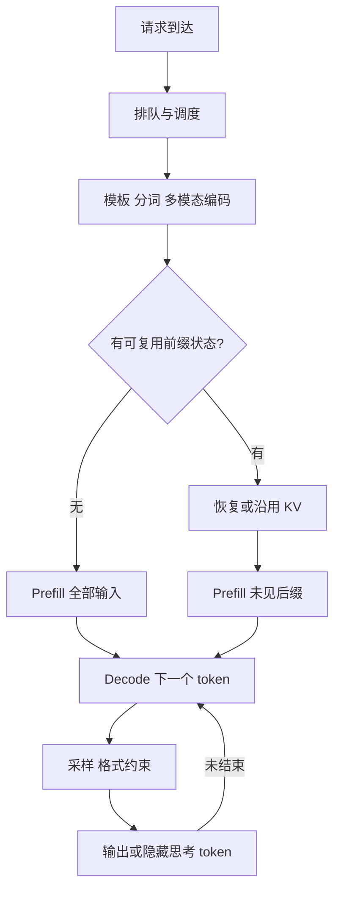
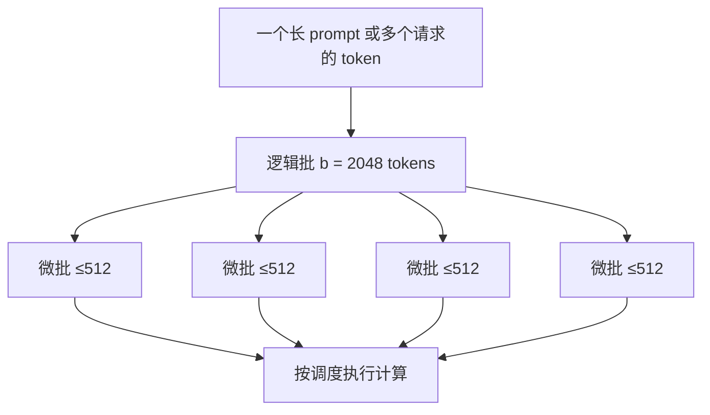
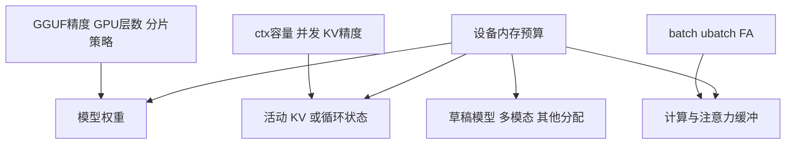
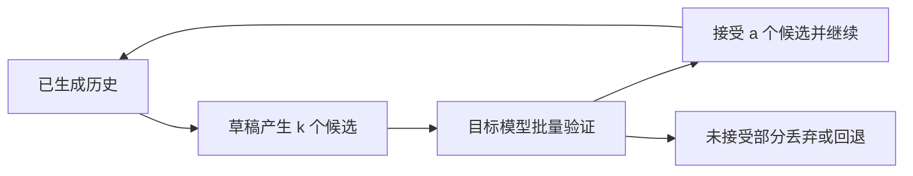

# llama.cpp 参数说明与性能图解

编写日期：2026-09-22～23。核对基线：本工作区 `llama.cpp` 的 **`f5e85d43a048f3d5adefb4c5e29867d8077fba62`**，提交日期 2026-08-28，`b10669-4-gf5e85d43a`。这是固定版本说明，**不宣称涵盖 9 月 22 日上游新增选项**。源码树没有未提交修改；本次没有编译模型、启动推理服务或产生新跑分。

阅读顺序：先读本文建立性能模型，再查[公共与各子程序完整参数表](llamacpp-all-parameters-catalog.md)、[独立工具参数表](llamacpp-tool-parameters.md)、[请求参数完整表](llamacpp-request-parameters.md)和[源码证据笔记](llamacpp-parameter-performance-evidence.md)。另提供合并后的完整手册；附录覆盖范围以各自的可核对清单为准。

“所有参数”在此具体指：该提交 `common/arg.cpp` 的全部参数注册项（含别名、工具独有、弃用和已移除项），再补上不走这套解析器的主要运行工具。C/C++ API 结构体字段、全部后端环境变量、CMake 选项以及模型转换/开发脚本是另外的配置接口；本文列重要入口，不把它们冒充命令行参数。HTTP 请求参数也另列，不能机械地把 `--` 改成下划线。

## 1. 先分清楚你要优化什么

| 指标 | 含义 | 常见影响项 |
|---|---|---|
| 冷启动耗时 | 从启动程序到模型可用 | 模型大小、磁盘、下载、`--load-mode`、warmup |
| 首 token 延迟 TTFT | 从提交请求到收到第一个输出 token | 排队、模板与分词、图像编码、前缀复用、prefill、首轮采样、网络 |
| 首个可见答案延迟 | 从请求到用户看到正文 | TTFT 加上可能隐藏的思考过程；思考 token 仍要计算 |
| PP tok/s | prompt processing / prefill，读取输入的速度 | `-b`、`-ub`、GPU offload、Flash Attention、输入长度 |
| TG tok/s | token generation / decode，逐 token 生成速度 | 权重带宽、模型量化、GPU/CPU 分配、KV 读写、已有上下文、投机解码 |
| TPOT / ITL | 每个输出 token 耗时 / 相邻流式输出间隔 | decode、调度、网络缓冲；二者在真实流式服务中不完全相等 |
| 总吞吐 | 所有并发请求每秒合计产出多少 token | `-np`、continuous batching、容量、批处理效率 |
| 尾延迟 P95/P99 | 最慢一部分请求的等待与完成时间 | 长 prompt 抢占计算、队列、缓存未命中、过高并发 |
| 容量与质量 | 能放下多少上下文、回答是否正确 | 模型与 KV 精度、上下文上限、截断、RoPE、采样、思考预算 |

**每秒生成更快、第一句话更早出现、能同时服务更多人，是三个不同目标。** 例如缩短输出通常减少完成时间，但不证明 TG tok/s 变高；缓存命中减少要读的 token，也不证明 GPU 的 PP 算力变强。



近似分解（用于理解，非基准模型）：

`TTFT ≈ 排队 + 输入处理 + 缓存恢复 + 未命中输入的 prefill + 首轮输出开销`

`总完成时间 ≈ TTFT + 后续生成 token 数 × 平均 TPOT`

实际阶段可能重叠；投机解码会一次提交多个 token。只拿服务端 `predicted_per_second` 不能代表客户端端到端速度。依据：[server 请求、响应和 timings 定义][server]、[bench 的 PP/TG/PG 说明][bench]。

## 2. 哪些参数值得先动

下面的方向是机制推断，不是保证的加速比例。所有“更快”都需要相同模型、工作负载和设备上的 A/B 验证。

| 参数/操作 | 首字与 prefill | decode | 内存/显存 | 质量或其他代价 |
|---|---|---|---|---|
| 换更小/低比特 GGUF，`-m` | 通常减少计算与搬运 | 带宽受限时常有收益 | 权重占用减少 | 可能降低质量；不同量化内核性能不单调 |
| 增加 `-ngl`，直到足够 GPU 驻留 | 通常改善 | 通常改善 | 显存增加、主存承担减少 | 放不下会失败/触发调整；CPU 与 GPU 性能决定收益 |
| 增大 `-ub`，配合足够 `-b` | GPU 利用不足时常改善 PP | 单路短步 decode 常不明显 | 计算缓冲通常增加 | 太大可能挤出权重、OOM或恶化调度延迟 |
| `-fa on` | 长上下文常有收益 | 依后端、模型、长度而定 | 注意力中间缓冲可能显著减少 | 要有支持的算子、形状与数据类型 |
| `-ctk/-ctv q8_0` 或更低比特 | 可能减少 KV 带宽 | 长上下文可能受益，也可能被解量化开销抵消 | KV 变小 | 长程记忆/精确检索质量需实测 |
| 降低 `-c` | 主要减少容量，不代表短输入必然更快 | 已使用长度不变时未必改善 | KV 预留通常减少 | 容纳的输入与输出变少 |
| 增大 `-np`、保留 `-cb` | 排队/首字可能变差 | 总 TG 可增加；单用户 TG可能下降 | 每路状态与容量需求增加 | 吞吐与延迟权衡 |
| 命中 `cache_prompt` / RAM 状态缓存 | 可以显著减少重复 prefill | 不会消除后续 attention 对历史的读取 | 需要保存状态 | 相同语义不足以命中，通常依赖相同 token 前缀 |
| 调 `-t/-tb` | CPU 执行时重要 | 线程过多可更慢 | 通常不是主要显存因素 | 受核心类型、NUMA、带宽影响 |
| 开投机解码 `--spec-type` | 不解决普通长 prompt 的 prefill | 高接受率且草稿便宜时加速 | 草稿权重、KV、验证缓冲增加 | 接受率低/设备竞争时更慢 |
| 限制 `-n`、`--reasoning-budget` | 后者可缩短正文出现前等待 | 减少总生成工作，未必提高每秒速度 | 缓解长期占用 | 回答可能不完整、推理能力受损 |
| `--temp`、`--top-p` 等 | 通常不是 PP 调优手段 | 主要改变采样；极端场景采样会成瓶颈 | 通常影响较小 | 直接改变回答分布，不能为跑分随意变动 |

参数语法与行为依据：[公共解析器][arg]、[默认结构体][common]；进一步证据见[机制核对笔记](llamacpp-parameter-performance-evidence.md)。

## 3. `-b`、`-ub`、`-np`：三个不同的“批”

`--batch-size / -b` 是送入处理过程的**逻辑 token 批大小上限**；`--ubatch-size / -ub` 是实际计算拆分的**物理微批上限**；`--parallel / -np` 是 server 的**请求 slot 数**。`-b 2048` 不等于 2048 个用户，`-ub 512` 也不等于每个用户生成 512 个 token。



这是上限示意，不承诺每次恰好四块；序列布局、后端和模型会影响实际拆分。单用户普通 decode 每步只有一个新 token，把 `-b` 从 2048 改成 8192 不会自动产生更多可并行的 token。多用户 decode 则可以把不同用户的新 token 拼进同批，提高权重读取的利用率。

建议先固定 `-b 2048` 扫描 `-ub 128/256/512/1024`，测 PP、显存峰值与混合负载 P95 TTFT；再测试 `-b 512/1024/2048/4096`。如果增加 `-ub` 后必须减少 GPU 层数，它可能让 PP 小幅改善却使 TG 大幅下降。依据：[参数定义][arg]、[批处理与计时实现][context]。

## 4. 上下文、并发与 KV：容量如何计算

`-c` 是运行上下文容量配置，实际生效值会受模型、对齐、自动 fit 和服务器 slot 规则影响。容量中要为模板、系统提示、历史、图片/音频 token、当前输入以及生成预留空间。token 不等于中文字数。

对普通 Transformer attention，KV 体积的近似式是：

`KV bytes ≈ token 槽位总数 × Σ各注意力层( K维数 × K每元素字节 + V维数 × V每元素字节 )`

同构 GQA 模型可写成 `C × L × Hkv × (Dk × Bk + Dv × Bv)`。这里用的是 **KV heads**，不是 query heads；不要把 GQA 按完整 query heads 计算。量化块还含 scale 等元数据，不能一律按 4bit=0.5 字节做精确预算。

**算例，非硬件跑分：** 32 层、8 个 KV heads、K/V head dimension 均为 128、普通 full attention：F16 K+V 每 token 为 128 KiB，8192 token 约 1 GiB，32768 token 约 4 GiB。Q8_0 块为 32 个值加 2 字节 scale，约为 F16 的 53.125%；Q4_0 为 16 字节数据加 2 字节 scale，约为 F16 的 28.125%。因此 32768 token 的同形 KV 粗估分别为 4 / 2.125 / 1.125 GiB。

这些数字**不含权重、计算缓冲、分配对齐、量化布局额外空间、多模态编码器、草稿模型、RAM 状态副本**。SWA、MLA、循环状态、混合 attention/SSM 架构不能直接套这个公式。依据：[KV 实现][kv]、[量化块结构][quants]。



### 4.1 明确分池与统一池

本版本 `-np` 在 server 默认自动设置；`--kv-unified` 的默认行为与 slot 是否自动有关。为可重复实验应显式指定。

| 配置意图 | 示例 | 含义 |
|---|---|---|
| 四路各约 8K，分池 | `-c 32768 -np 4 --no-kv-unified` | 常规分池中每路约为总上下文/路数，仍受对齐和模型上限约束 |
| 四路共享约 32K 活动池 | `-c 32768 -np 4 --kv-unified` | 空闲容量可以在序列间调剂；不表示四路都能同时占满32K |
| 统一池并限制每路 | `-c 32768 -np 4 --kv-unified --kv-unified-per-slot 8192` | 同时约束共享池和单路上限 |

当指定 `--kv-unified-per-slot N` 且**未显式设置 `-c`**时，代码可按 `n_parallel × N` 调整共享池。该版本 server 还会限制 slot 不超过模型报告的训练上下文；应读取启动日志的 `n_ctx`、`n_ctx_seq`、`n_ctx_slot` 和 `/props` 确认。它是这个提交的具体行为，不能泛化成所有版本都固定 `c/np`，也不能泛化成统一 KV 能无限借用显存。依据：[server context][srvctx]、[公共初始化][init]。

### 4.2 配置长度与实际长度

只把 `-c` 从 8K 提高到 128K，而测试 prompt 仍是 100 token，测到的是“大容量配置下的短输入”，不是“128K 已占用上下文的 decode”。普通 full attention 在历史增长后需要读更多 KV；长上下文 TG 可能下降。Flash Attention 优化访存与中间结果，并未使 full attention 的工作量与上下文无关。

`--context-shift` 可以在窗口满时移动/丢弃部分历史，`--keep` 指定保留开头的数量；它不会让模型真正记住被丢弃的全文。`--rope-scaling`、`--rope-scale`、`--rope-freq-*`、`--yarn-*` 影响位置编码与外推，不能凭扩大 `-c` 保证长文准确率。SWA 模型的 `--swa-full` 还涉及完整缓存与内存取舍，应按对应架构核对。[参数定义][arg]、[KV 实现][kv]

## 5. 模型放在哪儿：GPU、CPU 与多 GPU

### 5.1 单 GPU

`-ngl / --gpu-layers / --n-gpu-layers` 在本版本支持数值、`auto`、`all`。**99 是一个层数，不是“全部”的特殊关键字**；模型足够深时 99 并不覆盖所有层。想表达全部就使用本版本支持的 `-ngl all`，并看启动日志确认实际 offload。

`--fit on` 根据设备余量适配未显式指定的参数；`--fit-target` 是每设备要保留的余量，单位 MiB，默认 1024，**不是模型最多允许用的显存**。`--fit-ctx` 是允许 fit 调到的最小上下文。为了公平跑分，先用自动 fit 找可行配置，再固定关键值；否则更大微批触发更少 GPU 层数，会把两个变量混在一起。

`--device` 选择设备；`--list-devices` 查看当前二进制发现的后端。设置 GPU 层数不会给一个 CPU-only 构建凭空添加 GPU 支持。`--no-kv-offload` 把 KV offload 关掉可能省设备内存，但常增加 CPU 工作或传输；`--op-offload` 控制另一类运算 offload，和权重 offload 不是同一个开关。`--override-tensor` 是按 tensor 名称模式指定存储位置的高级工具，规则写得能加载不代表性能合理。[arg][arg]、[init][init]

### 5.2 多 GPU

| 参数 | 作用 | 性能判断 |
|---|---|---|
| `-sm none` | 单 GPU | 模型能放下时是很好的对照组 |
| `-sm layer` | 按层和 KV 分布到多 GPU，支持流水方式 | 主要扩容；多卡不意味着单请求翻倍，层间仍有依赖 |
| `-sm row` | 权重按行拆分 | 可并行，但跨卡传输与同步可能抵消收益 |
| `-sm tensor` | 权重与 KV 的张量并行，本版本实验项 | 强依赖支持程度、GPU互联和模型结构 |
| `-ts 3,1` | 分配比例，非 GiB 数字 | 用于异构显存；比例还会受不可分割的tensor/层等约束 |
| `-mg 0` | none 模式主卡；row 模式还涉及中间结果/KV | 不同 split mode 含义不同，不能当成通用调度权重 |

不要把“总显存够”当成“每卡都够”，主卡中间缓冲也会占空间。本版 `tensor` 模式要求 FA，backend sampling 会回退 CPU；`layer` 的自动流水也有完整 GPU offload、KV offload、无 tensor override、设备支持 async/events 等条件。CPU MoE 的 override 可能使流水不启用。跨机器 RPC 扩容还叠加网络代价，应单独测试。依据：[分片参数][arg]、[模型加载实现][model]、[context 初始化][context]。

### 5.3 MoE、dense FFN 与 CPU

`--cpu-moe` 把所有专家权重放 CPU；`--n-cpu-moe N` 只涉及前 N 层的专家；`--n-cpu-ffn N` 是 dense FFN 对应策略。它们让注意力等部分仍可驻 GPU，适用于显存紧张时的选择性分配。MoE 每 token 只激活部分专家，但**模型需要存储的专家权重总量并不会等于激活量**。

CPU 承担更多层/专家时，内存带宽、线程和跨设备传输变得重要。它常用于“能运行”的容量折中，是否优于整层 offload 需要比较具体模型。把 CPU 搬运误认为免费，是常见错误。[模型 tensor 放置定义][arg]

## 6. CPU 参数如何影响推理

`-t / --threads` 控制生成用线程；`-tb / --threads-batch` 控制批处理/prompt 阶段，未设置通常继承前者。decode 小批经常受内存带宽限制，prefill 则更容易利用矩阵运算并行，所以两者最优线程数不必相同。

| 参数族 | 含义与影响 |
|---|---|
| `--cpu-mask`、`--cpu-range`、`--cpu-strict` | 控制线程能去哪些逻辑 CPU；可减少跨 NUMA 访问、大小核迁移，也可能选错核心变慢 |
| 对应 `*-batch` 参数 | 给 PP 单独的亲和性、优先级和轮询设置 |
| `--prio` | 调度优先级；不会提升硬件带宽，过高会影响同机其他任务 |
| `--poll` | 更积极等待新工作可减少唤醒延迟，但增加空转 CPU 和功耗 |
| `--numa distribute/isolate/numactl` | NUMA 分配与亲和策略；平台相关，不能作为通用 Windows 调优开关 |
| `--spec-draft-*` CPU 参数 | 给草稿模型另配线程，避免目标与草稿抢满相同 CPU 资源 |

可先试线程数 `1,2,4,8` 到物理核心数，分别记录 PP/TG。超线程数或操作系统报告的逻辑核心数不自动等于最佳线程数。官方历史示例也展示了加线程并非一直更快；其机器和模型很旧，不宜复制其中 tok/s 当现代机器预期。[官方性能排查][tips]

## 7. Flash Attention 与 KV 精度

`--flash-attn on/off/auto` 调整 attention 的实现选择。FA 使用融合/分块方式减少中间张量写回和读写成本，尤其值得在长上下文下测试。`auto` 不是保证所有层实际都启用；必须检查实际后端和日志。

`--cache-type-k`、`--cache-type-v` 选择 KV 类型，**不修改 GGUF 权重精度**。本版本注册类型包括 `f32/f16/bf16/q8_0/q4_0/q4_1/iq4_nl/q5_0/q5_1`，但“解析器接受名字”不等于“每个模型与后端的所有 K/V 组合都有内核”。本版量化 V 要求 FA：`auto` 会启用，`off` 会报错；MLA / DeepSeek4 的 K/V 类型还必须一致。失败时应核对日志和该模型支持情况。

实用顺序：F16 建立质量基准 → Q8_0 看显存收益 → 必要时试更低比特 → 同时测长文检索、结构化输出、实际业务任务和长上下文 decode。不要因为短 prompt 测试没变化就认定长上下文量化也无损；也不要因为内存少一半就预计速度一定翻倍。[缓存类型参数][arg]、[context 验证][context]、[KV 实现][kv]

## 8. 三种“缓存”别混用

| 层次 | 相关参数/字段 | 保存什么 | 主要收益与代价 |
|---|---|---|---|
| 模型文件缓存/映射 | `--cache-list`、模型下载、`--load-mode` | 权重文件与操作系统页缓存 | 下载/加载快；不是对话 prefill 缓存 |
| 活动前缀复用 | 请求 `cache_prompt`、slot、`--slot-prompt-similarity` | 正在模型上下文里的序列状态 | 相同 token 前缀可不重算；占用活动容量 |
| 可恢复状态 | `--cache-ram`、`--cache-idle-slots`、checkpoints、slot save/restore | 可恢复的 prompt/序列状态副本 | 会话切换后省重算；消耗 RAM、复制和恢复时间 |

`--cache-ram` 单位 **MiB**，此基线默认 8192，0 禁用，-1 不限；它不是直接增大 GPU 活动 KV，更不是自动接入外部 Redis 或 LMCache。`--ctx-checkpoints`、`--checkpoint-min-step` 决定检查点数与间距，对不能任意裁剪状态的架构和回退恢复尤其相关。间隔太密可能多占 RAM、增加状态复制；太疏则要重算更长后缀。

`--cache-reuse` / 请求 `n_cache_reuse` 尝试通过 KV shift 复用片段，依赖模型与缓存实现；它不是对任意历史文本的语义检索。固定系统提示与知识前缀，把每轮变化内容放后面，通常更有利于前缀复用。

**算例：** 8192-token prompt 中有 7680 token 可直接复用，余下 512 token 新增；若假设 PP=2000 tok/s、恢复成本忽略，则重算约 4.096 秒变成约 0.256 秒。这是条件算例，实际还含恢复、排队与预填充长度效应，不能宣传成 16 倍整请求加速。继续生成仍要关注已有上下文，缓存不会让历史 KV 消失。[server 缓存说明][server]、[server context][srvctx]

## 9. 投机解码：为什么有时更快，有时反而慢

普通自回归每次由大模型走一步；投机解码先用便宜的草稿模型或 n-gram 方法提出多个候选，再由目标模型批量验证，接受可用前缀后继续。



关键参数：`--spec-type` 选择策略；`--spec-draft-model` 指定草稿模型；`--spec-draft-n-max/n-min/p-min` 控制候选长度与阈值；`--spec-draft-ngl`、设备、线程、缓存类型分配草稿资源；`--spec-ngram-*` 调整 n-gram 匹配与候选。完整合法类型和所有别名见参数表，旧 `--draft-*` 不应直接照搬。

粗略判断：`每个最终 token 的时间 ≈ (草稿耗时 + 目标验证耗时 + 回退/调度成本) / 本轮最终提交 token 数`。接受率高仍不够，草稿必须便宜；草稿抢占显存导致目标层回 CPU，或多用户已经充分利用 GPU 时，反而可能更慢。

兼容的 tokenizer、词表、特定架构与验证逻辑都是前提。MTP/EAGLE 等草稿不是任意小模型都能替代；不能笼统声称所有策略、所有采样组合都逐 token 与普通解码相同。用真实 prompt 测接受率、最终 TG 和质量，不能只比较草稿自身速度。[投机实现][spec]、[采样验证][sampling]

## 10. 采样、思考与格式：主要影响输出，也会影响成本

| 参数族 | 怎样影响输出 | 性能含义 |
|---|---|---|
| `--temp` | 调整分布尖锐程度；零温偏向贪心 | 通常不是模型主计算加速开关 |
| `--top-k/top-p/min-p/typical/top-n-sigma` | 筛选候选集 | 排序、概率处理有开销，但大模型一般由网络前向主导 |
| `--repeat-* / presence / frequency` | 历史重复惩罚 | 扫描窗口和数据结构有开销；过度惩罚可损害代码/JSON |
| `--dry-*` | 惩罚重复片段 | 历史窗口大时 CPU 采样开销可能明显 |
| `--mirostat-* / adaptive-* / dynatemp-* / xtc-*` | 不同分布控制策略 | 交互与执行链不同，不能假设可全部无冲突叠加 |
| `--samplers / --sampler-seq` | 采样器及顺序 | 相同各项数值但顺序不同，输出分布可能不同 |
| `--grammar / --json-schema*` | 限制合法 token 路径 | 复杂语法可能增加逐 token CPU 开销；格式正确不等于内容正确 |
| `--backend-sampling` | 实验性地让后端采样 | 可能减少主机同步/数据搬运；支持组合受限制 |
| `--seed` | 随机种子 | 有助实验可重复，但后端、batch、缓存变化仍可能导致差异 |
| `--ignore-eos`、停止词、`-n` | 决定何时停止 | 直接影响总计算量与完成时间 |
| `--reasoning-budget` | 限制受支持的思考 token 预算 | 能缩短隐式思考等待，但可能影响复杂题正确率 |
| `--reasoning-format` | 如何组织/分离思考文本 | 改输出呈现并不等于停止模型思考 |
| `--chat-template* / --jinja` | 控制角色、工具与思考格式 | 模板错误可能严重损害模型行为；模板长度也影响 prefill |

不要把“把 thinking 字段隐藏”当成取消计算，也不要把相同 seed 当跨设备位级一致性保证。该源码里 README 的手写 HTTP 默认值有滞后迹象，例如 `repeat_penalty` 与自动生成 CLI 表不同；实际默认应核对启动配置、`/props` 和当前请求解析实现。[采样实现][sampling]、[server 工具与请求解析][srvutils]

## 11. 其余参数怎么归类

完整列表在附录，下面提供定位方式。

| 家族 | 主要用途 | 对性能的关系 |
|---|---|---|
| `-m/-hf/-hff/-mu` 等来源 | 选择文件、下载源、认证 | 选择的模型决定性能；来源本身主要影响下载/加载 |
| `--load-mode` 与旧 mmap/mlock/direct-io | 文件映射、预装入、锁页等 | 主要影响加载、缺页、CPU驻留；已全驻留 GPU 的稳态 TG 不一定变化 |
| `--warmup` | 启动时提前做空跑 | 提前支付初始化成本；关闭可能启动快、首请求慢 |
| `--lora* / --control-vector*` | 适配器与行为方向 | 增加计算/权重；不同 LoRA 请求不能简单同批，影响吞吐 |
| `--mmproj* / --image-*-tokens / --mtmd-batch-max-tokens` | 多模态编码器、图片token预算 | 图片token更多，视觉细节可能更好，同时编码/PP/KV压力上升 |
| `--video-fps / --video-timestamp-interval` | 视频抽帧与时间戳 | fps 越高通常输入工作越多；不是提高文本解码速度 |
| embeddings / pooling / normalize / rerank | 向量、归一化与排序任务 | 任务改变，应测样本/秒和PP，不用聊天TG评判 |
| host / port / TLS / CORS / API key | 网络与访问配置 | 通常不改变模型计算；HTTP、TLS、传输仍影响端到端耗时 |
| `--threads-http` | HTTP 请求工作线程 | 不等于模型线程数，也不等于推理slot数 |
| models-dir / models-preset / models-max / sleep | 多模型路由、加载、休眠 | 冷启动、常驻内存与切换延迟权衡 |
| log / verbosity / metrics / slots / perf | 可观察性 | 详细日志、逐token信息可能扰动高吞吐或小模型测量 |
| tools / MCP / agent | 执行外部工具与工作流 | 外部工具时间可远大于推理；不属于纯模型tok/s |
| CLI 输入、显示、颜色、交互 | 使用体验 | 主要是I/O；慢终端输出会污染端到端时间 |
| perplexity / imatrix / retrieval / TTS / diffusion等 | 独立任务流程 | 指标与部分参数语义不同，查工具标签后使用 |

完整注册表同时区分**可用选项、兼容别名、弃用项、只用于明确报错的已移除项**。环境变量只在 `.set_env(...)` 有对应映射时成立，不应为任意旗标自行拼 `LLAMA_ARG_*`。对于公共配置，命令行优先于环境变量；server router/preset 另有自己的合并规则。[arg][arg]、[server presets][server]

## 12. 可复制的调参案例

以下是 **PowerShell 单行命令**，假设可执行文件在当前目录、模型路径已换成实际文件；属于实验起点，不是已测最优值。不要把 server 的参数格式直接复制给独立 `llama-bench`。

### A. 单人对话，优先低延迟

```powershell
.\llama-server.exe -m "D:\models\model.gguf" -ngl all -c 8192 -np 1 -b 2048 -ub 512 -fa on -ctk f16 -ctv f16 --cache-ram 0 --host 127.0.0.1 --port 8080
```

先确认显存足够、FA支持、实际全 offload。F16用于基准；放不下时依次考虑降低不需要的上下文、缩小微批、KV Q8、合适的权重量化/模型大小，最后再比较部分CPU offload。这里将RAM状态缓存关闭便于隔离测量，活动slot仍可能按请求复用前缀；要测冷prefill还必须设置请求 `cache_prompt:false`。日常多轮可再比较RAM缓存收益。

### B. 四个并发用户，明确每人8K容量

```powershell
.\llama-server.exe -m "D:\models\model.gguf" -ngl all -c 32768 -np 4 --no-kv-unified -cb -b 2048 -ub 512 -fa on -ctk q8_0 -ctv q8_0 --cache-ram 0
```

和 `-np 1/2/4` 比较总输出吞吐、每用户TPOT与P95 TTFT。为保证每人8K，分池对照时 `-c` 应随路数调整；为比较固定显存预算则固定 `-c`，明确每路可用容量因此变化。这是两种不同实验，不能混在同一张“并发加速表”。

### C. 长文分析与多轮复用

```powershell
.\llama-server.exe -m "D:\models\long-context.gguf" -ngl all -c 32768 -np 1 -fa on -ctk q8_0 -ctv q8_0 -b 2048 -ub 512 --cache-ram 4096
```

模型必须支持目标上下文，质量也要检验。先发送长文+问题A，再保持相同token前缀提问B，比较 `cache_prompt:true/false` 的真实TTFT、处理token数、缓存token数。不同聊天历史结构可能改变前缀，不能只看文本内容“差不多”。对会话轮换测试，再加入其它会话制造slot/缓存压力。

### D. CPU-only，分别找PP与TG的最佳线程

```powershell
.\llama-server.exe -m "D:\models\model.gguf" --device none -ngl 0 --no-kv-offload --no-op-offload -c 4096 -np 1 -t 4 -tb 8 -b 512 -ub 128
```

4和8是扫描起点。记录核心结构、内存通道、实际驻留和是否发生交换；逐一改变 `-t` 与 `-tb`。如果模型靠频繁换页运行，应先解决容量问题，再谈线程调优。

### E. 用官方bench拆开测PP与TG

```powershell
.\llama-bench.exe -m "D:\models\model.gguf" -ngl 999 -p 512,2048 -n 128 -b 2048 -ub 128,256,512 -fa on -ctk f16 -ctv f16 -r 5 -o json
```

bench 有独立解析器，示例用数值 `999`（仍是层数上限）避免将server的字符串 `all` 当成通用语法；确认日志实际全offload。此命令是参数笛卡尔组合扫描，不是同时跑很多模型。一般保留预热；分别报告首次启动和稳态。测**已有长历史**下的生成另用该工具 `-d / --n-depth` 或 `-pg` 的具体语义，并在报告中写清填充深度与本次测量长度，不能仅增加server `-c`。[bench源码][benchsrc]

### F. 测请求缓存与生成长度

```powershell
$body = @{ prompt = '请用三点介绍向量数据库。'; n_predict = 256; temperature = 0; cache_prompt = $false; stream = $false } | ConvertTo-Json
Invoke-RestMethod -Method Post -Uri 'http://127.0.0.1:8080/completion' -ContentType 'application/json; charset=utf-8' -Body ([Text.Encoding]::UTF8.GetBytes($body))
```

这是原生 `/completion` 测试，聊天业务应使用正确聊天模板或 `/v1/chat/completions`。`stream:false` 方便读取完整计时对象，却不能直接测客户端首token到达；测TTFT须使用流式客户端时间戳。对比缓存时保持输入、采样、输出上限等一致，并区分第一次填充与后续命中。

## 13. 请求参数与启动参数的区别

启动时确定设备、模型、KV 类型、context容量；请求级可选采样、生成长度、输出格式与缓存行为。不能在请求JSON里用 `n_gpu_layers` 给已经加载的模型随意改GPU分配。

| 原生 `/completion` 字段 | 说明 | 性能关注 |
|---|---|---|
| `prompt`、`n_cmpl` | 输入与每prompt生成份数 | 输入规模、请求工作倍数 |
| `n_predict`、`stop`、`ignore_eos` | 输出上限与停止条件 | 总生成工作；0可仅评估prompt |
| `n_keep`、`n_cache_reuse` | 超窗保留与KV片段复用 | 历史完整性、复用成本 |
| `cache_prompt`、`id_slot` | 前缀缓存、slot选择 | 命中率、slot竞争；固定slot不一定提高吞吐 |
| `temperature`、`top_k/top_p/min_p/typical_p` | 基础采样 | 分布与采样开销 |
| `dynatemp_range/exponent`、`mirostat/tau/eta` | 动态温度与Mirostat | 输出风格、熵与执行链 |
| `repeat_penalty/last_n`、`presence_penalty/frequency_penalty` | 重复控制 | 扫描与质量 |
| `dry_multiplier/base/allowed_length/penalty_last_n/sequence_breakers` | 重复片段控制 | 长窗口采样成本 |
| `xtc_probability/threshold`、`seed`、`samplers`、`min_keep`、`logit_bias` | 其他采样选项 | 候选集合与可重复性 |
| `grammar`、`json_schema`、`n_indent` | 结构与缩进 | 约束解码成本 |
| `n_probs`、`post_sampling_probs` | 返回候选概率 | 额外概率计算/拷贝/响应量 |
| `stream`、`sse_ping_interval` | 流式输出与连接保活 | 体验和网络行为；流式不等于模型算得更快 |
| `timings_per_token`、`return_progress`、`return_tokens`、`response_fields` | 诊断与返回内容 | 观测开销、传输体积 |
| `t_max_predict_ms` | 生成阶段软时间限制 | 有特定触发条件，不是整请求硬超时 |
| `lora` | 每请求适配器列表 | 不同LoRA配置会限制合批 |

这是该版本 README 原生completion文档字段的分组索引；实现中有效注册的 66 个顶层字段、1 个嵌套字段和6个别名另见[请求参数完整表](llamacpp-request-parameters.md)。本节**不是所有端点JSON schema的穷举**；实现还可能接受扩展项。`/v1/chat/completions` 的 `messages/tools/tool_choice/response_format/max_tokens` 等需按该端点兼容层核对。embedding、rerank、slot save/restore、models 管理等端点各有自己的输入。不要把返回的 `timings`、`tokens_cached` 当作启动旗标。依据：[server API][server]、[请求解析实现][srvutils]。

## 14. 跑分要能解释，才有调参价值

1. 固定模型文件与哈希、GGUF量化、llama.cpp build/commit、后端、驱动、设备、电源策略。
2. 固定实际输入token长度、已占用历史长度、输出长度、采样、思考预算与并发分布。
3. 分别测冷启动、冷prefill、缓存命中、短上下文TG、长上下文TG和并发负载。
4. 一次只改一个主变量；当容量约束迫使联动更改时，把联动项写进记录。
5. 预热后至少重复数次，报告中位数与波动；服务压测另报告吞吐、P95/P99和失败率。
6. 记录实际offload层数、KV大小、主存与显存峰值、缓存命中token、投机接受率。CPU与GPU利用率只作辅助证据。
7. 改量化、长上下文、RoPE、思考预算、采样、模板时同步做质量评估，别只看速度。

| 症状 | 先检查 |
|---|---|
| 启动即OOM | 权重+KV+计算缓冲总预算；各GPU分别是否超限；fit实际改了什么 |
| 长输入迟迟不出首字 | 是否重复prefill、PP速度、排队、多模态编码、微批 |
| 首字快但后续很慢 | 实际上下文长度、GPU offload、权重/KV带宽、线程过量、草稿成本 |
| 单人快多人慢 | 总吞吐与单人延迟是否混淆、slot容量、队列、prefill与decode竞争 |
| 修改参数后跑分突然很好 | 是否输出更短、缓存恰好命中、用了不同模型/设备、fit改变容量 |
| 显存还有空余却慢 | 未必容量瓶颈；可能是带宽、互联、CPU、采样或调度 |

## 15. 资料入口与版本维护

这里的机制以固定版本一手源码为主。网络检索已核对官方工具文档与性能排查页；没有将论坛上不同模型或分支的跑分拼成普遍结论。工作区既有的历史跑分使用了其它二进制版本，因此本文不将其当本提交验证结果。

| 一手资料 | 用途 |
|---|---|
| [公共参数解析器][arg] | 选项名、别名、环境变量、适用工具、删除/弃用判断 |
| [公共参数结构体][common] | 初始默认值；还需看每工具和运行时覆盖 |
| [Server完整说明][server] | 启动参数、接口、缓存、并发、模型路由 |
| [CLI说明][cli] | 交互程序参数与行为 |
| [官方bench说明][bench]与[实现][benchsrc] | 参数扫描、PP/TG/PG与实际解析语法 |
| [GPU/线程性能排查][tips] | 确认offload、避免CPU线程过量；历史数值非现代基准 |
| [构建说明][build] | 后端构建条件，运行旗标无法代替编译支持 |
| [FlashAttention论文](https://arxiv.org/abs/2205.14135) | attention的I/O优化思路；不代表llama.cpp所有内核都是相同实现 |

升级后先运行对应程序 `--version` 和 `--help`，对比参数表及实际启动日志。尤其重新核对 `--load-mode`、`--fit`、KV统一池、slot容量、投机类型、实验性后端、默认采样链。源代码里的注册项最多只能证明该工具能解析它；硬件与模型是否真正支持仍需运行确认。

[arg]: https://github.com/ggml-org/llama.cpp/blob/f5e85d43a048f3d5adefb4c5e29867d8077fba62/common/arg.cpp
[common]: https://github.com/ggml-org/llama.cpp/blob/f5e85d43a048f3d5adefb4c5e29867d8077fba62/common/common.h
[server]: https://github.com/ggml-org/llama.cpp/blob/f5e85d43a048f3d5adefb4c5e29867d8077fba62/tools/server/README.md
[cli]: https://github.com/ggml-org/llama.cpp/blob/f5e85d43a048f3d5adefb4c5e29867d8077fba62/tools/cli/README.md
[bench]: https://github.com/ggml-org/llama.cpp/blob/f5e85d43a048f3d5adefb4c5e29867d8077fba62/tools/llama-bench/README.md
[benchsrc]: https://github.com/ggml-org/llama.cpp/blob/f5e85d43a048f3d5adefb4c5e29867d8077fba62/tools/llama-bench/llama-bench.cpp
[context]: https://github.com/ggml-org/llama.cpp/blob/f5e85d43a048f3d5adefb4c5e29867d8077fba62/src/llama-context.cpp
[kv]: https://github.com/ggml-org/llama.cpp/blob/f5e85d43a048f3d5adefb4c5e29867d8077fba62/src/llama-kv-cache.cpp
[quants]: https://github.com/ggml-org/llama.cpp/blob/f5e85d43a048f3d5adefb4c5e29867d8077fba62/ggml/src/ggml-common.h
[srvctx]: https://github.com/ggml-org/llama.cpp/blob/f5e85d43a048f3d5adefb4c5e29867d8077fba62/tools/server/server-context.cpp
[srvutils]: https://github.com/ggml-org/llama.cpp/blob/f5e85d43a048f3d5adefb4c5e29867d8077fba62/tools/server/server-schema.cpp
[init]: https://github.com/ggml-org/llama.cpp/blob/f5e85d43a048f3d5adefb4c5e29867d8077fba62/common/common.cpp
[model]: https://github.com/ggml-org/llama.cpp/blob/f5e85d43a048f3d5adefb4c5e29867d8077fba62/src/llama-model.cpp
[sampling]: https://github.com/ggml-org/llama.cpp/blob/f5e85d43a048f3d5adefb4c5e29867d8077fba62/common/sampling.cpp
[spec]: https://github.com/ggml-org/llama.cpp/blob/f5e85d43a048f3d5adefb4c5e29867d8077fba62/common/speculative.cpp
[tips]: https://github.com/ggml-org/llama.cpp/blob/f5e85d43a048f3d5adefb4c5e29867d8077fba62/docs/development/token_generation_performance_tips.md
[build]: https://github.com/ggml-org/llama.cpp/blob/f5e85d43a048f3d5adefb4c5e29867d8077fba62/docs/build.md
